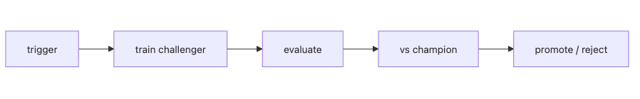

# Retraining

Deploying a model once is not the end of the job. Input distributions move, user behavior changes, and performance targets change. At some point, the team has to train again. The hard part is deciding who should trigger that retraining and on what evidence.

If retraining depends only on human instinct, it becomes slow and inconsistent. One team retrains on a schedule, another retrains only after an incident, and another swaps in a new model without proving it is actually better.

This is post 8 in the MLOps 101 series.

Here, we will treat retraining as an operating loop that starts from an explicit trigger, produces a challenger, and separates retraining from promotion.

## Questions this article answers

- Which signals should trigger retraining in the first place?
- How do schedule-based, drift-based, and performance-based triggers differ?
- Why do champion-versus-challenger comparisons need a margin?
- What risk does shadow evaluation remove?
- Why should retraining and deployment never be treated as the same step?

> Mental model: retraining creates a new candidate model. Promotion decides whether that candidate should become the new live model. The stages are connected, but they are not the same decision.

## Why It Matters

Without retraining, a model ages quietly. But a fully automatic retraining loop is not automatically safe either. If the policy is weak, the system may replace models too often and trade stability for false momentum.

That is why the real problem is policy, not automation for its own sake. The team has to define what starts retraining, how much better the challenger must be, and what path exists if the decision was wrong.

## See the Flow First



*See the Flow First*
This structure explains retraining well. A trigger fires, a challenger is trained, the challenger is evaluated against the champion, and the system either promotes it or rejects it.

So retraining is not just about running training again. It is about adding comparison and promotion policy around the training run.

## Key Terms

- **Champion**: the model currently serving production.
- **Challenger**: a freshly trained candidate model.
- **Shadow**: predicts in parallel without affecting users.
- **Promotion**: turning a challenger into the new champion.
- **Hysteresis**: a margin that prevents oscillation.

## Before/After

**Before**: ad-hoc quarterly retraining with weak justification.

**After**: drift alert → nightly retraining → metric comparison → promote or reject.

## Hands-on: A Tiny Retraining Loop

### Step 1 — Trigger types

```python
def should_retrain(psi: float, accuracy: float, days_since: int):
    if psi > 0.2:
        return "drift"
    if accuracy < 0.7:
        return "performance"
    if days_since >= 30:
        return "schedule"
    return None
```

### Step 2 — Train challenger

```python
from sklearn.linear_model import LogisticRegression

def train_challenger(X, y):
    return LogisticRegression().fit(X, y)
```

### Step 3 — Evaluate and compare

```python
def evaluate(model, X, y):
    return float(model.score(X, y))

def compare(challenger_acc, champion_acc, margin=0.01):
    return challenger_acc >= champion_acc + margin
```

### Step 4 — Shadow evaluation

```python
def shadow(challenger, X_live, y_live):
    return evaluate(challenger, X_live, y_live)
```

### Step 5 — Promotion decision

```python
def promote_decision(reason, challenger_acc, champion_acc):
    if reason is None:
        return "skip"
    if compare(challenger_acc, champion_acc):
        return "promote"
    return "reject"

print(promote_decision("drift", 0.82, 0.80))
```

## What to Notice in This Code

- Triggers are explicit, not vibes-based.
- The margin guards against random wins.
- Shadow gives you a zero-risk evaluation.

## Five Common Mistakes

1. **Not preserving the champion — rollback becomes impossible.**
2. **Promoting straight to production without a shadow stage.**
3. **Margin of zero — flapping causes constant churn.**
4. **Adding new features during retraining — root-cause analysis dies.**
5. **Only celebrating successful retrains, silencing failed ones.**

## How This Shows Up in Production

A recommender model retrains nightly, compares AUC and CTR against the champion, and rolls out to 5% canary traffic only if the margin holds.

## How a Senior Engineer Thinks

- Retraining is not the same as deploying.
- The champion is always preserved for rollback.
- Comparison metrics are agreed *before* the run.
- Promotion follows shadow → canary → full traffic.
- Change one thing at a time.

## Checklist

- [ ] Trigger policy is documented.
- [ ] Challenger evaluation runs automatically.
- [ ] A promotion margin is defined.
- [ ] Rollback procedure exists.

## Practice Problems

1. Add a *minimum stability period* to prevent flapping.
2. If shadow results look bad, how do you correct training data?
3. When two models tie, why is keeping the champion the right default?

## Wrap-up and Next Steps

Retraining is only clean if features are consistent across train and serve. The next post covers the *Feature Store*.

<!-- toc:begin -->
- [What is MLOps?](./01-what-is-mlops.md)
- [Experiment Tracking](./02-experiment-tracking.md)
- [Data Versioning](./03-data-versioning.md)
- [Model Training Pipeline](./04-training-pipeline.md)
- [Model Deployment](./05-model-deployment.md)
- [Model Monitoring](./06-model-monitoring.md)
- [Data Drift and Model Drift](./07-data-and-model-drift.md)
- **Retraining (current)**
- Feature Store (upcoming)
- Building a Production ML System (upcoming)
<!-- toc:end -->

## References

- [MLflow Model Registry](https://mlflow.org/docs/latest/model-registry.html)
- [Google — continuous training](https://cloud.google.com/architecture/mlops-continuous-delivery-and-automation-pipelines-in-machine-learning)
- [Uber — Michelangelo](https://www.uber.com/blog/michelangelo-machine-learning-platform/)
- [Netflix Tech Blog](https://netflixtechblog.com/)

Tags: MLOps, Retraining, Automation, Pipeline, DataScience
