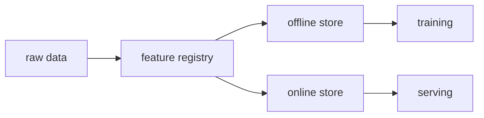

# Feature Store

> MLOps 101 series (9/10)

<!-- a-grade-intro:begin -->

**Core question**: Why do *training-time features* and *serving-time features* keep diverging?

> *A Feature Store defines features once and serves them identically to training and serving, eliminating train-serve skew.*

<!-- a-grade-intro:end -->

This is post 9 in the MLOps 101 series.

## What You Will Learn

- What train-serve skew really is
- Online vs offline stores
- Core concepts in Feast
- Feature reuse across teams
- Five common pitfalls

## Why It Matters

If two systems compute the *same feature name* in two different places, they *will* diverge. A Feature Store centralizes the definition.

## Concept at a Glance



## Key Terms

- **Entity**: the join key for features (e.g., `user_id`).
- **Feature View**: a feature definition tied to a source.
- **Online store**: low-latency key-value (e.g., Redis).
- **Offline store**: large-scale analytics (Parquet/BigQuery).
- **Point-in-time join**: time-correct historical join.

## Before/After

**Before**: training notebooks and serving code compute features independently.

**After**: one Feature View, called from both sides.

## Hands-on: A Tiny Feast Workflow

### Step 1 — Definitions

```python
from feast import Entity, FeatureView, Field, FileSource
from feast.types import Float32

user = Entity(name="user_id", join_keys=["user_id"])
src = FileSource(path="users.parquet", timestamp_field="event_ts")

view = FeatureView(
    name="user_stats",
    entities=[user],
    schema=[Field(name="age", dtype=Float32)],
    source=src,
)
```

### Step 2 — Register

```bash
feast apply
```

### Step 3 — Pull historical features

```python
from feast import FeatureStore
import pandas as pd

fs = FeatureStore(repo_path=".")
entity_df = pd.DataFrame({"user_id": [1, 2], "event_timestamp": pd.to_datetime(["2026-01-01", "2026-01-02"])})
training = fs.get_historical_features(entity_df, ["user_stats:age"]).to_df()
```

### Step 4 — Materialize to online

```bash
feast materialize-incremental $(date -u +"%Y-%m-%dT%H:%M:%S")
```

### Step 5 — Serve

```python
online = fs.get_online_features(
    features=["user_stats:age"],
    entity_rows=[{"user_id": 1}],
).to_dict()
```

## What to Notice in This Code

- The entity is the join key.
- A Feature View binds a definition to a source.
- Materialization is what bridges offline and online.

## Five Common Mistakes

1. **Feature name collisions across teams.**
2. **Time leakage from skipping point-in-time joins.**
3. **Different definitions in online and offline stores.**
4. **No TTL — stale values get served.**
5. **No monitoring — silent missing features.**

## How This Shows Up in Production

A payments fraud model uses Feast to share user behavior features between training and serving, with the same code path used by three teams.

## How a Senior Engineer Thinks

- Features are assets — names and definitions form a catalog.
- Time correctness matters more than raw accuracy.
- Online/offline parity is the top priority.
- Monitor features themselves (freshness, missingness).
- Reuse is the highest-ROI MLOps investment.

## Checklist

- [ ] Feature View definitions are versioned.
- [ ] Point-in-time joins are used.
- [ ] Online materialization is scheduled.
- [ ] Feature freshness is monitored.

## Practice Problems

1. Define a *7-day rolling revenue* feature as a Feature View.
2. What kind of leakage occurs without point-in-time joins?
3. Name two alternatives to Feast and the trade-offs.

## Wrap-up and Next Steps

A Feature Store is one piece. The final post stitches everything into a working production ML system.

<!-- toc:begin -->
- [What is MLOps?](./01-what-is-mlops.md)
- [Experiment Tracking](./02-experiment-tracking.md)
- [Data Versioning](./03-data-versioning.md)
- [Model Training Pipeline](./04-training-pipeline.md)
- [Model Deployment](./05-model-deployment.md)
- [Model Monitoring](./06-model-monitoring.md)
- [Data Drift and Model Drift](./07-data-and-model-drift.md)
- [Retraining](./08-retraining.md)
- **Feature Store (current)**
- Building a Production ML System (upcoming)
<!-- toc:end -->

## References

- [Feast documentation](https://docs.feast.dev/)
- [Tecton — feature platforms](https://www.tecton.ai/blog/)
- [Uber — feature store](https://www.uber.com/blog/michelangelo-machine-learning-platform/)
- [Google Vertex AI Feature Store](https://cloud.google.com/vertex-ai/docs/featurestore)

Tags: MLOps, FeatureStore, Feast, DataScience, Pipeline
