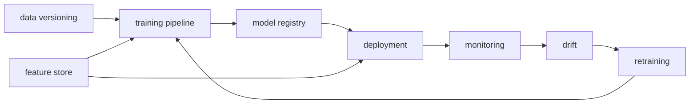

# Building a Production ML System

> MLOps 101 series (10/10)

<!-- a-grade-intro:begin -->

**Core question**: How do you assemble the *nine pieces* from this series into *one running production system*?

> *A production ML system runs the loop of data → training → deployment → monitoring → retraining automatically.*

<!-- a-grade-intro:end -->

## What You Will Learn

- The full system blueprint
- How nine components connect
- Runbooks and on-call
- Maturity stages
- Five common pitfalls

## Why It Matters

Knowing each tool individually does not give you a system. The wiring and the boundaries are the real work.

## Concept at a Glance



## Key Terms

- **MLOps maturity**: manual → automated → autonomous stages.
- **Runbook**: documented response to an alert.
- **On-call**: rotating responsibility for incidents.
- **SLI/SLO**: indicators and objectives.
- **Postmortem**: blameless review after an incident.

## Before/After

**Before**: notebook training, manual deploys, users report outages.

**After**: a DAG runs data → model → alerts on its own.

## Hands-on: Encode the Maturity Checklist

### Step 1 — Check items

```python
checks = {
    "data_versioned": True,
    "pipeline_dag": True,
    "model_registry": True,
    "container_image": True,
    "metrics_endpoint": True,
    "drift_alert": False,
    "retraining_trigger": False,
    "feature_store": False,
    "runbook": True,
}
```

### Step 2 — Maturity score

```python
def maturity(checks: dict) -> str:
    score = sum(checks.values())
    if score >= 8:
        return "production"
    if score >= 5:
        return "transitional"
    return "early"

print(maturity(checks))
```

### Step 3 — Report what is missing

```python
def missing(checks: dict) -> list:
    return [k for k, v in checks.items() if not v]

print(missing(checks))
```

### Step 4 — Pick the next thing

```python
def next_step(missing_items: list) -> str:
    priority = ["drift_alert", "retraining_trigger", "feature_store"]
    for p in priority:
        if p in missing_items:
            return p
    return "done"

print(next_step(missing(checks)))
```

### Step 5 — Status line for the team chat

```python
def status_line(checks: dict) -> str:
    return f"{maturity(checks)} | next={next_step(missing(checks))}"

print(status_line(checks))
```

## What to Notice in This Code

- A checklist as code makes progress visible.
- The maturity score is a shared bar.
- Picking the *next* one item is enough to keep moving.

## Five Common Mistakes

1. **Trying to install all components at once.**
2. **Buying tools while ignoring organizational change.**
3. **Wiring alerts before defining SLOs.**
4. **Going on-call without runbooks.**
5. **Repeating the same incident — no postmortem culture.**

## How This Shows Up in Production

A fintech runs a payments model on Airflow + MLflow + Feast + Prometheus, with on-call engineers paged using runbooks attached to every alert.

## How a Senior Engineer Thinks

- Start small, grow one component at a time.
- Make boundaries explicit (teams and systems).
- Alerts mean *action* — informational signals belong on dashboards.
- Change one thing at a time.
- Documentation is part of the system.

## Checklist

- [ ] Data versioning is in place.
- [ ] Training runs as a DAG.
- [ ] A model registry exists.
- [ ] Monitoring and drift detection are live.
- [ ] A retraining trigger is connected.
- [ ] Runbooks and on-call rotation exist.

## Practice Problems

1. Pick the three components your team lacks and draft a six-week rollout plan.
2. Which component is most likely to break a `99% < 200ms` SLO?
3. Name two organizational risks that automated retraining introduces.

## Wrap-up and Next Steps

This series gave you the basic circuitry of MLOps. Now go pick *one* component and ship it inside a real project.

<!-- toc:begin -->
- [What is MLOps?](./01-what-is-mlops.md)
- [Experiment Tracking](./02-experiment-tracking.md)
- [Data Versioning](./03-data-versioning.md)
- [Model Training Pipeline](./04-training-pipeline.md)
- [Model Deployment](./05-model-deployment.md)
- [Model Monitoring](./06-model-monitoring.md)
- [Data Drift and Model Drift](./07-data-and-model-drift.md)
- [Retraining](./08-retraining.md)
- [Feature Store](./09-feature-store.md)
- **Building a Production ML System (current)**
<!-- toc:end -->

## References

- [Google — MLOps maturity](https://cloud.google.com/architecture/mlops-continuous-delivery-and-automation-pipelines-in-machine-learning)
- [Microsoft — MLOps maturity model](https://learn.microsoft.com/azure/architecture/example-scenario/mlops/mlops-maturity-model)
- [Made With ML](https://madewithml.com/)
- [Hidden Technical Debt in ML Systems](https://papers.nips.cc/paper_files/paper/2015/hash/86df7dcfd896fcaf2674f757a2463eba-Abstract.html)

Tags: MLOps, Architecture, Production, DataScience, Pipeline
