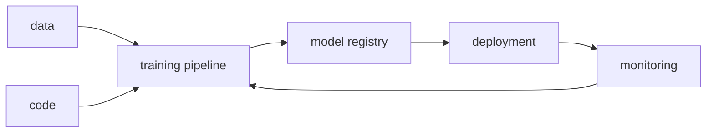

# MLOps란 무엇인가?

모델 하나를 잘 학습시키는 일과 그 모델을 서비스로 오래 운영하는 일은 전혀 다릅니다. 노트북 안에서는 정확도가 잘 나오는데 배포 뒤에는 재현이 안 되고, 데이터가 조금만 바뀌어도 결과가 흔들리고, 왜 성능이 떨어졌는지 설명할 기록도 남지 않는 경우가 흔합니다.

많은 팀이 여기서 같은 착각을 합니다. 모델만 좋아지면 운영도 따라 좋아질 거라고 생각하는 것입니다. 하지만 실제 프로덕션에서는 모델, 데이터, 코드, 배포, 모니터링, 재학습이 하나의 루프로 맞물려 돌아가야 시스템이 버팁니다.

이 글은 MLOps 101 시리즈의 첫 번째 글입니다.

여기서는 MLOps를 도구 이름 모음이 아니라, 모델이 프로덕션에서 살아남기 위해 필요한 운영 루프로 보겠습니다.

---

## 이 글에서 다룰 문제

- MLOps는 단순히 ML에 DevOps를 붙인 말과 무엇이 다를까요?
- 왜 정확도가 높은 모델도 운영 단계에서 금방 문제가 생길까요?
- 데이터, 코드, 모델을 함께 관리한다는 말은 실제로 무엇을 뜻할까요?
- 어떤 요소가 있어야 팀이 모델을 재현하고 배포하고 다시 개선할 수 있을까요?
- MLOps 성숙도는 보통 어떤 순서로 올라갈까요?

> 멘탈 모델: MLOps는 모델 파일 하나를 배포하는 기술이 아니라, 데이터 → 학습 → 등록 → 배포 → 모니터링 → 재학습으로 이어지는 반복 루프를 운영 가능하게 만드는 체계입니다.

---

## 왜 중요한가

현업에서 실패하는 ML 프로젝트는 대개 모델 성능보다 운영 구조에서 먼저 무너집니다. 지난주에 가장 잘 나온 실험을 오늘 다시 실행할 수 없고, 어떤 데이터로 학습했는지 기록이 없고, 배포된 모델이 어느 버전인지도 모른 채 서비스가 돌아가면 작은 문제도 금세 큰 장애로 번집니다.

그래서 MLOps의 출발점은 더 복잡한 플랫폼을 사오는 일이 아닙니다. 같은 입력이면 같은 결과를 다시 만들 수 있는지, 모델이 운영 중 어떤 상태인지 알 수 있는지, 문제가 생기면 어떤 루프로 되돌아갈지 먼저 정리하는 일입니다.

---

## 전체 흐름을 먼저 보겠습니다



이 그림이 MLOps의 핵심을 가장 간단하게 보여 줍니다. 데이터와 코드가 학습 파이프라인으로 들어가고, 결과 모델은 레지스트리에 등록된 뒤 배포됩니다. 배포가 끝나도 시스템은 멈추지 않고, 모니터링 결과가 다시 학습으로 이어지면서 운영 루프를 닫습니다.

중요한 점은 이 흐름이 일회성 배포 파이프라인이 아니라는 사실입니다. 모델은 시간이 지나면 낡고, 입력 분포는 바뀌고, 운영 조건도 달라집니다. MLOps는 바로 그 변화까지 시스템 안에서 다루려는 시도입니다.

---

## 먼저 잡아야 할 핵심 용어

- **MLOps**: ML과 DevOps를 결합해, 모델의 학습·배포·모니터링·재학습을 반복 가능한 운영 체계로 만드는 접근입니다.
- **CT(Continuous Training)**: 데이터나 성능 변화에 맞춰 모델을 다시 학습시키는 흐름입니다.
- **모델 레지스트리**: 학습된 모델 버전과 메타데이터를 보관하는 저장소입니다.
- **피처 스토어**: 학습과 서빙에서 같은 피처 정의를 재사용하게 해 주는 계층입니다.
- **드리프트**: 입력 데이터나 모델 성능이 시간에 따라 달라지는 현상입니다.

이 다섯 개만 먼저 머리에 넣어 두면, 이후 글에서 나오는 세부 도구와 패턴이 모두 같은 그림 안에 들어오기 시작합니다.

---

## 도입 전과 도입 후를 비교해 보겠습니다

**Before**: 노트북 하나에서 모델을 만들고, 수동으로 배포하고, 운영 상태는 사람 기억에 의존합니다.

**After**: 데이터와 모델 버전이 남고, 학습이 반복 가능하며, 예측 로그와 알림을 바탕으로 다시 개선 루프를 돌립니다.

차이는 자동화 유무만이 아닙니다. Before 상태에서는 문제를 설명할 증거가 거의 남지 않습니다. After 상태에서는 같은 모델을 다시 만들 수 있고, 어떤 변화가 있었는지도 추적할 수 있습니다.

---

## 작은 예제로 MLOps 루프를 따라가 보겠습니다

### 1단계 — 데이터를 스냅샷으로 남깁니다

```python
import hashlib, json
data = [{"x": 1, "y": 0}, {"x": 2, "y": 1}]
snap = hashlib.sha1(json.dumps(data).encode()).hexdigest()[:10]
print("data version:", snap)
```

아주 작은 예제지만 이 해시 한 줄이 중요합니다. 모델이 같은 코드로 다시 학습되지 않는 가장 흔한 이유는 코드가 아니라 데이터가 달라졌기 때문입니다. 데이터 버전을 남기면 학습 입력을 식별 가능한 상태로 고정할 수 있습니다.

### 2단계 — 모델을 학습합니다

```python
from sklearn.linear_model import LogisticRegression
import numpy as np
X = np.array([[1], [2], [3], [4]])
y = np.array([0, 0, 1, 1])
model = LogisticRegression().fit(X, y)
```

여기서는 단순한 로지스틱 회귀를 씁니다. 중요한 것은 모델 종류가 아니라, 이 학습 결과가 어떤 데이터와 어떤 코드에서 나왔는지 다시 연결할 수 있어야 한다는 점입니다.

### 3단계 — 모델을 레지스트리에 등록합니다

```python
import pickle, os
os.makedirs("registry", exist_ok=True)
with open("registry/model_v1.pkl", "wb") as f:
    pickle.dump(model, f)
```

처음부터 거대한 모델 레지스트리가 필요한 것은 아닙니다. 파일 하나라도 버전 규칙과 저장 위치를 정하면 그 순간부터 모델은 "한 번 돌려 본 결과물"이 아니라 관리 대상이 됩니다.

### 4단계 — 메타데이터를 함께 남깁니다

```python
meta = {"data_version": snap, "model_version": "v1", "metric": float(model.score(X, y))}
print(meta)
```

모델 파일만 따로 있으면 나중에 의미를 잃습니다. 어떤 데이터 버전에서 나왔는지, 성능이 어땠는지, 어떤 이름으로 등록했는지를 함께 남겨야 비교와 승격이 가능해집니다.

### 5단계 — 예측 로그를 남깁니다

```python
import time
log = {"ts": time.time(), "pred": int(model.predict([[5]])[0])}
print("log:", log)
```

이 단계가 운영의 출발점입니다. 배포된 모델은 결국 예측을 남기고, 그 예측의 분포와 지연 시간과 실패율을 바탕으로 다음 판단이 이뤄집니다. MLOps는 학습에서 끝나지 않고 이 로그에서 다시 시작합니다.

---

## 이 코드에서 먼저 봐야 할 점

- 데이터 해시는 재현성의 출발점입니다.
- 레지스트리는 처음에는 파일 시스템 수준으로도 시작할 수 있습니다.
- 메타데이터가 있어야 모델 파일이 운영 자산이 됩니다.
- 예측 로그가 있어야 모니터링과 드리프트 감지가 가능합니다.

이 예제는 작지만 MLOps의 기본 태도를 그대로 보여 줍니다. 데이터, 모델, 운영 신호를 각각 따로 보지 않고 하나의 연결된 흐름으로 취급한다는 점입니다.

---

## 자주 헷갈리는 지점

1. **모델만 버전 관리하고 데이터와 코드는 빼먹습니다.**
   이 상태에서는 같은 모델을 다시 만들 수 없습니다.
2. **배포만 되면 끝이라고 생각합니다.**
   실제 운영에서는 배포 뒤의 관측이 더 중요합니다.
3. **노트북을 그대로 프로덕션으로 밀어 넣습니다.**
   실험과 운영의 경계가 사라지면 재현성과 책임 경계가 함께 무너집니다.
4. **재학습을 사람 기억에 맡깁니다.**
   일정, 성능, 드리프트 기준이 없으면 팀마다 판단이 흔들립니다.
5. **모델 지표만 보고 비즈니스 지표는 보지 않습니다.**
   운영 모델은 정확도만으로 평가되지 않습니다.

---

## 실무에서는 이렇게 봅니다

추천 시스템, 사기 탐지, 수요 예측처럼 데이터가 빠르게 바뀌는 문제에서는 MLOps가 선택이 아니라 생존 조건에 가깝습니다. 모델이 한 번 잘 나온다고 끝나는 분야가 아니기 때문입니다. 반대로 데이터가 거의 변하지 않고 배치 실행만 필요한 문제라면, 아주 무거운 플랫폼보다 버전 관리와 배포 자동화부터 차근차근 갖추는 편이 현실적입니다.

시니어 엔지니어 관점에서는 정확도보다 루프를 먼저 봅니다. 이 모델이 어떤 데이터에서 나왔는지 설명할 수 있는가, 다시 학습할 수 있는가, 운영 신호가 남는가, 문제가 생기면 어느 단계로 돌아가야 하는가를 먼저 묻습니다.

---

## 체크리스트

- [ ] 데이터 버전이 남아 있다.
- [ ] 모델 버전이 남아 있다.
- [ ] 예측 로그를 수집한다.
- [ ] 재학습 기준이나 절차가 문서화되어 있다.

## 연습 문제

1. 최근 팀 모델 하나를 골라 데이터 해시를 어떻게 남길지 설계해 보세요.
2. 모델 파일과 메타데이터를 함께 저장하는 최소 레지스트리 구조를 적어 보세요.
3. 예측 로그에 어떤 필드를 남겨야 이후 모니터링이 쉬울지 정리해 보세요.

## 정리

MLOps는 모델을 더 잘 학습시키는 비법이 아니라, 모델이 운영 환경에서 계속 작동하도록 만드는 체계입니다. 핵심은 데이터, 코드, 모델, 운영 신호를 하나의 루프로 묶는 데 있습니다.

이 글에서 잡아야 할 문장은 하나입니다. **좋은 모델은 실험실에서 나오지만, 살아남는 모델은 MLOps 루프 안에서 만들어진다**는 점입니다. 다음 글에서는 그 루프의 첫 실무 도구인 실험 관리를 다루겠습니다.

<!-- toc:begin -->
- **MLOps란 무엇인가? (현재 글)**
- 실험 관리 (예정)
- 데이터 버전 관리 (예정)
- 모델 학습 파이프라인 (예정)
- 모델 배포 (예정)
- 모델 모니터링 (예정)
- 데이터 드리프트와 모델 드리프트 (예정)
- 재학습 (예정)
- 피처 스토어 (예정)
- 운영 가능한 ML 시스템 (예정)
<!-- toc:end -->

## 참고 자료

- [Google — MLOps levels](https://cloud.google.com/architecture/mlops-continuous-delivery-and-automation-pipelines-in-machine-learning)
- [ml-ops.org](https://ml-ops.org/)
- [Microsoft — MLOps maturity](https://learn.microsoft.com/en-us/azure/architecture/ai-ml/guide/mlops-maturity-model)
- [Sculley et al. — Hidden Tech Debt in ML](https://papers.nips.cc/paper_files/paper/2015/hash/86df7dcfd896fcaf2674f757a2463eba-Abstract.html)

Tags: MLOps, DevOps, MLSystem, Production, DataScience
