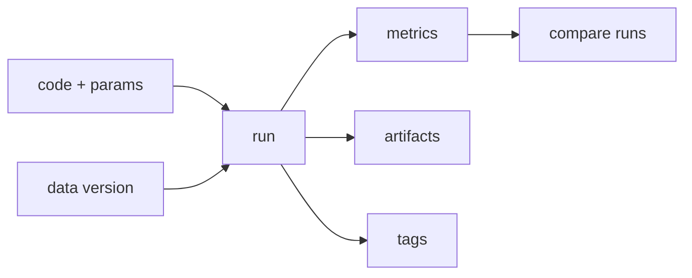

# 실험 관리

모델을 여러 번 학습하다 보면 어느 순간부터 기억이 먼저 무너집니다. 지난주에 가장 잘 나온 조합이 무엇이었는지, 그때 데이터 버전이 무엇이었는지, 왜 이번 결과가 달라졌는지 노트북 파일명만으로는 설명이 안 됩니다.

팀 단위로 작업할 때는 더 심각해집니다. 누군가는 `final_v2_really.pkl`을 남기고, 누군가는 메트릭을 슬랙에만 적어 두고, 누군가는 실패한 실험을 아예 기록하지 않습니다. 이 상태에서는 모델 개선보다 과거 복원이 더 어려운 일이 됩니다.

이 글은 MLOps 101 시리즈의 2번째 글입니다.

여기서는 실험 관리를 팀의 단기 기억 장치로 보고, 어떤 정보를 어떻게 남겨야 재현과 비교가 가능해지는지 정리하겠습니다.

---

## 이 글에서 다룰 문제

- 실험 관리가 없으면 왜 같은 모델도 다시 만들기 어려울까요?
- 파라미터, 메트릭, 아티팩트, 환경 중 무엇을 반드시 남겨야 할까요?
- MLflow에서 experiment와 run은 어떤 관계로 이해하면 좋을까요?
- 실패한 실험도 기록해야 하는 이유는 무엇일까요?
- 비교 가능한 기록 체계를 만들려면 팀이 무엇을 먼저 표준화해야 할까요?

> 멘탈 모델: 실험 관리 도구는 예쁜 대시보드가 아니라, 학습 실행 하나하나를 공통 포맷으로 적재하는 팀의 공유 기억 장치입니다.

---

## 왜 중요한가

실험 관리가 없으면 학습은 계속되는데 지식은 쌓이지 않습니다. 이번 주에 나온 최고 성능이 우연인지, 데이터 변화 덕분인지, 하이퍼파라미터 덕분인지 분리할 수 없기 때문입니다. 결국 모델 개선이 아니라 추측과 기억력 경쟁이 됩니다.

반대로 모든 run을 기록하면 모델 품질뿐 아니라 작업 과정도 자산이 됩니다. 실패한 실험이 남아 있으면 같은 실수를 반복하지 않고, 성공한 실험이 남아 있으면 승격 후보를 더 빨리 가를 수 있습니다.

---

## 전체 흐름을 먼저 보겠습니다



이 흐름은 실험 관리의 본질을 잘 보여 줍니다. 코드와 파라미터, 데이터 버전이 하나의 run으로 묶이고, 그 run에서 메트릭과 아티팩트와 태그가 나옵니다. 그 결과를 여러 run과 비교할 수 있어야 비로소 실험 관리가 됩니다.

즉, 실험 관리의 핵심은 저장 자체가 아니라 비교 가능성입니다. run이 많아지는 것은 자연스러운 일이고, 중요한 것은 그 run들을 같은 축에서 읽을 수 있는가입니다.

---

## 먼저 잡아야 할 핵심 개념

- **Experiment**: 관련 run들을 모아 두는 논리적 상자입니다.
- **Run**: 학습 한 번의 실행 단위입니다.
- **Param**: 학습 전에 정해지는 입력 값입니다.
- **Metric**: 실행 뒤 측정된 결과 값입니다.
- **Artifact**: 모델 파일, 그래프, 로그처럼 파일 형태로 남는 결과물입니다.

실무에서는 이 다섯 개를 얼마나 일관되게 쓰느냐가 더 중요합니다. 같은 의미의 메트릭을 팀원이 제각각 다른 이름으로 남기면 비교 화면이 금세 쓸모없어집니다.

---

## 도입 전과 도입 후를 비교해 보겠습니다

**Before**: `v3_final2.pkl` 같은 파일명이 사실상 기록 시스템을 대신합니다.

**After**: run 목록이 남고, MLflow 화면이나 API로 파라미터와 메트릭을 나란히 비교할 수 있습니다.

Before 상태에서는 최고 성능 모델을 다시 찾는 데도 사람 기억이 필요합니다. After 상태에서는 실패한 run까지 포함해 전체 탐색 과정을 읽을 수 있습니다.

---

## MLflow로 아주 작은 추적기를 만들어 보겠습니다

### 1단계 — 트래커를 준비합니다

```python
# pip install mlflow
import mlflow
mlflow.set_tracking_uri("file:./mlruns")
mlflow.set_experiment("demo")
```

이 단계는 기록을 어디에 남길지 정하는 과정입니다. 처음에는 로컬 파일 기반으로도 시작할 수 있지만, 팀이 함께 쓰기 시작하면 원격 서버가 필요해집니다.

### 2단계 — run 하나를 기록합니다

```python
from sklearn.datasets import make_classification
from sklearn.linear_model import LogisticRegression
X, y = make_classification(n_samples=500, random_state=0)

with mlflow.start_run():
    C = 1.0
    mlflow.log_param("C", C)
    m = LogisticRegression(C=C, max_iter=1000).fit(X, y)
    mlflow.log_metric("acc", m.score(X, y))
```

`with` 블록 하나가 run 경계입니다. 어떤 파라미터로 시작했고 어떤 메트릭으로 끝났는지를 이 블록 안에서 모읍니다. 실험 관리에서 가장 중요한 감각 중 하나가 바로 이 경계를 명시적으로 나누는 일입니다.

### 3단계 — 모델 아티팩트를 남깁니다

```python
import pickle, os
os.makedirs("art", exist_ok=True)
with mlflow.start_run():
    m = LogisticRegression().fit(X, y)
    with open("art/model.pkl", "wb") as f:
        pickle.dump(m, f)
    mlflow.log_artifact("art/model.pkl")
```

메트릭만 있으면 결과를 비교할 수는 있어도, 실제 산출물을 다시 가져오기는 어렵습니다. 모델 파일이나 시각화 결과까지 함께 남겨야 run이 운영 자산으로 이어집니다.

### 4단계 — 파라미터를 바꿔 여러 run을 만듭니다

```python
for C in [0.1, 1.0, 10.0]:
    with mlflow.start_run():
        mlflow.log_param("C", C)
        m = LogisticRegression(C=C, max_iter=1000).fit(X, y)
        mlflow.log_metric("acc", m.score(X, y))
```

이제 run이 여러 개 생깁니다. 실험 관리가 힘을 발휘하는 순간이 바로 여기입니다. 단일 run 저장은 로그일 뿐이고, 여러 run을 같은 기준으로 비교할 수 있어야 추적기가 됩니다.

### 5단계 — API로 비교합니다

```python
client = mlflow.tracking.MlflowClient()
exp = client.get_experiment_by_name("demo")
runs = client.search_runs(exp.experiment_id, order_by=["metrics.acc DESC"])
for r in runs[:3]:
    print(r.data.params, r.data.metrics)
```

실험 관리 도구를 쓰는 이유는 결국 비교를 자동화하기 위해서입니다. 상위 run을 바로 정렬해서 볼 수 있으면, 모델 선택 과정이 개인 감각이 아니라 공통 절차로 바뀝니다.

---

## 이 코드에서 먼저 봐야 할 점

- `with` 블록이 run의 경계를 만듭니다.
- param과 metric은 같은 이름 규칙으로 쌓여야 비교가 쉬워집니다.
- artifact는 파일 그대로 보존되므로 결과 재사용에 유리합니다.
- API 비교가 가능해져야 실험 선택이 수작업에서 벗어납니다.

실험 관리의 품질은 도구 선택보다 기록 규약에 더 크게 좌우됩니다. 팀마다 키 이름이 다르고, 일부 run만 남기고, 데이터 버전을 빼먹는 순간 기록은 있어도 비교는 불가능해집니다.

---

## 자주 헷갈리는 지점

1. **성공한 run만 남깁니다.**
   실패한 실험이 빠지면 탐색 과정이 사라지고 같은 실수를 반복합니다.
2. **데이터 버전을 기록하지 않습니다.**
   메트릭만 높아도 무엇이 바뀌었는지 알 수 없습니다.
3. **파라미터와 메트릭 이름을 제각각 씁니다.**
   비교 화면이 금세 읽기 어려워집니다.
4. **로컬 `mlruns`만 쓰고 공유 서버를 두지 않습니다.**
   팀의 기억이 개인 노트북에 갇힙니다.
5. **비교 규칙 없이 사람이 임의로 우승 모델을 고릅니다.**
   재현 가능한 승격 기준이 생기지 않습니다.

---

## 실무에서는 이렇게 봅니다

하이퍼파라미터 스윕, 주간 모델 리뷰, 챌린저 비교 같은 작업은 모두 실험 관리 체계 위에서 돌아갑니다. MLflow나 W&B 같은 도구는 단순히 로그를 저장하는 것이 아니라, 팀이 같은 run 테이블을 보며 의사결정하게 만드는 기반입니다.

시니어 엔지니어는 run 자체보다 run 메타데이터의 일관성을 먼저 봅니다. 데이터 버전을 param처럼 다루는지, 메트릭 키가 표준화되어 있는지, 실패한 run도 남기는지, 로컬이 아니라 공유 추적 서버를 기본값으로 두는지를 확인합니다.

---

## 체크리스트

- [ ] 모든 학습 실행이 run으로 기록된다.
- [ ] 데이터 버전과 코드 정보가 함께 남는다.
- [ ] 공유 추적 서버를 사용한다.
- [ ] 비교 화면이나 API를 기준으로 모델을 선택한다.

## 연습 문제

1. 파라미터 세 조합을 돌리고 상위 run을 출력해 보세요.
2. 데이터 해시를 param으로 추가해 보세요.
3. run tag를 사용해 실험 의도를 구분해 보세요.

## 정리

실험 관리는 팀의 단기 기억입니다. 모델을 계속 바꾸는 조직이라면, 무엇을 시도했고 무엇이 잘됐고 무엇이 실패했는지를 구조적으로 남겨야 합니다.

이 글에서 기억할 핵심은 하나입니다. **실험 추적이 있어야 모델 개선이 개인 기억이 아니라 팀 자산이 됩니다.** 다음 글에서는 그 기억을 더 오래 보존하는 데이터 버전 관리를 다루겠습니다.

<!-- toc:begin -->
- [MLOps란 무엇인가?](./01-what-is-mlops.md)
- **실험 관리 (현재 글)**
- 데이터 버전 관리 (예정)
- 모델 학습 파이프라인 (예정)
- 모델 배포 (예정)
- 모델 모니터링 (예정)
- 데이터 드리프트와 모델 드리프트 (예정)
- 재학습 (예정)
- 피처 스토어 (예정)
- 운영 가능한 ML 시스템 (예정)
<!-- toc:end -->

## 참고 자료

- [MLflow — Tracking](https://mlflow.org/docs/latest/tracking.html)
- [Weights & Biases](https://docs.wandb.ai/)
- [Neptune.ai — Comparison](https://neptune.ai/blog/best-ml-experiment-tracking-tools)
- [Google — Reproducible ML](https://cloud.google.com/architecture/ml-on-gcp-best-practices)

Tags: MLOps, ExperimentTracking, MLflow, Reproducibility, DataScience
