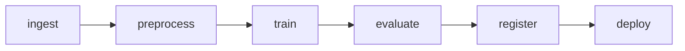

# 모델 학습 파이프라인

> MLOps 101 시리즈 (4/10)


## 이 글에서 다룰 문제

*수동 학습* 은 *재현 불가* + *지연* + *팀 병목*. *파이프라인* 은 *자동* 이고 *감사 가능*.

## 전체 흐름


## Before/After

**Before**: *train.py* 를 *cron 으로 돌리고 손가락으로 빌기*.

**After**: *DAG* 정의 → *재시도/알림/캐싱* 자동.

## 5단계 미니 파이프라인

### 1단계 — 단계 함수

```python
import pandas as pd

def ingest():
    df = pd.DataFrame({"x": range(50), "y": [i % 2 for i in range(50)]})
    df.to_csv("/tmp/raw.csv", index=False)
    return "/tmp/raw.csv"
```

### 2단계 — 전처리

```python
def preprocess(path):
    df = pd.read_csv(path)
    df["x"] = (df["x"] - df["x"].mean()) / df["x"].std()
    out = "/tmp/clean.csv"
    df.to_csv(out, index=False)
    return out
```

### 3단계 — 학습

```python
import pickle
from sklearn.linear_model import LogisticRegression

def train(path):
    df = pd.read_csv(path)
    m = LogisticRegression().fit(df[["x"]], df["y"])
    with open("/tmp/model.pkl", "wb") as f:
        pickle.dump(m, f)
    return "/tmp/model.pkl"
```

### 4단계 — 평가

```python
def evaluate(path, model_path):
    df = pd.read_csv(path)
    with open(model_path, "rb") as f:
        m = pickle.load(f)
    return float(m.score(df[["x"]], df["y"]))
```

### 5단계 — 오케스트레이션

```python
def run():
    raw = ingest()
    clean = preprocess(raw)
    model = train(clean)
    metric = evaluate(clean, model)
    print({"metric": metric, "model": model})

run()
```

## 이 코드에서 주목할 점

- 각 단계는 *함수 + 파일 입출력*.
- *오케스트레이터* 는 *DAG 순서* 만 정함.
- *Airflow* 는 위 함수들을 *Operator* 로 감싼다.

## 자주 하는 실수 5가지

1. ***단계가 너무 큼* → *실패시 전체 재실행*.**
2. ***Idempotent* 가 아님 (랜덤 시드 미고정).**
3. ***출력 경로* 가 *고정* → *동시 실행 충돌*.**
4. ***재시도* 정책 미정.**
5. ***알림* 없음 → *조용한 실패*.**

## 실무에서는 이렇게 쓰입니다

*매일 새벽* *Airflow* 로 *데이터 → 모델 → 등록* 자동. *주간 보고서* 는 같은 DAG 의 *마지막 단계*.

## 체크리스트

- [ ] 단계가 *작고 명확*.
- [ ] 단계마다 *입출력 명시*.
- [ ] *재시도/알림* 설정.
- [ ] *DAG* 그림이 있다.

## 정리 및 다음 단계

학습 파이프라인은 *반복 가능* 의 *기반* 입니다. 다음 글은 *모델 배포* 로 *학습된 모델* 을 *서비스화* 합니다.

<!-- toc:begin -->
- [MLOps란 무엇인가?](./01-what-is-mlops.md)
- [실험 관리](./02-experiment-tracking.md)
- [데이터 버전 관리](./03-data-versioning.md)
- **모델 학습 파이프라인 (현재 글)**
- 모델 배포 (예정)
- 모델 모니터링 (예정)
- Data Drift와 Model Drift (예정)
- 재학습 (예정)
- Feature Store (예정)
- 운영 가능한 ML 시스템 (예정)
<!-- toc:end -->

## 참고 자료

- [Apache Airflow](https://airflow.apache.org/docs/)
- [Prefect](https://docs.prefect.io/)
- [Kubeflow Pipelines](https://www.kubeflow.org/docs/components/pipelines/)
- [Google — TFX](https://www.tensorflow.org/tfx)

Tags: MLOps, Pipeline, Airflow, DAG, DataScience
