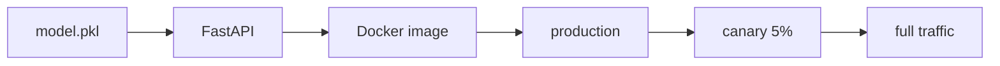

# 모델 배포

모델 학습이 끝났다고 서비스가 생기는 것은 아닙니다. 학습된 파일을 어떤 프로세스가 읽고, 어떤 입력을 검증하고, 어떤 환경에서 실행할지 정해지지 않으면 좋은 모델도 운영에서는 금방 흔들립니다.

현업에서 배포가 어렵다고 할 때는 대개 모델 자체보다 환경 차이, 버전 추적 부재, 롤백 불가능 상태를 말합니다. 그래서 모델 배포의 핵심은 파일을 서버에 올리는 일이 아니라, 재현 가능한 실행 환경과 안전한 전환 절차를 만드는 데 있습니다.

이 글은 MLOps 101 시리즈의 5번째 글입니다.

여기서는 학습된 모델을 API와 컨테이너로 감싸는 기본 흐름을 보고, 왜 카나리나 롤백 같은 운영 절차가 함께 필요해지는지 정리하겠습니다.

---

## 이 글에서 다룰 문제

- 학습된 모델 파일을 어떻게 사용자 요청에 연결할 수 있을까요?
- 온라인 추론, 배치 추론, 스트리밍 추론은 어떤 차이로 이해하면 좋을까요?
- FastAPI와 Docker는 모델 배포에서 어떤 역할을 할까요?
- 왜 버전 태그와 헬스 체크가 운영의 기본값이어야 할까요?
- Blue/Green과 Canary는 언제 어떤 위험을 줄여 줄까요?

> 멘탈 모델: 모델 배포는 모델 파일을 API나 배치 작업 안에 넣고, 그 실행 환경 전체를 버전 가능한 아티팩트로 묶어 운영에 올리는 과정입니다.

---

## 왜 중요한가

많은 팀이 배포를 어렵게 만드는 원인을 모델 복잡도에서 찾지만, 실제로는 환경 불일치와 무계획 롤백이 더 자주 문제를 만듭니다. 로컬에서는 잘 돌던 모델이 서버에서는 라이브러리 버전 차이로 깨지고, 새 버전이 이상해도 이전 버전으로 되돌리는 절차가 없으면 장애가 길어집니다.

그래서 배포는 학습의 마지막 단계가 아니라 운영의 첫 단계입니다. 어떤 버전이 살아 있는지, 어디까지 트래픽을 보낼지, 이상 징후가 보이면 어떻게 되돌릴지부터 함께 설계해야 합니다.

---

## 전체 흐름을 먼저 보겠습니다



이 그림은 모델 배포를 파일 복사 작업이 아니라 전달 경로로 보게 해 줍니다. 모델 파일은 API 안으로 들어가고, API는 Docker 이미지로 묶이고, 이미지는 프로덕션에 배포된 뒤 점진적으로 트래픽을 받습니다.

즉, 모델 배포는 "모델 + 실행 코드 + 런타임 환경 + 전환 정책"의 묶음입니다.

---

## 먼저 잡아야 할 핵심 개념

- **온라인 추론**: 요청을 받으면 즉시 예측을 반환하는 방식입니다.
- **배치 추론**: 대량 데이터를 일정 주기로 처리하는 방식입니다.
- **Blue/Green**: 두 환경을 병렬로 두고 전환하는 배포 방식입니다.
- **Canary**: 소량 트래픽부터 새 버전에 보내는 방식입니다.
- 롤백: 문제가 생겼을 때 이전 버전으로 되돌리는 절차입니다.

이 개념을 먼저 분리해 두면, 왜 어떤 모델은 API로 가고 어떤 모델은 배치 작업으로 가는지 자연스럽게 이해됩니다.

---

## 도입 전과 도입 후를 비교해 보겠습니다

**Before**: 노트북에서 `predict`를 직접 호출해 결과를 확인합니다.

**After**: 컨테이너가 HTTP 엔드포인트를 노출하고, 버전 태그와 헬스 체크를 함께 운영합니다.

Before 상태에서는 사람이 모델을 대신 호출합니다. After 상태에서는 서비스가 모델을 대신 호출하고, 운영 시스템이 그 상태를 감시합니다.

---

## FastAPI와 Docker로 작은 서빙 경로를 만들어 보겠습니다

### 1단계 — 모델 파일을 준비합니다

```python
import pickle
from sklearn.linear_model import LogisticRegression

m = LogisticRegression().fit([[0], [1], [2], [3]], [0, 0, 1, 1])
with open("model.pkl", "wb") as f:
    pickle.dump(m, f)
```

배포의 출발점은 학습 코드가 아니라 아티팩트입니다. 운영 환경에서는 모델이 코드 안에 숨어 있는 값이 아니라, 외부에서 로드되는 파일이어야 교체와 롤백이 쉬워집니다.

### 2단계 — FastAPI 앱으로 감쌉니다

```python
from fastapi import FastAPI
from pydantic import BaseModel
import pickle

app = FastAPI()
model = pickle.load(open("model.pkl", "rb"))

class Req(BaseModel):
    x: float

@app.post("/predict")
def predict(r: Req):
    p = model.predict([[r.x]])[0]
    return {"prediction": int(p)}
```

이 코드는 모델을 요청-응답 인터페이스로 바꾸는 최소 형태입니다. 입력 스키마를 분리하는 이유는 운영에서 잘못된 요청이 서버 전체를 흔드는 일을 막기 위해서입니다.

### 3단계 — 헬스 체크를 둡니다

```python
@app.get("/healthz")
def health():
    return {"ok": True, "version": "1.0.0"}
```

헬스 체크는 단순 편의 기능이 아닙니다. 오케스트레이터나 로드 밸런서가 어떤 인스턴스에 트래픽을 보내도 되는지 판단하는 기준이 됩니다.

### 4단계 — Docker 이미지로 고정합니다

```dockerfile
FROM python:3.11-slim
WORKDIR /app
COPY requirements.txt .
RUN pip install -r requirements.txt
COPY . .
CMD ["uvicorn", "main:app", "--host", "0.0.0.0", "--port", "8000"]
```

컨테이너는 모델 서빙 환경을 재현 가능한 아티팩트로 묶어 줍니다. 같은 이미지 태그면 같은 실행 환경이라는 합의를 만들 수 있기 때문에 배포와 롤백이 훨씬 단순해집니다.

### 5단계 — 빌드하고 실행합니다

```bash
docker build -t model-api:1.0.0 .
docker run -p 8000:8000 model-api:1.0.0
curl -X POST localhost:8000/predict -H "Content-Type: application/json" -d '{"x": 2.5}'
```

여기서 `model-api:1.0.0` 같은 태그가 왜 중요한지 봐야 합니다. 운영 중인 모델이 무엇인지, 문제 발생 시 무엇으로 되돌릴지, 카나리 대상이 어느 버전인지 모두 이 태그 체계에 달려 있습니다.

---

## 이 코드에서 먼저 봐야 할 점

- 모델은 요청마다 로드하지 않고 시작 시 한 번만 읽습니다.
- 입력 검증이 있어야 잘못된 페이로드가 장애로 번지지 않습니다.
- 헬스 체크는 트래픽 제어와 배포 자동화의 기준입니다.
- 이미지 태그가 곧 배포 단위 버전이 됩니다.

배포를 안정적으로 만드는 요소는 화려한 플랫폼보다 이런 기본 계약에 더 가깝습니다. 입력, 버전, 상태 확인, 롤백 경로가 분명해야 운영이 쉬워집니다.

---

## 자주 헷갈리는 지점

1. **버전 태그 없이 배포합니다.**
   어떤 모델이 살아 있는지 알 수 없습니다.
2. **`requirements.txt`를 고정하지 않습니다.**
   같은 코드인데 다른 환경이 됩니다.
3. **롤백 절차를 문서화하지 않습니다.**
   사고가 나면 되돌리는 시간부터 길어집니다.
4. **모델과 코드를 너무 강하게 묶습니다.**
   모델 교체가 배포 전체 변경으로 번집니다.
5. **입력 검증을 생략합니다.**
   잘못된 요청이 서버 안정성을 무너뜨립니다.

---

## 실무에서는 이렇게 봅니다

추천 모델은 FastAPI와 Docker를 묶어 Kubernetes 위에서 온라인 추론으로 돌리고, 주간 리포트는 배치 작업으로 따로 돌리는 식의 분리가 흔합니다. 같은 모델이라도 응답 시간 요구와 호출 패턴이 다르면 배포 형태도 달라집니다.

시니어 엔지니어는 배포를 모델 교체 문제가 아니라 폭발 반경 관리 문제로 봅니다. 그래서 카나리, 헬스 체크, 이미지 태그, 환경 변수 주입, 롤백 절차를 처음부터 함께 봅니다.

---

## 체크리스트

- [ ] `Dockerfile`이 있다.
- [ ] 헬스 체크 엔드포인트가 있다.
- [ ] 입력 스키마를 검증한다.
- [ ] 롤백 계획이 문서화되어 있다.

## 연습 문제

1. 모델 SHA를 반환하는 `/version` 엔드포인트를 설계해 보세요.
2. Nginx 가중치 기반 카나리 전환 흐름을 그림으로 적어 보세요.
3. 이 모델을 배치 추론 작업으로 바꾸면 무엇이 달라질지 정리해 보세요.

## 정리

모델 배포는 학습 결과를 서비스 인터페이스와 실행 환경 안으로 옮기는 일입니다. 여기서 중요한 것은 단순 배포 성공이 아니라, 같은 환경을 다시 만들 수 있고 문제 시 되돌릴 수 있는가입니다.

이 글에서 기억할 핵심은 하나입니다. **배포는 모델을 노출하는 단계가 아니라, 운영 위험을 제어하는 단계입니다.** 다음 글에서는 배포된 모델을 어떻게 관찰할지, 즉 모델 모니터링을 다루겠습니다.

<!-- toc:begin -->
- [MLOps란 무엇인가?](./01-what-is-mlops.md)
- [실험 관리](./02-experiment-tracking.md)
- [데이터 버전 관리](./03-data-versioning.md)
- [모델 학습 파이프라인](./04-training-pipeline.md)
- **모델 배포 (현재 글)**
- 모델 모니터링 (예정)
- 데이터 드리프트와 모델 드리프트 (예정)
- 재학습 (예정)
- 피처 스토어 (예정)
- 운영 가능한 ML 시스템 (예정)
<!-- toc:end -->

## 참고 자료

- [FastAPI documentation](https://fastapi.tiangolo.com/)
- [Docker — Dockerfile best practices](https://docs.docker.com/develop/develop-images/dockerfile_best-practices/)
- [BentoML](https://docs.bentoml.com/)
- [Seldon Core](https://docs.seldon.io/projects/seldon-core/en/latest/)

Tags: MLOps, Deployment, FastAPI, Docker, DataScience
