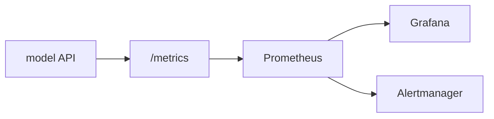

# 모델 모니터링

> MLOps 101 시리즈 (6/10)


## 이 글에서 다룰 문제

정확도만 보면 늦습니다. 지연시간, 에러율, 입력 분포가 먼저 흔들립니다.

## 전체 흐름


## Before/After

**Before**: *사용자 신고* 로 *사고 인지*.

**After**: 알림이 팀 채널로 자동 전송됩니다.

## FastAPI에 Prometheus 메트릭 붙이기

### 1단계 — 의존성

```bash
pip install prometheus-client
```

### 2단계 — 카운터 + 히스토그램

```python
from prometheus_client import Counter, Histogram

REQS = Counter("predict_requests_total", "total predict requests")
LAT = Histogram("predict_latency_seconds", "predict latency")
```

### 3단계 — FastAPI 통합

```python
import time
from fastapi import FastAPI
from prometheus_client import make_asgi_app

app = FastAPI()
app.mount("/metrics", make_asgi_app())

@app.post("/predict")
def predict(x: float):
    start = time.time()
    REQS.inc()
    result = {"prediction": int(x > 0.5)}
    LAT.observe(time.time() - start)
    return result
```

### 4단계 — 예측 분포 메트릭

```python
PRED = Counter("predict_class_total", "predicted class", ["cls"])

def record(p: int):
    PRED.labels(cls=str(p)).inc()
```

### 5단계 — 알림 규칙 (Prometheus rule)

```yaml
groups:
  - name: model
    rules:
      - alert: HighLatency
        expr: histogram_quantile(0.99, rate(predict_latency_seconds_bucket[5m])) > 0.5
        for: 5m
        labels:
          severity: warning
```

## 이 코드에서 주목할 점

- `/metrics` 엔드포인트는 Prometheus가 주기적으로 수집합니다.
- Histogram으로 분위수를 계산할 수 있습니다.
- *Label* 로 *분류 분포* 추적.

## 자주 하는 실수 5가지

1. ***시스템 메트릭만* 보기 (CPU 만).**
2. ***예측 분포* 미수집 → *Drift 감지 불가*.**
3. ***알림이 너무 많음* → *알람 피로*.**
4. ***SLO* 정의 없음.**
5. ***대시보드* 없음.**

## 실무에서는 이렇게 쓰입니다

*결제 사기 모델* 은 *분당 1회* 메트릭 수집 + *임계 초과* 시 *온콜 호출*.

## 체크리스트

- [ ] `/metrics` 엔드포인트.
- [ ] *지연시간 + 에러율* 알림.
- [ ] *예측 분포* 카운터.
- [ ] 런북 링크가 있다.

## 정리 및 다음 단계

모니터링은 Drift 감지의 전제입니다. 다음 글은 Data Drift / Model Drift로 예측 분포 변화를 다룹니다.

<!-- toc:begin -->
- [MLOps란 무엇인가?](./01-what-is-mlops.md)
- [실험 관리](./02-experiment-tracking.md)
- [데이터 버전 관리](./03-data-versioning.md)
- [모델 학습 파이프라인](./04-training-pipeline.md)
- [모델 배포](./05-model-deployment.md)
- **모델 모니터링 (현재 글)**
- Data Drift와 Model Drift (예정)
- 재학습 (예정)
- Feature Store (예정)
- 운영 가능한 ML 시스템 (예정)
<!-- toc:end -->

## 참고 자료

- [Prometheus 공식 문서](https://prometheus.io/docs/)
- [prometheus-client (Python)](https://github.com/prometheus/client_python)
- [Grafana 공식 문서](https://grafana.com/docs/)
- [Google SRE — SLO](https://sre.google/workbook/implementing-slos/)

Tags: MLOps, Monitoring, Prometheus, Observability, DataScience
