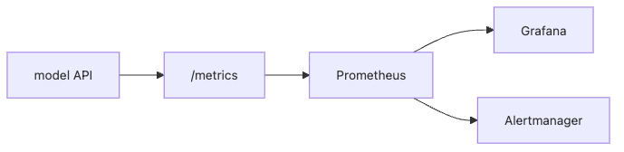

# 모델 모니터링

배포까지 끝낸 모델은 겉으로는 조용합니다. 요청도 받고 응답도 잘 주는 것처럼 보이는데, 실제로는 지연 시간이 조금씩 늘고 있거나 예측 분포가 한쪽으로 쏠리고 있을 수 있습니다. 이 단계의 문제는 대부분 사용자가 먼저 느끼기 전까지 잘 드러나지 않습니다.

그래서 모델 모니터링은 단순 운영 부가 기능이 아닙니다. 모델이 살아 있다는 사실만 확인하는 것이 아니라, 지금 이 모델이 정상적으로 예측하고 있는지, 곧 문제가 생길 조짐은 없는지를 계속 읽는 장치입니다.

이 글은 MLOps 101 시리즈의 6번째 글입니다.

여기서는 모델 모니터링을 시스템 메트릭, 모델 메트릭, 비즈니스 메트릭이 만나는 관측 계층으로 보고, Prometheus 중심의 최소 구성을 정리하겠습니다.

---

## 이 글에서 다룰 문제

- 정확도만 봐서는 왜 운영 문제를 너무 늦게 알게 될까요?
- 메트릭, 로그, 트레이스는 무엇이 다를까요?
- Prometheus와 Grafana는 모델 운영에서 어떤 역할을 할까요?
- 예측 분포를 남기는 일이 왜 드리프트 감지의 출발점일까요?
- 사람이 실제로 대응할 수 있는 알림 규칙은 어떻게 설계해야 할까요?

> 멘탈 모델: 모델 모니터링은 서버 상태만 보는 일이 아니라, 요청 처리 상태와 예측 결과의 분포를 함께 관찰해 운영 문제를 조기에 드러내는 감시 계층입니다.

---

## 왜 중요한가

정확도는 보통 늦게 옵니다. 라벨이 바로 생기지 않는 서비스라면 더 그렇습니다. 반면 지연 시간, 오류율, 입력 분포, 예측 클래스 분포 같은 신호는 훨씬 먼저 흔들립니다. 즉, 운영 중인 모델은 정확도 하나로만 볼 수 없습니다.

또한 모니터링이 없으면 배포는 사실상 눈 감고 운전하는 것과 비슷합니다. 문제가 생겨도 언제부터 이상했는지, 어느 버전에서 시작됐는지, 시스템 문제인지 모델 문제인지 나눌 근거가 부족해집니다.

---

## 전체 흐름을 먼저 보겠습니다



*모델 모니터링 수집 경로*
이 구성은 모델 모니터링의 가장 기본적인 형태입니다. 애플리케이션이 `/metrics` 엔드포인트로 시계열 메트릭을 노출하고, Prometheus가 주기적으로 긁어 오고, Grafana가 시각화하고, Alertmanager가 임계값을 넘는 상황을 사람에게 전달합니다.

여기서 중요한 것은 메트릭 수집이 자동이어야 한다는 점입니다. 사람 손으로 대시보드를 열어 확인하는 체계는 운영 체계가 아니라 점검 습관에 가깝습니다.

---

## 먼저 잡아야 할 핵심 개념

- 메트릭: 시간에 따라 쌓이는 숫자 시계열입니다.
- 로그: 개별 이벤트를 텍스트로 남긴 기록입니다.
- **트레이스**: 요청 하나가 여러 계층을 거치는 경로입니다.
- **SLO**: 예를 들어 99% 요청이 200ms 이내여야 한다는 목표입니다.
- 알림: 임계값을 넘었을 때 사람이나 자동화에 전달되는 신호입니다.

모니터링은 이 다섯 요소를 분리해서 이해할 때 훨씬 명확해집니다. 숫자를 계속 보는 것과, 사건을 자세히 복기하는 것은 같은 일이 아닙니다.

---

## 도입 전과 도입 후를 비교해 보겠습니다

**Before**: 사용자가 느리다고 말해야 문제를 알게 됩니다.

**After**: 지연 시간과 오류율 알림이 자동으로 팀 채널에 들어옵니다.

Before 상태에서는 장애 인지 시점이 늦고 맥락도 부족합니다. After 상태에서는 사람이 받는 첫 신호부터 어느 지표가 깨졌는지 드러납니다.

---

## FastAPI 모델에 메트릭을 붙여 보겠습니다

### 1단계 — 의존성을 설치합니다

```bash
pip install prometheus-client
```

모니터링은 별도 시스템처럼 보이지만, 출발점은 애플리케이션 안에서 어떤 숫자를 밖으로 내보낼지 정하는 일입니다.

### 2단계 — 카운터와 히스토그램을 정의합니다

```python
from prometheus_client import Counter, Histogram

REQS = Counter("predict_requests_total", "total predict requests")
LAT = Histogram("predict_latency_seconds", "predict latency")
```

요청 수와 지연 시간은 가장 기본적인 운영 지표입니다. 특히 히스토그램은 평균값 하나보다 더 실전적입니다. 나중에 p95, p99 같은 분위수를 계산할 수 있기 때문입니다.

### 3단계 — FastAPI와 연결합니다

```python
import time
from fastapi import FastAPI
from prometheus_client import make_asgi_app

app = FastAPI()
app.mount("/metrics", make_asgi_app())

@app.post("/predict")
def predict(x: float):
    start = time.time()
    REQS.inc()
    result = {"prediction": int(x > 0.5)}
    LAT.observe(time.time() - start)
    return result
```

이 코드는 메트릭 수집이 요청 처리 경로 안에서 자연스럽게 이뤄지게 만듭니다. 운영 관점에서 중요한 점은 추론 코드를 따로 복잡하게 바꾸지 않아도, 관측용 신호를 함께 남길 수 있다는 것입니다.

### 4단계 — 예측 분포를 기록합니다

```python
PRED = Counter("predict_class_total", "predicted class", ["cls"])

def record(p: int):
    PRED.labels(cls=str(p)).inc()
```

시스템 메트릭만 보면 서버는 멀쩡한데 모델이 이상해지는 상황을 놓치기 쉽습니다. 예측 클래스 분포 같은 모델 고유 지표를 같이 남겨야 드리프트의 전조를 볼 수 있습니다.

### 5단계 — 알림 규칙을 둡니다

```yaml
groups:
  - name: model
    rules:
      - alert: HighLatency
        expr: histogram_quantile(0.99, rate(predict_latency_seconds_bucket[5m])) > 0.5
        for: 5m
        labels:
          severity: warning
```

**Expected effect:** p99 지연 시간이 5분 동안 기준을 넘을 때만 경고가 올라와, 일시적인 스파이크와 실제 이상 상황을 구분할 수 있어야 합니다.

알림 규칙의 핵심은 숫자를 많이 만드는 데 있지 않습니다. 사람이 실제로 대응할 수 있는 신호만 골라 보내야 합니다. 그렇지 않으면 알람 피로가 오고, 중요한 경고도 무뎌집니다.

---

## 경고가 울리면 가장 먼저 볼 것

모니터링에서 중요한 것은 지표 수집 자체보다, 경고를 받았을 때 첫 5분 안에 무엇을 볼지 정해 두는 일입니다.

### 1단계 — 런타임 문제인지 모델 문제인지 먼저 가릅니다

```text
p95/p99 latency, error rate, request volume을 함께 봅니다.
```

지연 시간과 오류율이 같이 튀면 먼저 런타임 경로를 봐야 하고, 지연 시간은 안정적인데 예측 분포만 바뀌면 데이터/모델 쪽부터 보는 편이 맞습니다.

### 2단계 — 예측 분포가 비즈니스 지표보다 먼저 흔들렸는지 봅니다

```text
최근 클래스 분포를 직전 정상 구간과 비교합니다.
```

예측 분포가 먼저 흔들렸다면, 서빙 인프라보다 입력 분포 변화나 드리프트 가능성을 먼저 점검해야 합니다.

### 3단계 — 알림에 다음 행동 문서가 연결되어 있는지 확인합니다

```yaml
annotations:
  runbook: https://internal.example/runbooks/model-latency
```

런북 링크가 없는 알림은 상태 표시등에 가깝고, 실제 대응 도구로는 약합니다.

---

## 이 코드에서 먼저 봐야 할 점

- `/metrics` 엔드포인트를 Prometheus가 주기적으로 수집합니다.
- 히스토그램은 나중에 분위수 계산으로 이어집니다.
- 레이블을 쓰면 하나의 카운터로 여러 분포를 추적할 수 있습니다.
- 모델 메트릭이 있어야 드리프트 감지가 가능합니다.

결국 좋은 모니터링은 많이 남기는 것이 아니라, 운영 판단에 필요한 숫자를 정확한 위치에 남기는 일입니다.

---

## 자주 헷갈리는 지점

1. **CPU와 메모리만 봅니다.**
   서버는 정상인데 모델이 이상한 상황을 놓칩니다.
2. **예측 분포를 기록하지 않습니다.**
   드리프트가 조용히 지나갑니다.
3. **알림을 너무 많이 만듭니다.**
   사람이 어느 순간부터 아무 경고도 믿지 않게 됩니다.
4. **SLO 없이 임계값을 정합니다.**
   왜 그 숫자가 중요한지 팀 합의가 없습니다.
5. **대시보드나 런북이 없습니다.**
   경고를 받아도 바로 다음 행동으로 이어지지 않습니다.

---

## 실무에서는 이렇게 봅니다

결제 사기 탐지 모델처럼 지연 시간과 오탐 비용이 모두 민감한 서비스에서는 시스템 메트릭, 모델 출력 분포, 비즈니스 KPI를 함께 봅니다. 어떤 경고는 대시보드로만 보내고, 어떤 경고는 온콜을 깨울지 구분하는 것도 중요합니다.

시니어 엔지니어는 모니터링을 관찰이 아니라 대응 체계로 봅니다. 모든 알림에는 대응 문서가 붙어야 하고, 대시보드는 5초 안에 읽혀야 하며, 사람을 깨우는 경고는 반드시 행동으로 이어져야 한다고 봅니다.

---

## 체크리스트

- [ ] `/metrics` 엔드포인트가 있다.
- [ ] 지연 시간과 오류율 알림이 설정되어 있다.
- [ ] 예측 분포를 추적한다.
- [ ] 각 알림에 대응 문서가 연결되어 있다.

## 연습 문제

1. 오류율이 1%를 넘으면 울리는 알림 규칙을 적어 보세요.
2. 분당 평균 입력값을 기록하는 메트릭을 설계해 보세요.
3. 첫 Grafana 화면에 어떤 위젯 네 개를 둘지 골라 보세요.

## 정리

모니터링은 배포 뒤에 붙는 옵션이 아니라, 모델을 운영 자산으로 다루기 위한 기본 관측 장치입니다. 정확도만 기다리면 너무 늦고, 운영 신호를 먼저 봐야 문제를 조기에 잡을 수 있습니다.

이 글에서 기억할 핵심은 하나입니다. **모델이 살아 있는지보다, 지금 어떤 상태로 살아 있는지를 알아야 운영이 됩니다.** 다음 글에서는 그 신호를 바탕으로 데이터 드리프트와 모델 드리프트를 어떻게 구분할지 다루겠습니다.

<!-- toc:begin -->
- [MLOps란 무엇인가?](./01-what-is-mlops.md)
- [실험 관리](./02-experiment-tracking.md)
- [데이터 버전 관리](./03-data-versioning.md)
- [모델 학습 파이프라인](./04-training-pipeline.md)
- [모델 배포](./05-model-deployment.md)
- **모델 모니터링 (현재 글)**
- 데이터 드리프트와 모델 드리프트 (예정)
- 재학습 (예정)
- 피처 스토어 (예정)
- 운영 가능한 ML 시스템 (예정)
<!-- toc:end -->

## 참고 자료

- [Prometheus documentation](https://prometheus.io/docs/)
- [prometheus-client (Python)](https://github.com/prometheus/client_python)
- [Grafana documentation](https://grafana.com/docs/)
- [Google SRE workbook — SLOs](https://sre.google/workbook/implementing-slos/)

Tags: MLOps, Monitoring, Prometheus, Observability, DataScience
