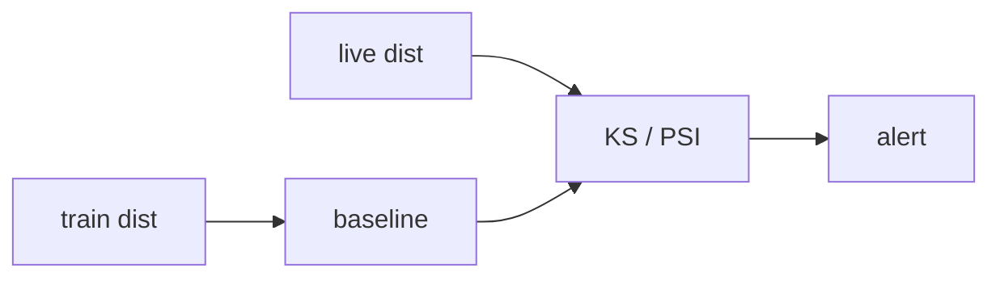

# Data Drift와 Model Drift

> MLOps 101 시리즈 (7/10)


## 이 글에서 다룰 문제

세상은 변합니다. 학습 시점의 분포가 영원히 유지되지는 않습니다. Drift를 놓치면 조용한 손실이 누적됩니다.

## 전체 흐름


## Before/After

**Before**: 정확도가 떨어진 뒤에야 문제를 알아챕니다.

**After**: *입력 PSI > 0.2* 가 뜨면 *조사 시작*.

## PSI로 Data Drift 감지

### 1단계 — 기준/현재 데이터

```python
import numpy as np

base = np.random.normal(0, 1, 1000)
live = np.random.normal(0.5, 1, 1000)
```

### 2단계 — 구간 나누기

```python
def bin_edges(x, n=10):
    return np.quantile(x, np.linspace(0, 1, n + 1))
```

### 3단계 — PSI 계산

```python
def psi(base, live, n=10):
    edges = bin_edges(base, n)
    edges[0], edges[-1] = -np.inf, np.inf
    b, _ = np.histogram(base, edges)
    l, _ = np.histogram(live, edges)
    bp = b / b.sum() + 1e-6
    lp = l / l.sum() + 1e-6
    return float(np.sum((lp - bp) * np.log(lp / bp)))

print(round(psi(base, live), 3))
```

### 4단계 — KS 검정

```python
from scipy.stats import ks_2samp
stat, p = ks_2samp(base, live)
print(round(stat, 3), round(p, 4))
```

### 5단계 — 임계 정책

```python
def status(p_value, psi_value):
    if psi_value > 0.2 or p_value < 0.01:
        return "drift"
    if psi_value > 0.1:
        return "watch"
    return "ok"
```

## 이 코드에서 주목할 점

- *`+ 1e-6`* 은 *0 나눗셈* 방지.
- *KS* 는 *분포 거리* 를 한 숫자로.
- 임계값은 팀이 함께 합의해야 합니다.

## 자주 하는 실수 5가지

1. ***기준* 을 *최근 며칠* 로 잡기 → *드리프트 무력화*.**
2. ***라벨 없이* *Concept Drift* 판단.**
3. ***개별 피처만* 보기 (다변량 무시).**
4. ***경계 분포* (예: 0/1) 에 *KS* 그대로 사용.**
5. ***알림만* 하고 *재학습 트리거* 없음.**

## 실무에서는 이렇게 쓰입니다

*리스크 모델* 은 *매일 PSI* 계산 후 *0.2 초과 시 재학습 큐* 에 *자동 등록*.

## 체크리스트

- [ ] *기준 분포* 가 정의됨.
- [ ] *PSI/KS* 가 *주기 계산*.
- [ ] 임계값이 문서화되어 있다.
- [ ] *재학습 트리거* 가 연결.

## 정리 및 다음 단계

드리프트가 보이면 재학습으로 대응합니다. 다음 글은 재학습 자동화입니다.

<!-- toc:begin -->
- [MLOps란 무엇인가?](./01-what-is-mlops.md)
- [실험 관리](./02-experiment-tracking.md)
- [데이터 버전 관리](./03-data-versioning.md)
- [모델 학습 파이프라인](./04-training-pipeline.md)
- [모델 배포](./05-model-deployment.md)
- [모델 모니터링](./06-model-monitoring.md)
- **Data Drift와 Model Drift (현재 글)**
- 재학습 (예정)
- Feature Store (예정)
- 운영 가능한 ML 시스템 (예정)
<!-- toc:end -->

## 참고 자료

- [Evidently AI — Drift](https://docs.evidentlyai.com/)
- [SciPy — KS test](https://docs.scipy.org/doc/scipy/reference/generated/scipy.stats.ks_2samp.html)
- [Population Stability Index 설명](https://www.listendata.com/2015/05/population-stability-index.html)
- [Google — ML Production Drift](https://developers.google.com/machine-learning/guides/rules-of-ml)

Tags: MLOps, Drift, Monitoring, DataScience, Statistics
