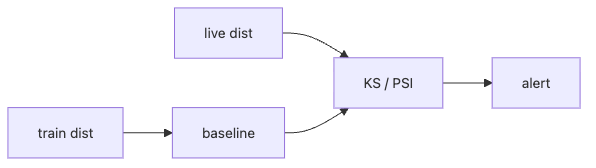

# 데이터 드리프트와 모델 드리프트

운영 중인 모델이 예전 같지 않다고 느껴질 때, 원인은 하나가 아닙니다. 입력 데이터 분포가 바뀌었을 수도 있고, 입력은 비슷한데 레이블과의 관계가 바뀌어 모델이 덜 맞기 시작했을 수도 있습니다. 둘을 구분하지 않으면 대응도 자꾸 헛짚게 됩니다.

많은 팀이 정확도 하락 하나만 보고 뒤늦게 문제를 인지합니다. 하지만 실제 현장에서는 입력 분포 변화가 먼저 나타나고, 그다음에야 비즈니스 손실이나 성능 저하가 보이는 경우가 많습니다.

이 글은 MLOps 101 시리즈의 7번째 글입니다.

여기서는 데이터 드리프트와 모델 드리프트를 분리해서 이해하고, PSI와 KS 같은 통계 도구를 어떻게 운영 경보로 연결할지 살펴보겠습니다.

---

## 이 글에서 다룰 문제

- 데이터 드리프트와 모델 드리프트는 무엇이 다를까요?
- 왜 기준 분포를 잘못 잡으면 드리프트가 안 보이게 될까요?
- PSI와 KS 검정은 어떤 상황에서 유용할까요?
- 임계값은 공식처럼 외우면 안 되고 왜 팀 합의가 되어야 할까요?
- 드리프트 감지를 재학습 트리거와 어떻게 연결해야 할까요?

> 멘탈 모델: 데이터 드리프트는 입력 분포의 변화이고, 모델 드리프트는 그 변화가 실제 성능 저하로 이어진 결과입니다. 전자는 조기 경보이고, 후자는 영향 확인에 가깝습니다.

---

## 왜 중요한가

세상은 멈추지 않습니다. 사용자 행동도, 계절성도, 정책도, 수집 방식도 계속 바뀝니다. 학습 시점에는 정상적이던 분포가 한 달 뒤에도 그대로 유지된다고 가정하는 순간 운영 모델은 서서히 낡기 시작합니다.

드리프트 감지가 없으면 손실은 조용히 쌓입니다. 그리고 나서야 정확도 하락이나 비즈니스 이상 신호가 눈에 들어옵니다. 조기 경보가 필요한 이유가 바로 여기에 있습니다.

---

## 전체 흐름을 먼저 보겠습니다



*드리프트 감지 흐름*
이 그림은 드리프트 감지의 핵심을 단순하게 보여 줍니다. 학습 시점 분포를 기준선으로 잡고, 운영 중에 들어오는 현재 분포와 통계적으로 비교한 뒤, 차이가 일정 수준을 넘으면 경고를 내보냅니다.

여기서 가장 중요한 선택은 기준선을 무엇으로 둘지입니다. 기준선이 흔들리면 드리프트 감지 자체가 흐려집니다.

---

## 먼저 잡아야 할 핵심 개념

- **데이터 드리프트**: 입력 X의 분포가 달라지는 현상입니다.
- **개념 드리프트**: X와 Y의 관계 자체가 달라지는 현상입니다.
- **PSI**: 분포 안정성을 보는 지표로, 보통 0.1 이하면 안정, 0.2 이상이면 주의 신호로 많이 봅니다.
- **KS 검정**: 두 연속 분포의 차이를 수치로 비교하는 방법입니다.
- 기준선: 대개 학습 데이터나 검증된 기준 기간의 분포입니다.

이 다섯 개를 분리해서 이해해야 경고가 떴을 때 무엇이 바뀐 것인지 더 빠르게 해석할 수 있습니다.

---

## 도입 전과 도입 후를 비교해 보겠습니다

**Before**: 비즈니스 손실이 실제로 발생한 뒤에야 정확도 하락을 알아챕니다.

**After**: PSI가 임계값을 넘는 순간 먼저 조사와 재학습 검토가 시작됩니다.

Before 상태에서는 문제 인지가 늦고 원인도 모호합니다. After 상태에서는 적어도 입력 분포 변화가 먼저 경고로 드러납니다.

---

## PSI로 드리프트를 감지해 보겠습니다

### 1단계 — 기준 데이터와 현재 데이터를 준비합니다

```python
import numpy as np

base = np.random.normal(0, 1, 1000)
live = np.random.normal(0.5, 1, 1000)
```

이 예제는 기준 분포와 현재 분포가 살짝 어긋난 상황을 가정합니다. 실제 서비스에서는 학습 데이터와 최근 운영 입력이 이 역할을 합니다.

### 2단계 — 구간 경계를 만듭니다

```python
def bin_edges(x, n=10):
    return np.quantile(x, np.linspace(0, 1, n + 1))
```

PSI는 분포를 구간으로 나누어 비교하기 때문에 경계 선택이 중요합니다. 기준선 쪽 분위수를 사용하면 현재 분포와 비교할 기준 프레임을 고정할 수 있습니다.

### 3단계 — PSI를 계산합니다

```python
def psi(base, live, n=10):
    edges = bin_edges(base, n)
    edges[0], edges[-1] = -np.inf, np.inf
    b, _ = np.histogram(base, edges)
    l, _ = np.histogram(live, edges)
    bp = b / b.sum() + 1e-6
    lp = l / l.sum() + 1e-6
    return float(np.sum((lp - bp) * np.log(lp / bp)))

print(round(psi(base, live), 3))
```

`+ 1e-6` 같은 작은 보정이 왜 들어가는지 꼭 봐야 합니다. 실제 운영 데이터에서는 특정 구간 빈도가 0이 될 수 있고, 그때 0 나눗셈이 생기면 계산 자체가 깨집니다.

### 4단계 — KS 검정도 함께 봅니다

```python
from scipy.stats import ks_2samp
stat, p = ks_2samp(base, live)
print(round(stat, 3), round(p, 4))
```

KS 검정은 두 분포 차이를 하나의 통계량으로 줄여 줍니다. PSI와 KS를 같이 보면 구간 기반 변화와 전체 분포 차이를 함께 읽을 수 있습니다.

### 5단계 — 운영용 정책으로 바꿉니다

```python
def status(p_value, psi_value):
    if psi_value > 0.2 or p_value < 0.01:
        return "drift"
    if psi_value > 0.1:
        return "watch"
    return "ok"
```

통계량이 나왔다고 바로 운영 판단이 끝나지는 않습니다. 결국 팀은 어떤 수준에서 조사하고, 어떤 수준에서 재학습 큐에 넣을지 규칙으로 정해야 합니다.

---

## 이 코드에서 먼저 봐야 할 점

- 작은 보정값은 수치 안정성을 지켜 줍니다.
- KS는 분포 차이를 한 숫자로 요약합니다.
- PSI와 KS는 신호일 뿐이고, 최종 판단은 정책이 결정합니다.
- 기준선과 임계값은 팀의 운영 계약입니다.

좋은 드리프트 감지는 통계 기법보다 운영 연결이 더 중요합니다. 경고가 떠도 다음 행동이 정해져 있지 않으면 숫자만 늘어날 뿐입니다.

---

## 자주 헷갈리는 지점

1. **기준선을 최근 며칠 데이터로 둡니다.**
   분포가 함께 움직여 드리프트가 잘 안 보입니다.
2. **라벨 없이 개념 드리프트를 단정합니다.**
   입력 변화와 성능 저하를 섞어 보게 됩니다.
3. **개별 피처만 보고 다변량 변화를 놓칩니다.**
   실제 문제는 피처 조합에서 생길 수 있습니다.
4. **범주형이나 경계형 피처에 KS를 그대로 씁니다.**
   특성에 맞는 지표 선택이 필요합니다.
5. **알림만 만들고 재학습 흐름과 연결하지 않습니다.**
   경고가 있어도 운영 루프가 닫히지 않습니다.

---

## 실무에서는 이렇게 봅니다

리스크 점수 모델처럼 입력 분포 변화가 바로 손실로 이어질 수 있는 분야에서는 PSI를 매일 계산하고, 일정 임계값을 넘으면 자동으로 티켓을 만들거나 재학습 후보 큐에 넣는 식의 운영이 흔합니다. 중요한 것은 드리프트 감지를 사람 눈에만 맡기지 않는 것입니다.

시니어 엔지니어는 데이터 드리프트를 조기 경보로, 모델 드리프트를 영향 확인 지표로 봅니다. 기준선은 쉽게 바꾸지 않고, 임계값은 문서화하며, 경고는 재학습 워크플로와 연결합니다.

---

## 체크리스트

- [ ] 기준 분포가 정의되어 있다.
- [ ] PSI나 KS를 주기적으로 계산한다.
- [ ] 임계값과 대응 규칙이 문서화되어 있다.
- [ ] 재학습 트리거가 경고와 연결되어 있다.

## 연습 문제

1. 범주형 피처용 PSI 함수를 직접 설계해 보세요.
2. 라벨이 늦게 들어오는 서비스에서 개념 드리프트를 어떻게 볼지 적어 보세요.
3. PSI가 0.18일 때 경고를 보낼지 감시만 할지 기준을 정해 보세요.

## 정리

드리프트 감지는 모델이 조용히 낡아 가는 과정을 조기에 드러내는 장치입니다. 입력 분포 변화와 실제 성능 저하를 구분해서 봐야 대응도 더 정확해집니다.

이 글에서 기억할 핵심은 하나입니다. **데이터 드리프트는 먼저 오는 신호이고, 모델 드리프트는 그 신호가 만든 결과입니다.** 다음 글에서는 이 신호를 받아 실제로 모델을 다시 학습시키는 재학습 자동화를 다루겠습니다.

<!-- toc:begin -->
- [MLOps란 무엇인가?](./01-what-is-mlops.md)
- [실험 관리](./02-experiment-tracking.md)
- [데이터 버전 관리](./03-data-versioning.md)
- [모델 학습 파이프라인](./04-training-pipeline.md)
- [모델 배포](./05-model-deployment.md)
- [모델 모니터링](./06-model-monitoring.md)
- **데이터 드리프트와 모델 드리프트 (현재 글)**
- 재학습 (예정)
- 피처 스토어 (예정)
- 운영 가능한 ML 시스템 (예정)
<!-- toc:end -->

## 참고 자료

- [Evidently AI — drift detection](https://docs.evidentlyai.com/)
- [SciPy — `ks_2samp`](https://docs.scipy.org/doc/scipy/reference/generated/scipy.stats.ks_2samp.html)
- [Population Stability Index explained](https://www.listendata.com/2015/05/population-stability-index.html)
- [Google — Rules of ML](https://developers.google.com/machine-learning/guides/rules-of-ml)

Tags: MLOps, Drift, Monitoring, DataScience, Statistics
