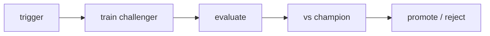

# 재학습

모델은 한 번 배포했다고 끝나지 않습니다. 입력 분포가 바뀌고, 사용자 행동이 바뀌고, 성능 목표가 달라지면 언젠가는 다시 학습해야 합니다. 문제는 그 시점을 누가 어떤 기준으로 판단하느냐입니다.

재학습을 사람 감각에만 맡기면 느리고 일관성이 떨어집니다. 어떤 팀은 매달 돌리고, 어떤 팀은 사고가 난 뒤에야 돌리고, 어떤 팀은 새 모델이 좋아졌는지 검증도 없이 바로 교체합니다. 이러면 자동화가 아니라 더 빠른 혼란이 됩니다.

이 글은 MLOps 101 시리즈의 8번째 글입니다.

여기서는 재학습을 단순 재실행이 아니라, 명시적 트리거와 챔피언-챌린저 비교를 거쳐 승격 여부를 판단하는 운영 루프로 보겠습니다.

---

## 이 글에서 다룰 문제

- 언제 재학습해야 하는지를 어떤 신호로 정할 수 있을까요?
- 일정 기반, 드리프트 기반, 성능 기반 트리거는 어떻게 다를까요?
- 챔피언과 챌린저를 비교할 때 왜 마진이 필요할까요?
- 섀도우 평가는 어떤 위험을 줄여 줄까요?
- 재학습과 배포를 왜 같은 일로 보면 안 될까요?

> 멘탈 모델: 재학습은 새 모델을 만드는 단계이고, 승격은 그 모델을 운영에 올릴지 결정하는 단계입니다. 둘은 붙어 있지만 같은 단계가 아닙니다.

---

## 왜 중요한가

재학습이 없으면 모델은 서서히 낡아 갑니다. 하지만 재학습이 자동이라고 해서 무조건 좋은 것도 아닙니다. 기준 없이 자주 재학습하면 작은 잡음에도 모델이 계속 바뀌고, 운영 안정성은 오히려 나빠질 수 있습니다.

그래서 중요한 것은 자동 실행 자체보다 정책입니다. 어떤 신호가 들어오면 학습을 다시 시작하고, 새 모델이 기존 챔피언보다 얼마나 좋아야 승격하는지, 실패하면 어떻게 되돌아갈지를 먼저 정해야 합니다.

---

## 전체 흐름을 먼저 보겠습니다



이 구조는 재학습을 잘 설명합니다. 어떤 트리거가 발생하면 챌린저 모델을 학습하고, 평가하고, 현재 챔피언과 비교하고, 마지막에 승격하거나 반려합니다. 즉, 재학습은 학습만이 아니라 비교와 승격 정책을 함께 포함한 루프입니다.

---

## 먼저 잡아야 할 핵심 개념

- 챔피언: 현재 프로덕션에 올라가 있는 모델입니다.
- 챌린저: 새로 학습된 후보 모델입니다.
- **섀도우 평가**: 실제 트래픽이나 운영 데이터로 병렬 평가만 하고 결과는 사용자에게 반영하지 않는 방식입니다.
- 승격: 챌린저를 새 챔피언으로 바꾸는 결정입니다.
- **히스테리시스**: 작은 우연한 차이로 모델이 자주 바뀌지 않도록 두는 완충 마진입니다.

재학습을 운영 가능한 체계로 만들려면 이 개념 다섯 개를 먼저 분리해서 봐야 합니다.

---

## 도입 전과 도입 후를 비교해 보겠습니다

**Before**: 분기마다 한 번씩 감으로 재학습하고 근거는 약합니다.

**After**: 드리프트 경고나 성능 저하가 감지되면 야간 재학습이 돌고, 챔피언과 비교한 뒤 승격 여부를 결정합니다.

Before 상태에서는 왜 교체했는지 설명이 어렵습니다. After 상태에서는 트리거와 비교 근거가 모두 남습니다.

---

## 아주 작은 재학습 루프를 만들어 보겠습니다

### 1단계 — 트리거 정책을 정의합니다

```python
def should_retrain(psi: float, accuracy: float, days_since: int):
    if psi > 0.2:
        return "drift"
    if accuracy < 0.7:
        return "performance"
    if days_since >= 30:
        return "schedule"
    return None
```

이 함수는 재학습의 출발점을 명시적으로 보여 줍니다. 트리거가 코드로 드러나면 팀이 같은 기준으로 움직일 수 있고, 나중에 기준을 조정하기도 쉬워집니다.

### 2단계 — 챌린저를 학습합니다

```python
from sklearn.linear_model import LogisticRegression

def train_challenger(X, y):
    return LogisticRegression().fit(X, y)
```

재학습의 목적은 새 후보를 만드는 것입니다. 이 단계는 단순해 보여도, 운영적으로는 기존 챔피언과 분리된 새 아티팩트를 생성한다는 의미가 있습니다.

### 3단계 — 평가하고 비교합니다

```python
def evaluate(model, X, y):
    return float(model.score(X, y))

def compare(challenger_acc, champion_acc, margin=0.01):
    return challenger_acc >= champion_acc + margin
```

여기서 `margin`이 중요합니다. 0.001 차이처럼 우연에 가까운 개선으로 모델을 계속 바꾸면 운영이 불안정해집니다. 재학습에서는 승부보다 안정성이 더 중요할 때가 많습니다.

### 4단계 — 섀도우 평가를 합니다

```python
def shadow(challenger, X_live, y_live):
    return evaluate(challenger, X_live, y_live)
```

섀도우 평가는 사용자에게 영향을 주지 않고 새 모델을 검증하게 해 줍니다. 운영 데이터로 비교하되 실제 응답에는 반영하지 않으므로 위험이 작습니다.

### 5단계 — 승격 여부를 결정합니다

```python
def promote_decision(reason, challenger_acc, champion_acc):
    if reason is None:
        return "skip"
    if compare(challenger_acc, champion_acc):
        return "promote"
    return "reject"

print(promote_decision("drift", 0.82, 0.80))
```

이 단계가 재학습을 운영 체계로 만듭니다. 트리거가 생겼다고 무조건 승격하는 것이 아니라, 비교 규칙을 통과했을 때만 다음 단계로 넘어갑니다.

---

## 이 코드에서 먼저 봐야 할 점

- 트리거는 사람 감각이 아니라 명시적 규칙으로 두어야 합니다.
- 비교 마진이 있어야 모델 교체가 너무 잦아지지 않습니다.
- 섀도우 평가는 낮은 위험으로 검증 범위를 넓혀 줍니다.
- 재학습과 승격은 분리된 결정입니다.

좋은 재학습 체계는 자주 돌리는 체계가 아니라, 어떤 조건에서 무엇을 비교하고 왜 교체했는지 설명할 수 있는 체계입니다.

---

## 자주 헷갈리는 지점

1. **챔피언 모델을 보존하지 않습니다.**
   롤백이 불가능해집니다.
2. **섀도우 단계 없이 바로 프로덕션으로 올립니다.**
   새 모델의 운영 리스크를 너무 빨리 떠안게 됩니다.
3. **마진을 0으로 둡니다.**
   미세한 차이로 계속 교체되는 현상이 생깁니다.
4. **재학습 중에 새 피처까지 같이 넣습니다.**
   성능 변화 원인을 분리하기 어려워집니다.
5. **성공한 재학습만 기록하고 실패는 묻어 둡니다.**
   학습 루프에서 중요한 교훈이 사라집니다.

---

## 실무에서는 이렇게 봅니다

추천 모델은 야간 재학습으로 새 챌린저를 만들고, AUC나 CTR을 챔피언과 비교한 뒤, 기준을 넘기면 카나리로 일부 트래픽에만 먼저 적용하는 식의 운영이 흔합니다. 재학습 성공이 곧바로 전체 배포 성공을 뜻하지는 않습니다.

시니어 엔지니어는 재학습을 배포 자동화의 하위 기능으로 보지 않습니다. 비교 기준을 먼저 합의하고, 챔피언을 항상 남겨 두고, 변경은 한 번에 하나씩만 넣는 방식으로 운영 안정성을 우선합니다.

---

## 체크리스트

- [ ] 트리거 정책이 문서화되어 있다.
- [ ] 챌린저 평가가 자동으로 실행된다.
- [ ] 승격 마진이 정의되어 있다.
- [ ] 롤백 절차가 있다.

## 연습 문제

1. 모델 교체가 너무 잦지 않도록 최소 안정 기간 규칙을 설계해 보세요.
2. 섀도우 결과가 나쁘게 나왔을 때 어떤 데이터부터 점검할지 적어 보세요.
3. 두 모델이 비슷하게 나오면 왜 챔피언 유지가 기본값이어야 하는지 설명해 보세요.

## 정리

재학습은 모델을 자동으로 다시 돌리는 기능이 아니라, 명시적 신호를 받아 새 후보를 만들고 챔피언과 비교해 승격 여부를 판단하는 운영 루프입니다.

이 글에서 기억할 핵심은 하나입니다. **재학습이 자동이어도 승격은 항상 근거 기반이어야 합니다.** 다음 글에서는 학습과 서빙에서 같은 피처를 쓰기 위한 피처 스토어를 다루겠습니다.

<!-- toc:begin -->
- [MLOps란 무엇인가?](./01-what-is-mlops.md)
- [실험 관리](./02-experiment-tracking.md)
- [데이터 버전 관리](./03-data-versioning.md)
- [모델 학습 파이프라인](./04-training-pipeline.md)
- [모델 배포](./05-model-deployment.md)
- [모델 모니터링](./06-model-monitoring.md)
- [데이터 드리프트와 모델 드리프트](./07-data-and-model-drift.md)
- **재학습 (현재 글)**
- 피처 스토어 (예정)
- 운영 가능한 ML 시스템 (예정)
<!-- toc:end -->

## 참고 자료

- [MLflow Model Registry](https://mlflow.org/docs/latest/model-registry.html)
- [Google — continuous training](https://cloud.google.com/architecture/mlops-continuous-delivery-and-automation-pipelines-in-machine-learning)
- [Uber — Michelangelo](https://www.uber.com/blog/michelangelo-machine-learning-platform/)
- [Netflix Tech Blog](https://netflixtechblog.com/)

Tags: MLOps, Retraining, Automation, Pipeline, DataScience
