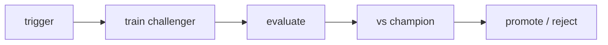

# 재학습

> MLOps 101 시리즈 (8/10)


## 이 글에서 다룰 문제

*수동 재학습* 은 *느리고* *편향* 됩니다. *자동* 이면 *빠르고* *증거 기반*.

## 전체 흐름


## Before/After

**Before**: *분기마다* *수동* 재학습. *근거 부족*.

**After**: *드리프트 알림* → *야간 재학습* → *지표 비교* → *승급/반려*.

## 미니 재학습 자동화

### 1단계 — 트리거 종류

```python
def should_retrain(psi: float, accuracy: float, days_since: int):
    if psi > 0.2:
        return "drift"
    if accuracy < 0.7:
        return "performance"
    if days_since >= 30:
        return "schedule"
    return None
```

### 2단계 — 챌린저 학습

```python
from sklearn.linear_model import LogisticRegression

def train_challenger(X, y):
    return LogisticRegression().fit(X, y)
```

### 3단계 — 평가 + 비교

```python
def evaluate(model, X, y):
    return float(model.score(X, y))

def compare(challenger_acc, champion_acc, margin=0.01):
    return challenger_acc >= champion_acc + margin
```

### 4단계 — 섀도우 평가

```python
def shadow(challenger, X_live, y_live):
    return evaluate(challenger, X_live, y_live)
```

### 5단계 — 승급 결정

```python
def promote_decision(reason, challenger_acc, champion_acc):
    if reason is None:
        return "skip"
    if compare(challenger_acc, champion_acc):
        return "promote"
    return "reject"

print(promote_decision("drift", 0.82, 0.80))
```

## 이 코드에서 주목할 점

- *트리거* 는 *명시적*.
- *마진* 으로 *우연한 우세* 를 막는다.
- *섀도우* 는 *위험 0* 평가.

## 자주 하는 실수 5가지

1. ***챔피언 미보존* → *롤백 불가*.**
2. ***섀도우 없이* 직접 승급.**
3. ***마진 0* → *떨림으로 잦은 교체*.**
4. ***재학습 시 새 피처 추가* → *원인 분리 불가*.**
5. ***성공 알림* 만 → *실패 사일런스*.**

## 실무에서는 이렇게 쓰입니다

*추천 모델* 은 *매일 야간 재학습* 후 *AUC + CTR* 비교, *마진 통과 시* *카나리* 로 5% 트래픽.

## 체크리스트

- [ ] *트리거 정책* 문서화.
- [ ] *Challenger* 자동 평가.
- [ ] *마진* 정의.
- [ ] *롤백 절차*.

## 정리 및 다음 단계

재학습은 *피처 일관성* 이 있어야 깨끗합니다. 다음 글은 *Feature Store* 입니다.

<!-- toc:begin -->
- [MLOps란 무엇인가?](./01-what-is-mlops.md)
- [실험 관리](./02-experiment-tracking.md)
- [데이터 버전 관리](./03-data-versioning.md)
- [모델 학습 파이프라인](./04-training-pipeline.md)
- [모델 배포](./05-model-deployment.md)
- [모델 모니터링](./06-model-monitoring.md)
- [Data Drift와 Model Drift](./07-data-and-model-drift.md)
- **재학습 (현재 글)**
- Feature Store (예정)
- 운영 가능한 ML 시스템 (예정)
<!-- toc:end -->

## 참고 자료

- [MLflow Model Registry](https://mlflow.org/docs/latest/model-registry.html)
- [Google — Continuous training](https://cloud.google.com/architecture/mlops-continuous-delivery-and-automation-pipelines-in-machine-learning)
- [Uber Michelangelo](https://www.uber.com/blog/michelangelo-machine-learning-platform/)
- [Netflix — ML Platform](https://netflixtechblog.com/)

Tags: MLOps, Retraining, Automation, Pipeline, DataScience
