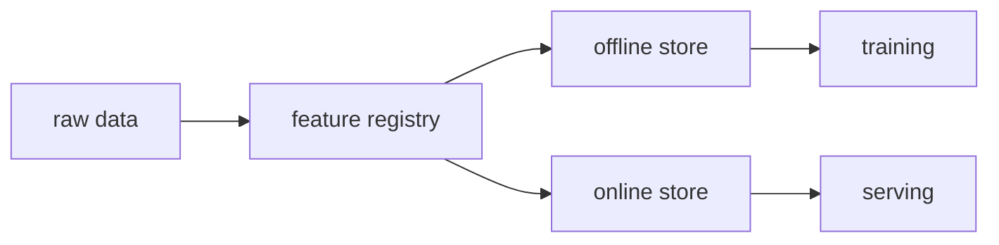

# 피처 스토어

같은 이름의 피처를 학습 코드와 서빙 코드가 각각 따로 계산하기 시작하면 언젠가는 어긋납니다. 학습 때는 하루 단위 집계를 쓰고, 서빙 때는 실시간 계산식을 조금 다르게 쓰는 식의 작은 차이가 쌓이면 모델은 배포 전과 배포 후에 다른 세상을 보게 됩니다.

이른바 학습-서빙 불일치는 눈에 잘 띄지 않아서 더 까다롭습니다. 오프라인 검증에서는 잘 나오는데 운영 성능이 기대보다 낮을 때, 실제 원인이 모델 자체보다 피처 계산 경로 차이인 경우가 적지 않습니다.

이 글은 MLOps 101 시리즈의 9번째 글입니다.

여기서는 피처 스토어를 피처 저장소가 아니라, 학습과 서빙이 같은 정의를 공유하게 만드는 계약 계층으로 보고 Feast 예제로 감각을 잡아 보겠습니다.

---

## 이 글에서 다룰 문제

- 학습-서빙 불일치는 왜 자꾸 반복될까요?
- 온라인 저장소와 오프라인 저장소는 어떤 역할 차이가 있을까요?
- Feast에서 entity와 feature view는 어떻게 이해하면 좋을까요?
- 시점 일치 조인이 왜 그렇게 중요할까요?
- 피처 스토어를 도입하면 팀 간 재사용성이 왜 높아질까요?

> 멘탈 모델: 피처 스토어는 피처 값을 한곳에 모아 두는 도구가 아니라, 피처 정의를 한 번만 선언하고 학습과 서빙이 그 정의를 공유하게 만드는 계층입니다.

---

## 왜 중요한가

같은 피처 이름을 두 시스템이 각자 계산하면 언젠가는 차이가 납니다. 구현이 조금만 달라도, 시간 기준이 조금만 달라도, 결측 처리 방식이 조금만 달라도 모델 입력은 달라집니다. 이 문제는 실험실에서는 잘 안 보이고 운영에서 크게 드러납니다.

그래서 피처 스토어의 진짜 가치는 저장보다 일관성에 있습니다. 학습용 추출과 서빙용 조회가 같은 정의를 바라보게 해야 학습-서빙 불일치를 줄일 수 있습니다.

---

## 전체 흐름을 먼저 보겠습니다



이 구조에서 중심은 피처 레지스트리입니다. 원천 데이터에서 정의된 피처가 오프라인 저장소와 온라인 저장소로 흘러가고, 학습은 오프라인에서, 서빙은 온라인에서 같은 정의를 씁니다.

즉, 피처 스토어는 값보다 정의를 중심에 둡니다.

---

## 먼저 잡아야 할 핵심 개념

- 엔터티: 피처를 조인할 기준 키입니다. 예를 들어 `user_id`가 여기에 해당합니다.
- **피처 뷰**: 특정 소스와 연결된 피처 정의 묶음입니다.
- **온라인 저장소**: 낮은 지연 시간으로 피처를 읽는 저장소입니다.
- **오프라인 저장소**: 대규모 분석과 학습용 추출을 담당하는 저장소입니다.
- **시점 일치 조인**: 과거 시점에 맞는 피처만 붙여 데이터 누수를 막는 방식입니다.

피처 스토어를 이해할 때는 저장소 종류보다 이 정의 계층을 먼저 봐야 합니다.

---

## 도입 전과 도입 후를 비교해 보겠습니다

**Before**: 학습 노트북과 서빙 코드가 피처를 각자 계산합니다.

**After**: 피처 뷰를 한 번 정의하고 학습과 서빙이 함께 씁니다.

Before 상태에서는 작은 구현 차이가 운영 성능 저하로 이어집니다. After 상태에서는 적어도 피처 정의가 한곳에서 관리됩니다.

---

## Feast로 아주 작은 흐름을 따라가 보겠습니다

### 1단계 — 피처 정의를 만듭니다

```python
from feast import Entity, FeatureView, Field, FileSource
from feast.types import Float32

user = Entity(name="user_id", join_keys=["user_id"])
src = FileSource(path="users.parquet", timestamp_field="event_ts")

view = FeatureView(
    name="user_stats",
    entities=[user],
    schema=[Field(name="age", dtype=Float32)],
    source=src,
)
```

이 예제에서 가장 먼저 봐야 할 것은 엔터티와 피처 뷰입니다. 어떤 키로 조인할지, 어떤 소스에서 어떤 피처를 가져올지 정의가 코드로 고정됩니다.

### 2단계 — 정의를 등록합니다

```bash
feast apply
```

등록 단계는 선언한 피처 정의를 시스템에 반영하는 과정입니다. 피처 스토어를 쓰는 이유는 결국 이 정의를 여러 팀과 여러 경로에서 공유하기 위해서입니다.

### 3단계 — 학습용 피처를 조회합니다

```python
from feast import FeatureStore
import pandas as pd

fs = FeatureStore(repo_path=".")
entity_df = pd.DataFrame({"user_id": [1, 2], "event_timestamp": pd.to_datetime(["2026-01-01", "2026-01-02"])})
training = fs.get_historical_features(entity_df, ["user_stats:age"]).to_df()
```

학습용 조회에서는 시점이 특히 중요합니다. 특정 시점의 엔터티에 대해 그때 실제로 알 수 있었던 피처만 붙여야 데이터 누수를 막을 수 있습니다.

### 4단계 — 온라인 저장소로 적재합니다

```bash
feast materialize-incremental $(date -u +"%Y-%m-%dT%H:%M:%S")
```

적재 단계는 오프라인 정의를 온라인 조회 경로와 연결합니다. 이 다리가 있어야 학습 때 본 정의가 서빙에도 같은 형태로 들어옵니다.

### 5단계 — 서빙용 피처를 조회합니다

```python
online = fs.get_online_features(
    features=["user_stats:age"],
    entity_rows=[{"user_id": 1}],
).to_dict()
```

이 단계에서 학습과 서빙이 같은 정의를 공유한다는 점이 드러납니다. 입력 경로는 달라도, 읽는 피처 이름과 정의는 같아야 합니다.

---

## 이 코드에서 먼저 봐야 할 점

- 엔터티는 조인 키 역할을 합니다.
- 피처 뷰는 정의와 소스를 함께 묶습니다.
- 온라인 적재가 오프라인과 온라인 경로를 연결합니다.
- 학습과 서빙의 정의 일치가 가장 중요합니다.

피처 스토어의 가치는 결국 재사용성과 일관성에서 나옵니다. 똑같은 피처를 여러 팀이 따로 계산하지 않게 만드는 효과가 큽니다.

---

## 자주 헷갈리는 지점

1. **팀마다 같은 이름의 피처를 다르게 정의합니다.**
   재사용보다 충돌이 먼저 생깁니다.
2. **시점 일치 조인을 생략합니다.**
   학습 데이터에 미래 정보가 섞입니다.
3. **온라인과 오프라인 정의가 다릅니다.**
   학습-서빙 불일치가 다시 생깁니다.
4. **TTL이나 신선도 정책이 없습니다.**
   오래된 피처가 계속 서빙될 수 있습니다.
5. **피처 자체 모니터링이 없습니다.**
   결측이나 지연이 조용히 쌓입니다.

---

## 실무에서는 이렇게 봅니다

결제 이상 탐지나 추천 시스템처럼 사용자 행동 피처를 여러 모델이 함께 쓰는 환경에서는 피처 스토어의 투자 대비 효과가 큽니다. 한 번 정의한 피처를 여러 팀이 공통으로 재사용할 수 있기 때문입니다.

시니어 엔지니어는 피처를 모델 입력이 아니라 조직 자산으로 봅니다. 그래서 이름 규칙, 정의 문서화, 시점 일치, 신선도 모니터링을 함께 설계합니다.

---

## 체크리스트

- [ ] 피처 뷰 정의가 버전 관리된다.
- [ ] 시점 일치 조인을 사용한다.
- [ ] 온라인 적재가 스케줄링되어 있다.
- [ ] 피처 신선도와 결측을 모니터링한다.

## 연습 문제

1. 7일 이동 매출 같은 피처를 피처 뷰로 정의해 보세요.
2. 시점 일치 조인이 없으면 어떤 데이터 누수가 생기는지 설명해 보세요.
3. Feast 대신 쓸 수 있는 대안 두 가지와 그 차이를 정리해 보세요.

## 정리

피처 스토어는 피처를 저장하는 상자가 아니라, 학습과 서빙이 같은 정의를 보게 만드는 계약 계층입니다. 이 계층이 있어야 모델이 오프라인에서 본 세상과 운영에서 보는 세상이 덜 어긋납니다.

이 글에서 기억할 핵심은 하나입니다. **피처 스토어의 목적은 편의성이 아니라 학습-서빙 일관성입니다.** 다음 글에서는 지금까지의 조각들을 묶어 하나의 운영 가능한 ML 시스템으로 정리하겠습니다.

<!-- toc:begin -->
- [MLOps란 무엇인가?](./01-what-is-mlops.md)
- [실험 관리](./02-experiment-tracking.md)
- [데이터 버전 관리](./03-data-versioning.md)
- [모델 학습 파이프라인](./04-training-pipeline.md)
- [모델 배포](./05-model-deployment.md)
- [모델 모니터링](./06-model-monitoring.md)
- [데이터 드리프트와 모델 드리프트](./07-data-and-model-drift.md)
- [재학습](./08-retraining.md)
- **피처 스토어 (현재 글)**
- 운영 가능한 ML 시스템 (예정)
<!-- toc:end -->

## 참고 자료

- [Feast documentation](https://docs.feast.dev/)
- [Tecton — feature platforms](https://www.tecton.ai/blog/)
- [Uber — feature store](https://www.uber.com/blog/michelangelo-machine-learning-platform/)
- [Google Vertex AI Feature Store](https://cloud.google.com/vertex-ai/docs/featurestore)

Tags: MLOps, FeatureStore, Feast, DataScience, Pipeline
