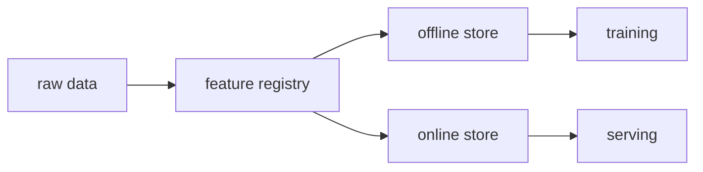

# Feature Store

> MLOps 101 시리즈 (9/10)

<!-- a-grade-intro:begin -->

**핵심 질문**: *학습 시 사용한 피처* 와 *서빙 시 만든 피처* 가 *왜 자꾸 달라질까* 요?

> *Feature Store 는 *피처* 를 *중앙 정의* 하고 *학습/서빙* 에 *동일* 하게 제공해 *Train-Serve Skew* 를 없앱니다.*

<!-- a-grade-intro:end -->

## 이 글에서 배울 것

- *Train-Serve Skew* 의 정의
- *Online vs Offline* 스토어
- *Feast* 의 핵심 개념
- *피처 재사용*
- 흔한 함정 5가지

## 왜 중요한가

*같은 피처 이름* 을 *두 곳에서 따로* 만들면 *반드시 어긋납니다*. *Feature Store* 가 *한 곳* 으로 통일.

## 개념 한눈에 보기



## 핵심 용어 정리

- **Entity**: *피처가 결합되는 키* (예: user_id).
- **Feature View**: *피처 정의* + *소스*.
- **Online Store**: *낮은 지연* 키-값 (Redis 등).
- **Offline Store**: *대용량 분석* (Parquet/BQ).
- **Point-in-time join**: *시점 정확* 결합.

## Before/After

**Before**: *학습 노트북* 과 *서빙 코드* 가 *피처를 따로 계산*.

**After**: *Feature View* 한 번 정의, *양쪽* 에서 호출.

## 실습: Feast 미니 워크플로우

### 1단계 — 정의 파일

```python
from feast import Entity, FeatureView, Field, FileSource
from feast.types import Float32

user = Entity(name="user_id", join_keys=["user_id"])
src = FileSource(path="users.parquet", timestamp_field="event_ts")

view = FeatureView(
    name="user_stats",
    entities=[user],
    schema=[Field(name="age", dtype=Float32)],
    source=src,
)
```

### 2단계 — 등록

```bash
feast apply
```

### 3단계 — 학습용 조회

```python
from feast import FeatureStore
import pandas as pd

fs = FeatureStore(repo_path=".")
entity_df = pd.DataFrame({"user_id": [1, 2], "event_timestamp": pd.to_datetime(["2026-01-01", "2026-01-02"])})
training = fs.get_historical_features(entity_df, ["user_stats:age"]).to_df()
```

### 4단계 — 온라인 적재

```bash
feast materialize-incremental $(date -u +"%Y-%m-%dT%H:%M:%S")
```

### 5단계 — 서빙용 조회

```python
online = fs.get_online_features(
    features=["user_stats:age"],
    entity_rows=[{"user_id": 1}],
).to_dict()
```

## 이 코드에서 주목할 점

- *Entity* 가 *조인 키*.
- *Feature View* 는 *정의 + 소스* 의 결합.
- *Materialize* 가 *오프라인 → 온라인*.

## 자주 하는 실수 5가지

1. ***피처 이름 충돌* (팀 별 정의 다름).**
2. ***시점 누수* (point-in-time 미사용).**
3. ***온라인/오프라인 정의 불일치*.**
4. ***Feature TTL* 미지정 → *오래된 값* 서빙.**
5. ***모니터링 부재* → *피처 결손* 못 봄.**

## 실무에서는 이렇게 쓰입니다

*결제 모델* 은 *Feast* 로 *유저 행동 피처* 를 *학습/서빙* 모두에 제공, *팀 간 재사용*.

## 시니어 엔지니어는 이렇게 생각합니다

- *피처 = 자산*. 이름과 정의가 *카탈로그*.
- *시점 정확성* 은 *정확도* 보다 *중요*.
- *온라인/오프라인 동일 정의* 가 *최우선*.
- *피처도 모니터링* (신선도, 결측).
- *재사용* 이 *MLOps 의 최고 ROI*.

## 체크리스트

- [ ] *Feature View* 정의 파일.
- [ ] *PIT join* 사용.
- [ ] *Online materialize* 스케줄.
- [ ] *피처 신선도* 메트릭.

## 연습 문제

1. *유저별 최근 7일 매출* 피처를 *FeatureView* 로 정의하세요.
2. *Point-in-time join* 이 없으면 어떤 *누수* 가 발생할까요?
3. *Feast 외 대안* 두 가지를 들고 차이를 적으세요.

## 정리 및 다음 단계

Feature Store 는 *조각* 입니다. 마지막 글은 *모든 조각* 을 *하나의 운영 시스템* 으로 묶습니다.

<!-- toc:begin -->
- [MLOps란 무엇인가?](./01-what-is-mlops.md)
- [실험 관리](./02-experiment-tracking.md)
- [데이터 버전 관리](./03-data-versioning.md)
- [모델 학습 파이프라인](./04-training-pipeline.md)
- [모델 배포](./05-model-deployment.md)
- [모델 모니터링](./06-model-monitoring.md)
- [Data Drift와 Model Drift](./07-data-and-model-drift.md)
- [재학습](./08-retraining.md)
- **Feature Store (현재 글)**
- 운영 가능한 ML 시스템 (예정)
<!-- toc:end -->

## 참고 자료

- [Feast 공식 문서](https://docs.feast.dev/)
- [Tecton — Feature platform](https://www.tecton.ai/blog/)
- [Uber — Feature Store](https://www.uber.com/blog/michelangelo-machine-learning-platform/)
- [Google Vertex AI Feature Store](https://cloud.google.com/vertex-ai/docs/featurestore)

Tags: MLOps, FeatureStore, Feast, DataScience, Pipeline
