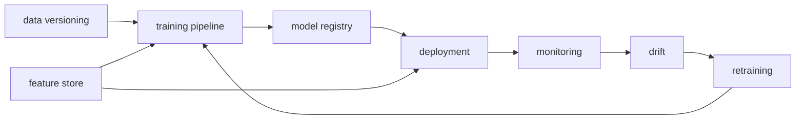

# 운영 가능한 ML 시스템

시리즈 앞부분에서는 실험 관리, 데이터 버전 관리, 학습 파이프라인, 배포, 모니터링, 드리프트, 재학습, 피처 스토어를 각각 따로 봤습니다. 그런데 개별 조각을 아는 것과 그것을 하나의 운영 시스템으로 묶는 일은 완전히 다른 문제입니다.

현업에서 어려운 지점도 여기에 있습니다. 도구 이름을 안다고 시스템이 되는 것은 아닙니다. 데이터가 언제 학습으로 넘어가고, 학습 결과가 어떤 기준으로 등록되고, 이상 징후가 보이면 누가 무엇을 해야 하는지까지 연결되어야 비로소 운영 가능한 시스템이 됩니다.

이 글은 MLOps 101 시리즈의 마지막 글입니다.

여기서는 앞선 아홉 개 조각을 하나의 운영 루프로 엮어 보고, 팀이 지금 어디쯤 와 있는지 평가하는 최소 체크리스트까지 정리하겠습니다.

---

## 이 글에서 다룰 문제

- 앞선 아홉 개 구성 요소는 실제 시스템에서 어떻게 연결될까요?
- 왜 도구를 각각 아는 것만으로는 운영 체계가 되지 않을까요?
- 런북, 온콜, SLI/SLO는 기술 요소와 어떻게 맞물릴까요?
- 팀의 MLOps 성숙도는 무엇으로 점검하면 좋을까요?
- 어떤 순서로 개선해야 한 번에 너무 많은 복잡도를 떠안지 않을까요?

> 멘탈 모델: 운영 가능한 ML 시스템은 여러 도구의 모음이 아니라, 데이터 → 학습 → 배포 → 관측 → 재학습이 닫힌 루프로 연결되고 각 단계의 책임이 분명한 구조입니다.

---

## 왜 중요한가

좋은 모델 하나를 만드는 일과 운영 가능한 시스템을 만드는 일은 다릅니다. 전자는 실험 최적화에 가깝고, 후자는 경계 설계와 복구 설계에 가깝습니다. 그래서 개별 도구 이해만으로는 충분하지 않습니다.

운영 가능한 시스템이 되려면 세 가지가 함께 있어야 합니다. 첫째, 데이터와 모델 흐름이 자동으로 연결되어야 합니다. 둘째, 이상 징후가 보이면 관측과 대응이 이어져야 합니다. 셋째, 사람이 개입해야 할 순간과 자동화가 맡을 순간이 구분되어 있어야 합니다.

---

## 전체 흐름을 먼저 보겠습니다



이 그림은 시리즈 전체를 하나의 루프로 압축한 모습입니다. 데이터 버전 관리와 피처 스토어가 입력 일관성을 잡고, 학습 파이프라인이 모델을 만들고, 모델 레지스트리가 버전을 관리하고, 배포와 모니터링이 운영 상태를 관찰합니다. 드리프트와 재학습은 다시 학습 루프로 되돌아가게 만듭니다.

중요한 것은 이 구조가 직선이 아니라 순환 구조라는 사실입니다. 운영 중 나온 신호가 다시 학습으로 들어와야 MLOps가 완성됩니다.

---

## 먼저 잡아야 할 핵심 개념

- **MLOps 성숙도**: 수동 중심 단계에서 자동화 단계, 더 나아가 자율 운영 단계로 발전하는 정도입니다.
- 런북: 경고가 울렸을 때 무엇을 확인하고 어떤 조치를 취할지 적어 둔 문서입니다.
- 온콜: 운영 경고에 대응할 담당 책임 체계입니다.
- **SLI/SLO**: 서비스 상태를 측정하는 지표와 목표입니다.
- **포스트모템**: 사고 뒤에 원인과 재발 방지책을 정리하는 비난 없는 리뷰입니다.

이 다섯 개는 도구 목록에서 빠지기 쉽지만, 실제 운영 체계를 완성하는 데 꼭 필요합니다. 시스템은 자동화만으로 유지되지 않고 대응 절차까지 포함해 돌아갑니다.

---

## 도입 전과 도입 후를 비교해 보겠습니다

**Before**: 노트북에서 학습하고 수동 배포하고, 운영 이슈는 사용자가 먼저 발견합니다.

**After**: 데이터에서 학습, 등록, 배포, 경고, 재학습까지 하나의 루프가 이어집니다.

Before 상태에서는 사람 기억과 수작업이 시스템 경계를 대신합니다. After 상태에서는 경계가 명시적이고, 빠진 구성 요소도 체크리스트로 드러납니다.

---

## 성숙도 점검표를 코드로 표현해 보겠습니다

### 1단계 — 점검 항목을 둡니다

```python
checks = {
    "data_versioned": True,
    "pipeline_dag": True,
    "model_registry": True,
    "container_image": True,
    "metrics_endpoint": True,
    "drift_alert": False,
    "retraining_trigger": False,
    "feature_store": False,
    "runbook": True,
}
```

이 딕셔너리는 팀이 갖춰야 할 운영 요소를 단순하게 보여 줍니다. 어떤 항목이 빠져 있는지 코드로 드러내면, 추상적인 성숙도 논의가 훨씬 구체적인 개선 목록으로 바뀝니다.

### 2단계 — 성숙도 점수를 계산합니다

```python
def maturity(checks: dict) -> str:
    score = sum(checks.values())
    if score >= 8:
        return "production"
    if score >= 5:
        return "transitional"
    return "early"

print(maturity(checks))
```

물론 실제 성숙도를 숫자 하나로 완벽하게 표현할 수는 없습니다. 그래도 팀 대화에서는 이런 공통 기준이 유용합니다. 지금이 초기 단계인지, 전환 구간인지, 운영 수준인지 빠르게 공유할 수 있기 때문입니다.

### 3단계 — 빠진 항목을 찾습니다

```python
def missing(checks: dict) -> list:
    return [k for k, v in checks.items() if not v]

print(missing(checks))
```

성숙도라는 말은 자주 추상적으로 흘러갑니다. 빠진 항목을 바로 나열하면, 부족한 부분이 논쟁이 아니라 작업 목록으로 바뀝니다.

### 4단계 — 다음 우선순위를 고릅니다

```python
def next_step(missing_items: list) -> str:
    priority = ["drift_alert", "retraining_trigger", "feature_store"]
    for p in priority:
        if p in missing_items:
            return p
    return "done"

print(next_step(missing(checks)))
```

운영 체계는 한 번에 완성되지 않습니다. 그래서 가장 중요한 다음 한 걸음을 고르는 일이 중요합니다. 부족한 것을 다 아는 것보다, 지금 무엇부터 고칠지 정하는 편이 더 실전적입니다.

### 5단계 — 팀 상태 문장을 만듭니다

```python
def status_line(checks: dict) -> str:
    return f"{maturity(checks)} | next={next_step(missing(checks))}"

print(status_line(checks))
```

짧은 상태 문장은 팀이 같은 상황 인식을 공유하게 해 줍니다. 긴 문서도 필요하지만, 운영에서는 지금 상태와 다음 우선순위를 한 줄로 말할 수 있는지가 더 중요할 때가 많습니다.

---

## 이 코드에서 먼저 봐야 할 점

- 체크리스트를 코드로 두면 진척이 눈에 보입니다.
- 성숙도 기준이 있어야 팀이 같은 언어로 대화합니다.
- 다음 한 가지를 고르는 것만으로도 개선 속도가 붙습니다.
- 운영 요소와 기술 요소를 함께 봐야 시스템이 완성됩니다.

이 예제는 단순하지만 중요한 태도를 보여 줍니다. MLOps는 플랫폼 도입이 아니라, 점검 가능하고 설명 가능한 운영 상태를 만드는 일입니다.

---

## 자주 헷갈리는 지점

1. **모든 구성 요소를 한 번에 도입하려고 합니다.**
   복잡도만 커지고 팀 피로가 빨리 옵니다.
2. **도구만 보고 조직 변화는 놓칩니다.**
   소유자와 대응 절차가 없으면 시스템이 굴러가지 않습니다.
3. **SLO 없이 경고부터 붙입니다.**
   무엇이 중요한 신호인지 합의되지 않습니다.
4. **런북 없이 온콜부터 시작합니다.**
   경고를 받아도 첫 10분 행동이 정해지지 않습니다.
5. **같은 사고를 반복하면서 포스트모템을 남기지 않습니다.**
   시스템은 사고 뒤의 학습으로 자랍니다.

---

## 실무에서는 이렇게 봅니다

예를 들어 핀테크 팀이 결제 이상 탐지 모델을 운영한다면, 데이터 준비와 학습은 DAG로 돌고, 모델 버전은 레지스트리에서 관리하고, 온라인 피처는 피처 스토어에서 읽고, 운영 지표는 Prometheus로 수집하며, 드리프트 경고가 오면 재학습 후보를 만들고 온콜이 런북에 따라 대응하는 구조가 흔합니다.

시니어 엔지니어는 처음부터 완성형 플랫폼을 만들기보다 가장 약한 연결부를 먼저 고칩니다. 그리고 경고는 행동 요청이어야 하고, 문서는 시스템의 일부이며, 변화는 한 번에 하나씩만 넣어야 원인을 읽을 수 있다고 봅니다.

---

## 체크리스트

- [ ] 데이터 버전 관리가 들어가 있다.
- [ ] 학습이 DAG로 반복 실행된다.
- [ ] 모델 레지스트리가 있다.
- [ ] 모니터링과 드리프트 감지가 운영에 연결되어 있다.
- [ ] 재학습 트리거가 정의되어 있다.
- [ ] 런북과 온콜 체계가 있다.

## 연습 문제

1. 지금 팀에 없는 구성 요소 세 가지를 골라 6주 도입 계획을 적어 보세요.
2. `99% < 200ms` 같은 SLO를 가장 먼저 깨뜨릴 수 있는 구성 요소를 골라 보세요.
3. 자동 재학습이 새로 만드는 조직 리스크 두 가지를 정리해 보세요.

## 정리

운영 가능한 ML 시스템은 여러 도구를 나열한다고 생기지 않습니다. 데이터, 학습, 등록, 배포, 관측, 재학습이 닫힌 루프로 연결되고, 각 단계의 책임과 대응 절차가 분명해야 비로소 시스템이 됩니다.

이 시리즈에서 가져가야 할 마지막 문장은 이것입니다. **MLOps의 완성은 더 많은 도구가 아니라, 더 분명한 경계와 더 짧은 운영 루프입니다.** 이제 실제 프로젝트에서 가장 약한 연결부 하나를 골라, 그 지점부터 시스템으로 바꿔 보시면 됩니다.

<!-- toc:begin -->
- [MLOps란 무엇인가?](./01-what-is-mlops.md)
- [실험 관리](./02-experiment-tracking.md)
- [데이터 버전 관리](./03-data-versioning.md)
- [모델 학습 파이프라인](./04-training-pipeline.md)
- [모델 배포](./05-model-deployment.md)
- [모델 모니터링](./06-model-monitoring.md)
- [데이터 드리프트와 모델 드리프트](./07-data-and-model-drift.md)
- [재학습](./08-retraining.md)
- [피처 스토어](./09-feature-store.md)
- **운영 가능한 ML 시스템 (현재 글)**
<!-- toc:end -->

## 참고 자료

- [Google — MLOps maturity](https://cloud.google.com/architecture/mlops-continuous-delivery-and-automation-pipelines-in-machine-learning)
- [Microsoft — MLOps maturity model](https://learn.microsoft.com/azure/architecture/example-scenario/mlops/mlops-maturity-model)
- [Made With ML](https://madewithml.com/)
- [Hidden Technical Debt in ML Systems](https://papers.nips.cc/paper_files/paper/2015/hash/86df7dcfd896fcaf2674f757a2463eba-Abstract.html)

Tags: MLOps, Architecture, Production, DataScience, Pipeline
