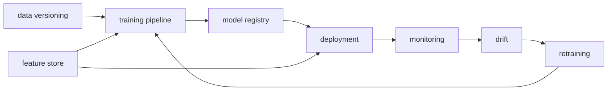

# 운영 가능한 ML 시스템

> MLOps 101 시리즈 (10/10)


## 이 글에서 다룰 문제

*개별 도구* 만 알아도 *시스템* 이 안 됩니다. *연결* 과 *경계* 가 *진짜 일* 입니다.

## 개념 한눈에 보기



## Before/After

**Before**: *학습 노트북* + *수동 배포* + *사용자 신고*.

**After**: *DAG* 가 *데이터 → 모델 → 알림* 을 *자동*.

## 실습: 운영 시스템 점검표 코드화

### 1단계 — 점검 항목

```python
checks = {
    "data_versioned": True,
    "pipeline_dag": True,
    "model_registry": True,
    "container_image": True,
    "metrics_endpoint": True,
    "drift_alert": False,
    "retraining_trigger": False,
    "feature_store": False,
    "runbook": True,
}
```

### 2단계 — 성숙도 점수

```python
def maturity(checks: dict) -> str:
    score = sum(checks.values())
    if score >= 8:
        return "production"
    if score >= 5:
        return "transitional"
    return "early"

print(maturity(checks))
```

### 3단계 — 누락 보고

```python
def missing(checks: dict) -> list:
    return [k for k, v in checks.items() if not v]

print(missing(checks))
```

### 4단계 — 다음 한 가지

```python
def next_step(missing_items: list) -> str:
    priority = ["drift_alert", "retraining_trigger", "feature_store"]
    for p in priority:
        if p in missing_items:
            return p
    return "done"

print(next_step(missing(checks)))
```

### 5단계 — 점검 자동화 메모

```python
def status_line(checks: dict) -> str:
    return f"{maturity(checks)} | next={next_step(missing(checks))}"

print(status_line(checks))
```

## 이 코드에서 주목할 점

- *체크리스트* 를 *코드* 로 보면 *진척* 이 보인다.
- *성숙도 점수* 는 *합의된 기준*.
- *다음 한 가지* 만 정해도 *전진*.

## 자주 하는 실수 5가지

1. ***모든 컴포넌트* 를 *한 번에* 도입.**
2. ***도구* 만 보고 *조직 변화* 무시.**
3. ***SLO 없이* *알림 설정*.**
4. ***런북* 없이 *온콜*.**
5. ***포스트모템* 없이 *반복 사고*.**

## 실무에서는 이렇게 쓰입니다

*핀테크* 는 *결제 모델* 을 *Airflow + MLflow + Feast + Prometheus* 로 운영, *온콜* 이 *런북* 으로 대응.

## 체크리스트

- [ ] *데이터 버전* 관리.
- [ ] *학습 DAG*.
- [ ] *모델 레지스트리*.
- [ ] *모니터링 + 드리프트*.
- [ ] *재학습 트리거*.
- [ ] *런북 + 온콜*.

## 정리 및 다음 단계

이번 시리즈는 *MLOps* 의 *기초 회로* 입니다. 이제 *프로젝트* 에서 *한 컴포넌트씩* *내재화* 해 보세요.

<!-- toc:begin -->
- [MLOps란 무엇인가?](./01-what-is-mlops.md)
- [실험 관리](./02-experiment-tracking.md)
- [데이터 버전 관리](./03-data-versioning.md)
- [모델 학습 파이프라인](./04-training-pipeline.md)
- [모델 배포](./05-model-deployment.md)
- [모델 모니터링](./06-model-monitoring.md)
- [Data Drift와 Model Drift](./07-data-and-model-drift.md)
- [재학습](./08-retraining.md)
- [Feature Store](./09-feature-store.md)
- **운영 가능한 ML 시스템 (현재 글)**
<!-- toc:end -->

## 참고 자료

- [Google — MLOps Maturity](https://cloud.google.com/architecture/mlops-continuous-delivery-and-automation-pipelines-in-machine-learning)
- [Microsoft — MLOps Maturity Model](https://learn.microsoft.com/azure/architecture/example-scenario/mlops/mlops-maturity-model)
- [Made With ML](https://madewithml.com/)
- [Hidden Technical Debt in ML Systems](https://papers.nips.cc/paper_files/paper/2015/hash/86df7dcfd896fcaf2674f757a2463eba-Abstract.html)

Tags: MLOps, Architecture, Production, DataScience, Pipeline
