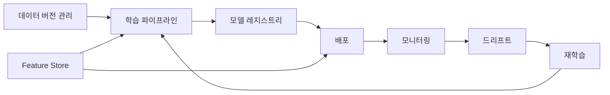

# 운영 가능한 ML 시스템

## 이 글에서 다룰 문제

이 시리즈에서는 실험 관리, 데이터 버전 관리, 학습 파이프라인, 배포, 모니터링, 드리프트, 재학습, Feature Store까지 MLOps의 핵심 조각을 하나씩 살펴봤습니다. 그런데 각 조각을 따로 이해하는 것과, 그것을 실제 운영 시스템으로 엮는 일은 전혀 다른 문제입니다.

현업에서 어려운 지점은 도구 이름을 아는 데 있지 않습니다. 데이터가 언제 학습으로 넘어가고, 학습 결과가 어떤 기준으로 배포되며, 운영 중 이상 징후를 누가 어떤 절차로 처리하는지까지 연결해야 비로소 시스템이 됩니다. 다시 말해 운영 가능한 ML 시스템의 본질은 개별 컴포넌트보다 연결 방식과 경계 설계에 있습니다.

이 글에서는 바로 그 문제를 다룹니다. 시리즈에서 다룬 아홉 가지 조각을 하나의 운영 루프로 어떻게 묶는지, 어디까지 자동화해야 하는지, 그리고 팀이 다음 단계로 나아가려면 무엇부터 갖춰야 하는지를 정리하겠습니다.

> MLOps 101 시리즈 (10/10)

## 이 글에서 배울 것

- 운영 가능한 ML 시스템의 전체 청사진
- 아홉 개 컴포넌트가 실제로 연결되는 방식
- 런북, 온콜, SLI/SLO 같은 운영 요소의 의미
- 우리 팀의 성숙도를 점검하는 간단한 기준
- 마지막 단계에서 자주 생기는 실수 다섯 가지

## 왜 중요한가

실험 환경에서는 좋은 모델 하나를 만드는 일로도 충분할 수 있습니다. 하지만 프로덕션에서는 모델 자체보다 그 앞뒤에 붙는 운영 체계가 더 많은 장애를 만듭니다. 데이터 스키마가 바뀌었는데 학습 파이프라인이 이를 감지하지 못할 수도 있고, 새 모델이 배포된 뒤 예측 성능이 떨어져도 모니터링이 없으면 한참 뒤에야 알게 될 수 있습니다.

그래서 운영 가능한 ML 시스템을 이해할 때는 "모델을 잘 학습시키는 법"보다 "문제가 생겼을 때 시스템이 어떻게 반응하는가"를 먼저 봐야 합니다. 자동 재학습이 있더라도 잘못된 데이터를 더 빠르게 퍼뜨릴 수 있고, 경고가 많더라도 누가 무엇을 해야 하는지 정해져 있지 않으면 결국 아무도 대응하지 못합니다.

## 전체 구조를 한눈에 보기



이 그림은 운영 가능한 ML 시스템을 가장 단순한 루프로 압축한 모습입니다. 데이터 버전 관리에서 출발한 변화가 학습 파이프라인으로 들어가고, 검증을 통과한 모델은 레지스트리에 등록된 뒤 배포됩니다. 배포가 끝나면 시스템은 멈추지 않고, 운영 지표와 드리프트 신호를 계속 관찰하다가 필요할 때 다시 학습을 트리거합니다.

중요한 점은 이 흐름이 일직선이 아니라 순환 구조라는 점입니다. 모델을 한 번 올리고 끝나는 것이 아니라, 운영 중에 얻은 신호가 다시 학습 단계로 돌아가야 합니다. 그리고 Feature Store는 학습 단계와 서빙 단계를 동시에 지탱하면서, 학습 때 쓴 특징과 운영 때 쓰는 특징 사이의 차이를 줄이는 역할을 합니다.

## 핵심 용어

- **MLOps 성숙도**: 수동 중심 단계에서 자동화 단계, 더 나아가 자율 운영 단계로 발전하는 수준을 말합니다.
- **런북(Runbook)**: 경고가 울렸을 때 어떤 순서로 무엇을 확인해야 하는지 적어 둔 대응 문서입니다.
- **온콜(On-call)**: 장애나 경고에 대응할 담당자를 순번으로 정해 두는 운영 방식입니다.
- **SLI/SLO**: 서비스 상태를 측정하는 지표와 목표입니다. 예를 들어 지연 시간, 오류율, 예측 정확도 하락률 같은 항목이 여기에 들어갑니다.
- **포스트모템(Postmortem)**: 사고가 끝난 뒤 비난 없이 원인과 재발 방지책을 정리하는 리뷰입니다.

## Before / After

운영 가능한 ML 시스템이 왜 필요한지 감을 잡으려면, 도입 전과 도입 후를 나눠 보면 이해가 쉽습니다.

**Before**: 데이터 과학자가 노트북에서 모델을 학습하고, 결과 파일을 수동으로 전달한 뒤, 운영 이슈는 사용자가 먼저 발견합니다.

**After**: 데이터 변화부터 모델 학습, 배포, 경고까지 하나의 DAG와 운영 절차가 이어져서, 시스템이 먼저 이상 징후를 드러냅니다.

차이는 단순히 자동화 유무가 아닙니다. Before 상태에서는 모든 단계가 사람의 기억과 수작업에 기대고 있어서 재현성이 낮고, 문제가 생겨도 어디서부터 틀어졌는지 추적하기 어렵습니다. After 상태에서는 시스템 경계가 명확해지고, 누락된 운영 요소도 체크리스트로 드러납니다.

## 실습: 운영 성숙도 점검표를 코드로 표현하기

이제 아주 작은 예제로 운영 성숙도를 어떻게 표현할 수 있는지 보겠습니다. 아래 코드는 실제 MLOps 플랫폼을 구현하는 예제는 아니지만, 팀이 현재 어디쯤 와 있는지 공통 언어로 정리하는 데는 꽤 유용합니다.

### 1단계 — 점검 항목 정의

```python
checks = {
    "data_versioned": True,
    "pipeline_dag": True,
    "model_registry": True,
    "container_image": True,
    "metrics_endpoint": True,
    "drift_alert": False,
    "retraining_trigger": False,
    "feature_store": False,
    "runbook": True,
}
```

이 딕셔너리는 우리 팀이 운영 가능한 ML 시스템을 이루는 필수 항목을 얼마나 갖췄는지 나타냅니다. 데이터 버전 관리, DAG 기반 학습, 모델 레지스트리, 컨테이너 이미지, 메트릭 엔드포인트까지는 갖췄지만, 드리프트 경고, 재학습 트리거, Feature Store는 아직 비어 있다고 가정한 상태입니다.

여기서 핵심은 항목의 이름보다 팀 내부 합의입니다. 무엇을 "운영 가능"의 기준으로 볼지 먼저 정해 두어야 체크리스트가 살아 움직입니다.

### 2단계 — 성숙도 점수 계산

```python
def maturity(checks: dict) -> str:
    score = sum(checks.values())
    if score >= 8:
        return "production"
    if score >= 5:
        return "transitional"
    return "early"

print(maturity(checks))
```

이 함수는 켜져 있는 항목 수를 합산해서 현재 단계를 early, transitional, production 중 하나로 분류합니다. 물론 현실의 성숙도를 단순 합계 하나로 정확히 표현할 수는 없습니다. 그래도 팀 대화에서는 이런 단순한 분류가 오히려 효과적입니다. 지금이 초기 단계인지, 전환 구간인지, 운영 체계가 어느 정도 갖춰졌는지를 빠르게 공유할 수 있기 때문입니다.

### 3단계 — 빠진 항목 찾기

```python
def missing(checks: dict) -> list:
    return [k for k, v in checks.items() if not v]

print(missing(checks))
```

성숙도 점수만 보면 막연할 수 있습니다. 그래서 바로 뒤에 빠진 항목을 목록으로 뽑아 보는 함수가 필요합니다. 운영 개선은 늘 예산과 인력이 제한된 상태에서 진행되므로, 부족한 부분을 명시적으로 드러내는 것 자체가 큰 진전입니다.

### 4단계 — 다음 우선순위 하나 고르기

```python
def next_step(missing_items: list) -> str:
    priority = ["drift_alert", "retraining_trigger", "feature_store"]
    for p in priority:
        if p in missing_items:
            return p
    return "done"

print(next_step(missing(checks)))
```

빠진 항목을 다 안다고 해서 한 번에 다 해결할 수는 없습니다. 그래서 이 함수는 우선순위를 정해 가장 먼저 손대야 할 항목 하나를 고릅니다. 여기서는 드리프트 경고, 재학습 트리거, Feature Store 순으로 우선순위를 두었습니다.

이 방식이 실무에서 유용한 이유는 개선 작업을 "해야 할 일 전체"가 아니라 "지금 가장 중요한 다음 한 걸음"으로 바꿔 주기 때문입니다. 운영 체계는 대개 이렇게 한 칸씩 올라갑니다.

### 5단계 — 팀 채팅에 보낼 상태 문장 만들기

```python
def status_line(checks: dict) -> str:
    return f"{maturity(checks)} | next={next_step(missing(checks))}"

print(status_line(checks))
```

운영 상태를 팀이 공유할 때는 긴 보고서보다 짧은 상태 문장이 더 자주 쓰입니다. 이 함수는 현재 성숙도와 다음 우선순위를 한 줄로 묶어, 예를 들어 스탠드업이나 팀 채팅에서 빠르게 공유할 수 있게 해 줍니다.

## 이 코드에서 주목할 점

- 체크리스트를 코드로 표현하면 운영 준비 상태가 눈에 보입니다.
- 성숙도 점수는 기술팀이 공유하는 최소 기준이 됩니다.
- 빠진 항목을 한 번에 다 해결하지 않아도, 다음 한 가지를 정하는 것만으로 실제 개선이 시작됩니다.

이 예제는 작지만 중요한 태도를 보여 줍니다. 운영 체계는 보이지 않는 작업이 많아서, 문서와 대화만으로는 진척을 공유하기 어렵습니다. 반면 체크리스트를 코드나 대시보드로 옮기면 현재 상태를 팀이 같은 방식으로 볼 수 있습니다.

## 자주 하는 실수 5가지

1. **모든 컴포넌트를 한 번에 깔려고 합니다.**
   보통은 이 접근이 가장 빨리 지칩니다. 데이터 버전 관리도 없는데 Feature Store부터 붙이면 연결은 복잡해지고 효과는 체감하기 어렵습니다.
2. **도구 도입만 보고 조직 변화는 놓칩니다.**
   MLflow, Airflow, Feast를 깔아도 소유자, 승인 기준, 장애 대응 절차가 없으면 운영 체계는 생기지 않습니다.
3. **SLO 없이 경고부터 연결합니다.**
   무엇이 중요한 신호인지 정해지지 않은 상태에서 알림을 늘리면, 결국 아무도 경고를 신뢰하지 않게 됩니다.
4. **런북 없이 온콜부터 시작합니다.**
   담당자를 세우는 것만으로는 운영이 되지 않습니다. 새벽에 경고가 울렸을 때 첫 10분에 무엇을 확인할지 문서가 있어야 합니다.
5. **같은 사고를 반복하면서 포스트모템은 남기지 않습니다.**
   운영 성숙도는 사고를 안 내는 데서 끝나지 않습니다. 사고 뒤에 시스템과 절차를 고치는 문화까지 포함합니다.

## 실무에서는 이렇게 쓰입니다

예를 들어 핀테크 팀이 결제 이상 탐지 모델을 운영한다고 가정해 보겠습니다. 데이터 준비와 학습은 Airflow DAG로 돌고, 실험과 모델 버전은 MLflow로 관리하며, 온라인·오프라인 특징 일관성은 Feast로 맞춥니다. 배포 이후의 지표는 Prometheus와 대시보드에서 보고, 특정 경고가 울리면 온콜 엔지니어가 런북에 따라 대응합니다.

이 예시에서 중요한 것은 특정 도구 조합이 정답이라는 뜻이 아닙니다. 어떤 도구를 쓰든 데이터, 학습, 등록, 배포, 모니터링, 대응이 한 시스템으로 이어져야 한다는 점이 핵심입니다.

## 시니어 엔지니어는 이렇게 생각합니다

- 처음부터 완성형 플랫폼을 만들기보다, 가장 약한 연결부 하나를 먼저 고칩니다.
- 팀 경계와 시스템 경계를 명확히 적어 둡니다. 누가 어떤 단계의 소유자인지 모호하면 운영이 흔들립니다.
- 경고는 "정보"가 아니라 "행동 요청"이어야 합니다. 액션이 없는 신호는 대시보드로 보내고, 사람을 깨우는 경고는 줄입니다.
- 운영 체계를 바꿀 때는 한 번에 하나씩 바꿉니다. 그래야 원인과 효과를 분리해서 볼 수 있습니다.
- 문서는 부수 작업이 아니라 시스템의 일부라고 봅니다. 런북, 배포 기준, 포스트모템이 빠지면 자동화도 오래 버티지 못합니다.

## 체크리스트

- [ ] 데이터 버전 관리가 이미 들어가 있다.
- [ ] 학습이 DAG 형태로 반복 가능하게 실행된다.
- [ ] 모델 레지스트리가 있어 버전과 승격 기준을 추적할 수 있다.
- [ ] 모니터링과 드리프트 탐지가 실제 운영에 연결되어 있다.
- [ ] 재학습 트리거가 정의되어 있다.
- [ ] 런북과 온콜 순번이 존재한다.

## 연습 문제

1. 지금 팀에 없는 컴포넌트 세 가지를 골라서, 6주 안에 도입하는 계획을 적어 보세요.
2. `99% < 200ms` 같은 SLO가 깨질 때 가장 먼저 영향을 줄 가능성이 큰 컴포넌트는 무엇인지 생각해 보세요.
3. 자동 재학습을 붙였을 때 새로 생기는 조직 리스크 두 가지를 적어 보세요.

## 정리 및 다음 단계

이번 글은 MLOps를 구성하는 여러 조각을 하나의 운영 루프로 연결해 보는 마무리 장이었습니다. 핵심은 복잡한 플랫폼을 한 번에 완성하는 데 있지 않습니다. 데이터, 학습, 배포, 모니터링, 재학습이 어떤 경계로 이어져야 하는지 이해하고, 그 연결을 조금씩 실제 프로젝트 안에 심는 데 있습니다.

이 시리즈를 다 읽었다면 이제 필요한 일은 하나입니다. 지금 팀이 가장 약한 컴포넌트 하나를 고르고, 그것을 운영 체계 안에 실제로 붙여 보는 것입니다. 체크리스트를 만들고, 경고 기준을 정하고, 런북을 쓰는 순간부터 MLOps는 개념이 아니라 시스템이 됩니다.

<!-- toc:begin -->
- [MLOps란 무엇인가?](./01-what-is-mlops.md)
- [실험 관리](./02-experiment-tracking.md)
- [데이터 버전 관리](./03-data-versioning.md)
- [모델 학습 파이프라인](./04-training-pipeline.md)
- [모델 배포](./05-model-deployment.md)
- [모델 모니터링](./06-model-monitoring.md)
- [Data Drift와 Model Drift](./07-data-and-model-drift.md)
- [재학습](./08-retraining.md)
- [Feature Store](./09-feature-store.md)
- **운영 가능한 ML 시스템 (현재 글)**
<!-- toc:end -->

## 참고 자료

- [Google — MLOps Maturity](https://cloud.google.com/architecture/mlops-continuous-delivery-and-automation-pipelines-in-machine-learning)
- [Microsoft — MLOps Maturity Model](https://learn.microsoft.com/azure/architecture/example-scenario/mlops/mlops-maturity-model)
- [Made With ML](https://madewithml.com/)
- [Hidden Technical Debt in ML Systems](https://papers.nips.cc/paper_files/paper/2015/hash/86df7dcfd896fcaf2674f757a2463eba-Abstract.html)

Tags: MLOps, Architecture, Production, DataScience, Pipeline
