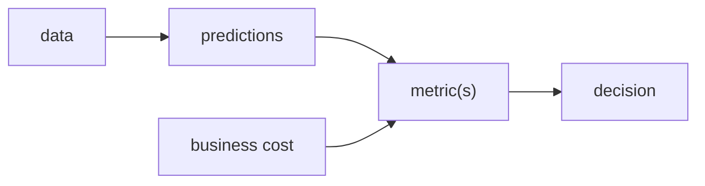

# Why Model Evaluation Is Hard

> Model Evaluation 101 series (1/10)

<!-- a-grade-intro:begin -->

**Core question**: Is a model with 99% accuracy actually a good model?

> *Evaluation is not one number. It is the intersection of data distribution, cost structure, and the decision the model supports.*

<!-- a-grade-intro:end -->

## What You Will Learn

- Four reasons evaluation is hard
- Why metrics are not business value
- The threat of distribution drift
- How thresholds drive decisions
- Five common pitfalls

## Why It Matters

Evaluation is the language of model selection. When the language is wrong, the entire team aims at the wrong target.

## Concept at a Glance



## Key Terms

- **Metric**: a numerical summary of performance.
- **Base rate**: class proportion in the data.
- **Threshold**: probability cut-off for class assignment.
- **Drift**: change in distribution over time.
- **Cost matrix**: distinct costs for different errors.

## Before/After

**Before**: One accuracy number drives the decision.

**After**: Metrics, confusion matrix, cost, and drift are reviewed together.

## Hands-on: 5 Steps Through Evaluation Pitfalls

### Step 1 — Imbalanced data

```python
import numpy as np
y = np.array([0]*95 + [1]*5)
pred_dummy = np.zeros_like(y)
print("acc:", (pred_dummy == y).mean())
```

### Step 2 — The accuracy trap

```python
print("recall (1):", ((pred_dummy == 1) & (y == 1)).sum() / (y == 1).sum())
```

### Step 3 — Confusion matrix

```python
from sklearn.metrics import confusion_matrix
print(confusion_matrix(y, pred_dummy))
```

### Step 4 — Threshold sensitivity

```python
import numpy as np
prob = np.linspace(0, 1, 100)
yt = (prob > 0.5).astype(int)
for t in [0.3, 0.5, 0.7]:
    pred = (prob >= t).astype(int)
    print(t, (pred == yt).mean())
```

### Step 5 — Cost weighting

```python
def cost(tp, fp, fn, c_fp=1, c_fn=10):
    return c_fp * fp + c_fn * fn
print("cost:", cost(tp=5, fp=10, fn=2))
```

## What to Notice in This Code

- 95% accuracy can be completely useless.
- The threshold moves every metric.
- The cost matrix represents the real decision.

## Five Common Mistakes

1. Selecting models based on a single metric.
2. Ignoring base rates.
3. Re-evaluating on the test set.
4. Locking the threshold to 0.5.
5. Skipping business cost considerations.

## How This Shows Up in Production

A/B experiments, MLOps gates, and compliance reviews all hinge on the evaluation definition. It is the contract among teams.

## How a Senior Engineer Thinks

- Order: business cost, then metric, then threshold.
- One metric is rarely enough.
- Touch the test set exactly once.
- Drift always happens.
- Treat evaluation as code worth reviewing.

## Checklist

- [ ] At least two metrics in addition to accuracy.
- [ ] Always include the confusion matrix.
- [ ] Document the business cost.
- [ ] Justify the threshold with reasoning.

## Practice Problems

1. Build a dummy model that scores 99% accuracy on a 1% base-rate dataset.
2. Sweep thresholds from 0.1 to 0.9 and compare precision and recall.
3. Define a cost matrix and minimize total cost over thresholds.

## Wrap-up and Next Steps

Evaluation is the language of model selection. Next, we cover the roles of train, validation, and test sets.

<!-- toc:begin -->
- **Why Model Evaluation Is Hard (current)**
- Train, Validation, and Test (upcoming)
- The Limits of Accuracy (upcoming)
- Precision and Recall (upcoming)
- F1 Score (upcoming)
- ROC and AUC (upcoming)
- Calibration (upcoming)
- Cross Validation (upcoming)
- Error Analysis (upcoming)
- Building an Evaluation Report (upcoming)
<!-- toc:end -->

## References

- [scikit-learn — Model evaluation](https://scikit-learn.org/stable/modules/model_evaluation.html)
- [Google — Rules of ML](https://developers.google.com/machine-learning/guides/rules-of-ml)
- [Wikipedia — Confusion matrix](https://en.wikipedia.org/wiki/Confusion_matrix)
- [Pattern Recognition and Machine Learning — Bishop](https://www.microsoft.com/en-us/research/people/cmbishop/prml-book/)

Tags: ModelEvaluation, Metrics, MachineLearning, Foundations, Beginner
