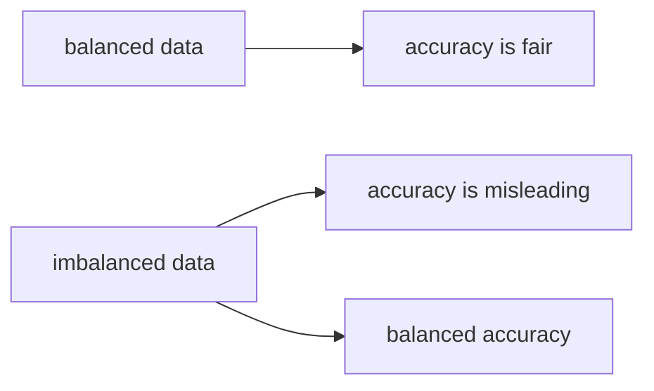

# The Limits of Accuracy

> Model Evaluation 101 series (3/10)

<!-- a-grade-intro:begin -->

**Core question**: Is "95% accuracy" always a good score?

> *Accuracy is fair only when classes are balanced. On imbalanced data, you need baselines and balanced accuracy.*

<!-- a-grade-intro:end -->

## What You Will Learn

- The accuracy formula and meaning
- Base rates and dummy classifiers
- The intuition behind balanced accuracy
- Limits of accuracy in multiclass settings
- Five common pitfalls

## Why It Matters

When the comparison standard is a single accuracy number, the entire team can drift unknowingly into wrong decisions.

## Concept at a Glance



## Key Terms

- **Accuracy**: `(TP+TN)/N`.
- **Base rate**: class proportion.
- **Dummy classifier**: a constant or random predictor.
- **Balanced Accuracy**: average per-class recall.
- **Top-k Accuracy**: correct label appears in top-k predictions.

## Before/After

**Before**: "acc 95%, done."

**After**: Baseline, then balanced accuracy, then per-class breakdown.

## Hands-on: 5 Steps Dissecting Accuracy

### Step 1 — Imbalanced data

```python
from sklearn.datasets import make_classification
X, y = make_classification(n_samples=1000, weights=[0.95, 0.05], random_state=0)
print("base rate:", y.mean())
```

### Step 2 — Dummy classifier

```python
from sklearn.dummy import DummyClassifier
d = DummyClassifier(strategy="most_frequent").fit(X, y)
print("dummy acc:", d.score(X, y))
```

### Step 3 — Train a model

```python
from sklearn.model_selection import train_test_split
from sklearn.linear_model import LogisticRegression
Xtr, Xte, ytr, yte = train_test_split(X, y, test_size=0.2, stratify=y, random_state=42)
m = LogisticRegression(max_iter=1000).fit(Xtr, ytr)
print("acc:", m.score(Xte, yte))
```

### Step 4 — Balanced accuracy

```python
from sklearn.metrics import balanced_accuracy_score
pred = m.predict(Xte)
print("bacc:", balanced_accuracy_score(yte, pred))
```

### Step 5 — Per-class report

```python
from sklearn.metrics import classification_report
print(classification_report(yte, pred))
```

## What to Notice in This Code

- A 95% dummy is your real baseline.
- Balanced accuracy is closer to the truth on skewed data.
- Per-class recall reveals where the model actually fails.

## Five Common Mistakes

1. Claiming superiority without comparing to a dummy classifier.
2. Reporting only top-1 accuracy on multiclass problems.
3. Using accuracy on heavy imbalance.
4. Comparing accuracy after resampling.
5. Ignoring the small-class row in the report.

## How This Shows Up in Production

Spam, fraud, and rare-disease detection all sit at base rates below 5%. Accuracy is a trap in those settings.

## How a Senior Engineer Thinks

- Always compare against a dummy.
- For imbalance, prefer balanced accuracy and PR-AUC.
- Per-class analysis is debugging.
- Top-k makes sense for ranking and recommendation.
- Accuracy is the closing number on balanced data, not the opener.

## Checklist

- [ ] I compare to a dummy classifier.
- [ ] I report balanced accuracy.
- [ ] I look at per-class recall.
- [ ] I use top-k where appropriate.

## Practice Problems

1. Compare a dummy and a real model on a 1% base-rate dataset.
2. Construct a dataset where balanced accuracy and accuracy diverge most.
3. Compute top-3 accuracy on a multiclass dataset.

## Wrap-up and Next Steps

Accuracy is useless when its assumptions break. Next, we cover precision and recall for imbalanced evaluation.

<!-- toc:begin -->
- [Why Model Evaluation Is Hard](./01-why-evaluation-is-hard.md)
- [Train, Validation, and Test](./02-train-val-test.md)
- **The Limits of Accuracy (current)**
- Precision and Recall (upcoming)
- F1 Score (upcoming)
- ROC and AUC (upcoming)
- Calibration (upcoming)
- Cross Validation (upcoming)
- Error Analysis (upcoming)
- Building an Evaluation Report (upcoming)
<!-- toc:end -->

## References

- [scikit-learn — Balanced accuracy](https://scikit-learn.org/stable/modules/generated/sklearn.metrics.balanced_accuracy_score.html)
- [scikit-learn — DummyClassifier](https://scikit-learn.org/stable/modules/generated/sklearn.dummy.DummyClassifier.html)
- [Wikipedia — Accuracy paradox](https://en.wikipedia.org/wiki/Accuracy_paradox)
- [Google — Classification metrics](https://developers.google.com/machine-learning/crash-course/classification/accuracy)

Tags: ModelEvaluation, Accuracy, ImbalancedData, BaselineModel, scikit-learn
