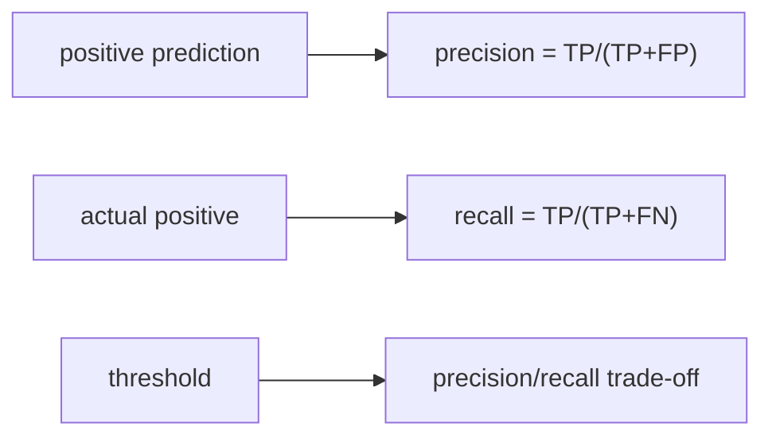

# Precision and Recall

> Model Evaluation 101 series (4/10)

<!-- a-grade-intro:begin -->

**Core question**: Is "being correct" or "missing nothing" more important?

> *Precision reduces false alarms. Recall reduces misses. Each problem ranks them differently.*

<!-- a-grade-intro:end -->

This is post 4 in the Model Evaluation 101 series.

## What You Will Learn

- The formulas and intuitions of precision and recall
- How to read a confusion matrix
- How to tune the threshold to balance the two
- The PR curve and average precision
- Five common pitfalls

## Why It Matters

A spam filter and a cancer screen can use the same model, yet must prioritize different metrics.

## Concept at a Glance



## Key Terms

- **TP/FP/FN/TN**: the four cells of the confusion matrix.
- **Precision**: of predicted positives, how many are truly positive.
- **Recall**: of actual positives, how many you caught.
- **Threshold**: the probability cutoff for predicting positive.
- **Average Precision (AP)**: area under the precision-recall curve.

## Before/After

**Before**: "report a single F1 and move on."

**After**: separate precision and recall, sweep the threshold, weigh business cost.

## Hands-on: 5 Steps of Threshold Analysis

### Step 1 — Data and model

```python
from sklearn.datasets import make_classification
from sklearn.model_selection import train_test_split
from sklearn.linear_model import LogisticRegression
X, y = make_classification(n_samples=2000, weights=[0.9, 0.1], random_state=0)
Xtr, Xte, ytr, yte = train_test_split(X, y, stratify=y, random_state=42)
m = LogisticRegression(max_iter=1000).fit(Xtr, ytr)
```

### Step 2 — Confusion matrix

```python
from sklearn.metrics import confusion_matrix
pred = m.predict(Xte)
print(confusion_matrix(yte, pred))
```

### Step 3 — Precision and recall scores

```python
from sklearn.metrics import precision_score, recall_score
print("precision:", precision_score(yte, pred))
print("recall:", recall_score(yte, pred))
```

### Step 4 — Threshold sweep

```python
proba = m.predict_proba(Xte)[:, 1]
for t in [0.3, 0.5, 0.7]:
    p = (proba >= t).astype(int)
    print(t, precision_score(yte, p), recall_score(yte, p))
```

### Step 5 — PR curve and AP

```python
from sklearn.metrics import precision_recall_curve, average_precision_score
prec, rec, _ = precision_recall_curve(yte, proba)
print("AP:", average_precision_score(yte, proba))
```

## What to Notice in This Code

- The threshold is the most important post-training knob.
- Precision and recall usually move in opposite directions.
- AP summarizes performance across all thresholds.

## Five Common Mistakes

1. Optimizing recall while ignoring an explosion of false positives.
2. Optimizing precision while quietly missing positives.
3. Treating 0.5 as a fixed threshold.
4. Reading ROC on imbalance and ignoring PR.
5. Optimizing a metric without a business cost behind it.

## How This Shows Up in Production

Fraud detection prioritizes recall. Ad ranking prioritizes precision. The cost ratio sets the threshold.

## How a Senior Engineer Thinks

- Metrics approximate a cost function.
- Business defines the threshold, not the model.
- The PR curve is the standard for imbalance.
- Precision and recall are read together.
- Always check per-class scores.

## Checklist

- [ ] I report precision and recall together.
- [ ] I document the threshold.
- [ ] I review the PR curve and AP.
- [ ] I confirm the business cost ratio.

## Practice Problems

1. Build a table of precision and recall as the threshold sweeps from 0.1 to 0.9.
2. Compare PR curves for a high-AP model and a low-AP model.
3. If one false positive costs as much as ten false negatives, find the optimal threshold.

## Wrap-up and Next Steps

Read precision and recall as a pair. Next, F1 score combines them into a single number.

<!-- toc:begin -->
- [Why Model Evaluation Is Hard](./01-why-evaluation-is-hard.md)
- [Train, Validation, and Test](./02-train-val-test.md)
- [The Limits of Accuracy](./03-limits-of-accuracy.md)
- **Precision and Recall (current)**
- F1 Score (upcoming)
- ROC and AUC (upcoming)
- Calibration (upcoming)
- Cross Validation (upcoming)
- Error Analysis (upcoming)
- Building an Evaluation Report (upcoming)
<!-- toc:end -->

## References

- [scikit-learn — precision_score](https://scikit-learn.org/stable/modules/generated/sklearn.metrics.precision_score.html)
- [scikit-learn — recall_score](https://scikit-learn.org/stable/modules/generated/sklearn.metrics.recall_score.html)
- [scikit-learn — Precision-Recall](https://scikit-learn.org/stable/auto_examples/model_selection/plot_precision_recall.html)
- [Wikipedia — Precision and recall](https://en.wikipedia.org/wiki/Precision_and_recall)

Tags: ModelEvaluation, Precision, Recall, ConfusionMatrix, scikit-learn
