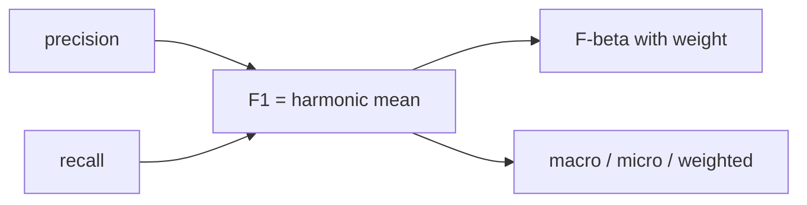

# F1 Score

> Model Evaluation 101 series (5/10)

<!-- a-grade-intro:begin -->

**Core question**: When you collapse precision and recall into a single number, what gets distorted?

> *F1 is the harmonic mean. F-beta generalizes it by weighting one side over the other.*

<!-- a-grade-intro:end -->

## What You Will Learn

- The formula and intuition behind F1
- F-beta for recall-heavy vs precision-heavy use cases
- Macro, micro, and weighted averaging
- What F1 means under class imbalance
- Five common pitfalls

## Why It Matters

Leaderboards usually report a single F1 number. Without specifying which F1, two models cannot be compared.

## Concept at a Glance



## Key Terms

- **F1**: `2*P*R/(P+R)`.
- **F-beta**: `beta>1` favors recall, `beta<1` favors precision.
- **Macro**: simple average of per-class F1.
- **Micro**: aggregate TP, FP, FN first, then compute.
- **Weighted**: weighted by class frequency.

## Before/After

**Before**: "F1 is 0.78."

**After**: "macro F1 is 0.78, F2 is 0.82, per-class F1 is ..."

## Hands-on: 5 Steps Comparing F1 Variants

### Step 1 — Data and model

```python
from sklearn.datasets import make_classification
from sklearn.model_selection import train_test_split
from sklearn.linear_model import LogisticRegression
X, y = make_classification(n_samples=2000, n_classes=3, n_informative=5, weights=[0.6, 0.3, 0.1], random_state=0)
Xtr, Xte, ytr, yte = train_test_split(X, y, stratify=y, random_state=42)
m = LogisticRegression(max_iter=1000).fit(Xtr, ytr)
pred = m.predict(Xte)
```

### Step 2 — F1 averaging

```python
from sklearn.metrics import f1_score
print("micro:", f1_score(yte, pred, average="micro"))
print("macro:", f1_score(yte, pred, average="macro"))
print("weighted:", f1_score(yte, pred, average="weighted"))
```

### Step 3 — Per-class F1

```python
print("per class:", f1_score(yte, pred, average=None))
```

### Step 4 — F-beta

```python
from sklearn.metrics import fbeta_score
print("F2 (recall heavy):", fbeta_score(yte, pred, beta=2, average="macro"))
print("F0.5 (precision heavy):", fbeta_score(yte, pred, beta=0.5, average="macro"))
```

### Step 5 — Threshold vs F1 (binary case)

```python
import numpy as np
from sklearn.datasets import make_classification
Xb, yb = make_classification(n_samples=1000, weights=[0.8, 0.2], random_state=1)
mb = LogisticRegression(max_iter=1000).fit(Xb, yb)
proba = mb.predict_proba(Xb)[:, 1]
for t in np.arange(0.2, 0.9, 0.1):
    p = (proba >= t).astype(int)
    print(round(t, 1), round(f1_score(yb, p), 3))
```

## What to Notice in This Code

- Macro F1 treats minority classes equally.
- Micro F1 is dominated by the majority class.
- Weighted F1 mirrors the class distribution as is.

## Five Common Mistakes

1. Reporting F1 without naming the averaging mode.
2. Misreading macro F1 on imbalanced data.
3. Ignoring per-class precision and recall behind F1.
4. Choosing F-beta beta arbitrarily instead of from cost.
5. Skipping the F1 vs threshold curve.

## How This Shows Up in Production

Competitions love a single F1 for ranking. In production, per-class F1 and the threshold curve matter more.

## How a Senior Engineer Thinks

- A single F1 is a starting line, not a verdict.
- Beta comes from cost, not taste.
- Macro and micro answer different questions.
- Sweep the threshold to find the F1 peak.
- Read per-class F1 to find weaknesses.

## Checklist

- [ ] I name the averaging mode.
- [ ] I report per-class F1.
- [ ] I justify the choice of beta.
- [ ] I plot F1 versus threshold.

## Practice Problems

1. Explain how macro, micro, and weighted F1 differ on a 3-class problem.
2. Pick an F-beta beta when recall is twice as important as precision.
3. Find the threshold that maximizes F1 on the binary example.

## Wrap-up and Next Steps

F1 summarizes; it does not diagnose. Next, ROC and AUC give a threshold-free view.

<!-- toc:begin -->
- [Why Model Evaluation Is Hard](./01-why-evaluation-is-hard.md)
- [Train, Validation, and Test](./02-train-val-test.md)
- [The Limits of Accuracy](./03-limits-of-accuracy.md)
- [Precision and Recall](./04-precision-and-recall.md)
- **F1 Score (current)**
- ROC and AUC (upcoming)
- Calibration (upcoming)
- Cross Validation (upcoming)
- Error Analysis (upcoming)
- Building an Evaluation Report (upcoming)
<!-- toc:end -->

## References

- [scikit-learn — f1_score](https://scikit-learn.org/stable/modules/generated/sklearn.metrics.f1_score.html)
- [scikit-learn — fbeta_score](https://scikit-learn.org/stable/modules/generated/sklearn.metrics.fbeta_score.html)
- [Wikipedia — F-score](https://en.wikipedia.org/wiki/F-score)
- [Google — Classification metrics](https://developers.google.com/machine-learning/crash-course/classification/precision-and-recall)

Tags: ModelEvaluation, F1Score, Fbeta, ImbalancedData, scikit-learn
