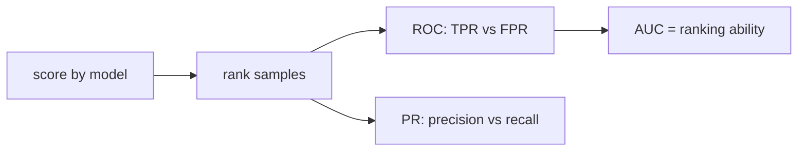

# ROC and AUC

> Model Evaluation 101 series (6/10)

<!-- a-grade-intro:begin -->

**Core question**: Can you grade a model's ranking ability without picking a threshold?

> *ROC plots TPR against FPR over all thresholds. AUC summarizes a model's ranking ability into a single number.*

<!-- a-grade-intro:end -->

This is post 6 in the Model Evaluation 101 series.

## What You Will Learn

- The axes and meaning of the ROC curve
- The probabilistic interpretation of AUC
- How PR and ROC curves disagree
- The AUC trap on imbalanced data
- Five common pitfalls

## Why It Matters

AUC is convenient because it avoids picking a threshold, but production decisions live at one specific threshold.

## Concept at a Glance



## Key Terms

- **TPR**: same as recall.
- **FPR**: `FP/(FP+TN)`.
- **ROC**: TPR vs FPR as the threshold sweeps.
- **AUC-ROC**: probability that a random positive scores higher than a random negative.
- **AUC-PR**: area under the precision-recall curve, more sensitive on imbalance.

## Before/After

**Before**: "AUC 0.9, ship it."

**After**: "AUC 0.9, plus precision and recall at the operating threshold, plus PR-AUC for imbalance."

## Hands-on: 5 Steps Through ROC and AUC

### Step 1 — Data and model

```python
from sklearn.datasets import make_classification
from sklearn.model_selection import train_test_split
from sklearn.linear_model import LogisticRegression
X, y = make_classification(n_samples=2000, weights=[0.9, 0.1], random_state=0)
Xtr, Xte, ytr, yte = train_test_split(X, y, stratify=y, random_state=42)
m = LogisticRegression(max_iter=1000).fit(Xtr, ytr)
proba = m.predict_proba(Xte)[:, 1]
```

### Step 2 — ROC curve

```python
from sklearn.metrics import roc_curve
fpr, tpr, thr = roc_curve(yte, proba)
print("first 3 thresholds:", thr[:3])
```

### Step 3 — AUC

```python
from sklearn.metrics import roc_auc_score
print("AUC-ROC:", roc_auc_score(yte, proba))
```

### Step 4 — Compare with PR-AUC

```python
from sklearn.metrics import average_precision_score
print("AUC-PR:", average_precision_score(yte, proba))
```

### Step 5 — Pick an operating threshold

```python
import numpy as np
target_fpr = 0.05
idx = np.searchsorted(fpr, target_fpr)
print("threshold for FPR<=0.05:", thr[idx], "TPR:", tpr[idx])
```

## What to Notice in This Code

- AUC measures ranking quality and is less sensitive to distribution.
- PR-AUC reacts strongly to imbalance, which is often what you want.
- Operating thresholds are usually fixed by an FPR or recall constraint.

## Five Common Mistakes

1. Trusting AUC alone on heavy imbalance.
2. Mixing ROC and PR comparisons across models.
3. Shipping without nailing down the threshold.
4. Tuning the threshold without calibrating probabilities.
5. Assuming AUC 0.5 always means "random."

## How This Shows Up in Production

Risk-scoring models choose between candidates by AUC. Alerting systems pin a maximum FPR and read TPR off the curve.

## How a Senior Engineer Thinks

- AUC is a comparison summary, not a deployment decision.
- Add PR-AUC under imbalance.
- Fix the threshold from an FPR or recall budget.
- Watch AUC drift over time.
- Look at per-class AUC where it applies.

## Checklist

- [ ] I report AUC-ROC.
- [ ] I report AUC-PR for imbalance.
- [ ] I document the operating threshold.
- [ ] I monitor AUC drift in production.

## Practice Problems

1. Find the TPR achievable at FPR <= 0.01.
2. Show how AUC-ROC and AUC-PR diverge on heavily imbalanced data.
3. Construct two models with the same AUC that make different operating decisions.

## Wrap-up and Next Steps

ROC and AUC speak the language of ranking. Next, calibration asks whether the predicted probabilities themselves are trustworthy.

<!-- toc:begin -->
- [Why Model Evaluation Is Hard](./01-why-evaluation-is-hard.md)
- [Train, Validation, and Test](./02-train-val-test.md)
- [The Limits of Accuracy](./03-limits-of-accuracy.md)
- [Precision and Recall](./04-precision-and-recall.md)
- [F1 Score](./05-f1-score.md)
- **ROC and AUC (current)**
- Calibration (upcoming)
- Cross Validation (upcoming)
- Error Analysis (upcoming)
- Building an Evaluation Report (upcoming)
<!-- toc:end -->

## References

- [scikit-learn — roc_curve](https://scikit-learn.org/stable/modules/generated/sklearn.metrics.roc_curve.html)
- [scikit-learn — roc_auc_score](https://scikit-learn.org/stable/modules/generated/sklearn.metrics.roc_auc_score.html)
- [Wikipedia — ROC curve](https://en.wikipedia.org/wiki/Receiver_operating_characteristic)
- [Google — ROC and AUC](https://developers.google.com/machine-learning/crash-course/classification/roc-and-auc)

Tags: ModelEvaluation, ROC, AUC, PRCurve, scikit-learn
