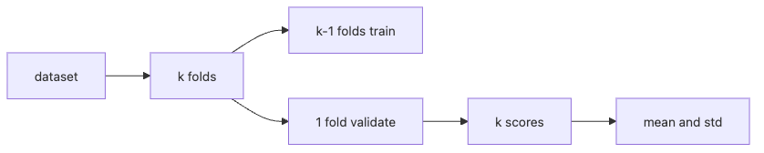

# Cross Validation

One train/test split can make evaluation look more certain than it really is. On small or moderately noisy datasets, a tiny shift in the split can reorder two models that looked clearly separated a minute earlier.

That is why cross validation is better understood as an uncertainty tool than as a score factory. The average matters, but the spread matters too. If the variance is large, a small lead is rarely a real lead.

This is post 8 in the Model Evaluation 101 series. In this post, we use fold-based evaluation to separate stable comparisons from noisy ones and to spot leakage that survives a single split.

## Questions this post answers

- The meaning and trade-offs of K-Fold
- Why stratified is the default
- GroupKFold and time-series splits
- How to read variance
- Five common pitfalls

> Cross validation is not just repeated scoring. It measures how much your estimate moves when the split moves, which is often the difference between a real win and noise.

## Why It Matters

A single split is noisy. Reporting the standard deviation alongside the mean makes comparisons meaningful.

## Concept at a Glance



*cross-validation flow from folds to score mean and variance*
## Key Terms

- **K-Fold**: split into k parts, train and validate k times.
- **Stratified**: preserves class balance per fold.
- **GroupKFold**: keeps groups from leaking across folds.
- **TimeSeriesSplit**: respects past-to-future ordering.
- **Repeated K-Fold**: reruns K-Fold across multiple seeds.

## Before/After

**Before**: a single train and test giving one number.

**After**: a 5-fold mean and standard deviation, plus a leakage check.

## Hands-on: 5 Steps Through CV

### Step 1 — Data and model

```python
from sklearn.datasets import make_classification
from sklearn.linear_model import LogisticRegression
X, y = make_classification(n_samples=2000, weights=[0.7, 0.3], random_state=0)
m = LogisticRegression(max_iter=1000)
```

### Step 2 — Stratified K-Fold

```python
from sklearn.model_selection import cross_val_score, StratifiedKFold
cv = StratifiedKFold(n_splits=5, shuffle=True, random_state=0)
scores = cross_val_score(m, X, y, cv=cv, scoring="f1_macro")
print("mean:", scores.mean(), "std:", scores.std())
```

### Step 3 — GroupKFold (synthetic groups)

```python
import numpy as np
from sklearn.model_selection import GroupKFold
groups = np.repeat(np.arange(100), 20)
gkf = GroupKFold(n_splits=5)
scores = cross_val_score(m, X, y, cv=gkf, groups=groups, scoring="f1_macro")
print("group cv:", scores.mean(), scores.std())
```

### Step 4 — TimeSeriesSplit

```python
from sklearn.model_selection import TimeSeriesSplit
tscv = TimeSeriesSplit(n_splits=5)
scores = cross_val_score(m, X, y, cv=tscv, scoring="f1_macro")
print("time cv:", scores.mean(), scores.std())
```

### Step 5 — Multiple metrics

```python
from sklearn.model_selection import cross_validate
out = cross_validate(m, X, y, cv=cv, scoring=["f1_macro", "roc_auc"])
print({k: v.mean() for k, v in out.items() if k.startswith("test_")})
```

**Expected output:** You should get a mean and standard deviation rather than one fragile score, and you should see how group-aware or time-aware cross validation can reduce false confidence caused by leakage-prone splits.

## What to Notice in This Code

- Stratified is the classification default.
- Group leakage is the most common trap.
- TimeSeriesSplit grows the training window over time.

## Five Common Mistakes

1. Using ordinary K-Fold on time series.
2. Letting the same user or document appear in multiple folds.
3. Reporting the mean while hiding variance.
4. Picking k too small (k=2) or too large.
5. Validating with the test set and then "reporting" on the same set.

## How This Shows Up in Production

Hyperparameter tuning runs CV for inner evaluation, then a separate held-out set for the final number.

## How a Senior Engineer Thinks

- High-variance scores can be incomparable.
- Check group and time leakage before anything else.
- Repeated CV reduces seed dependence.
- Nested CV separates tuning from evaluation.
- Start at 3 folds for slow models.

## Checklist

- [ ] I use stratified, group, or time CV as appropriate.
- [ ] I report mean and standard deviation.
- [ ] Tuning and evaluation are separated.
- [ ] A final hold-out exists.

## Practice Problems

1. Compare the variance of K=2 and K=10 on the same data.
2. Measure the gap between GroupKFold and ordinary KFold scores.
3. Show the optimistic bias of KFold on time-series data.

## Wrap-up and Next Steps

CV is the confidence of the estimate. Next, error analysis dissects the predictions that go wrong.

<!-- toc:begin -->
- [Why Model Evaluation Is Hard](./01-why-evaluation-is-hard.md)
- [Train, Validation, and Test](./02-train-val-test.md)
- [The Limits of Accuracy](./03-limits-of-accuracy.md)
- [Precision and Recall](./04-precision-and-recall.md)
- [F1 Score](./05-f1-score.md)
- [ROC and AUC](./06-roc-and-auc.md)
- [Calibration](./07-calibration.md)
- **Cross Validation (current)**
- Error Analysis (upcoming)
- Building an Evaluation Report (upcoming)
<!-- toc:end -->

## References

- [scikit-learn — Cross-validation](https://scikit-learn.org/stable/modules/cross_validation.html)
- [scikit-learn — StratifiedKFold](https://scikit-learn.org/stable/modules/generated/sklearn.model_selection.StratifiedKFold.html)
- [scikit-learn — TimeSeriesSplit](https://scikit-learn.org/stable/modules/generated/sklearn.model_selection.TimeSeriesSplit.html)
- [Wikipedia — Cross-validation](https://en.wikipedia.org/wiki/Cross-validation_(statistics))

Tags: ModelEvaluation, CrossValidation, KFold, Stratified, scikit-learn
