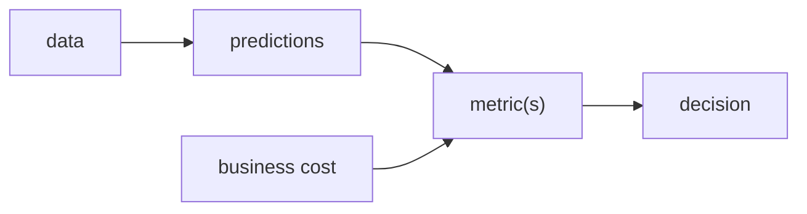

# 모델 평가는 왜 어려운가?

> Model Evaluation 101 시리즈 (1/10)


## 이 글에서 다룰 문제

평가는 모델 선택의 언어입니다. 이 언어가 잘못되면 팀 전체가 잘못된 방향으로 갑니다.

## 전체 흐름


## Before/After

**Before**: *“정확도” 한 줄* 로 모델을 결정.

**After**: 지표, 혼동행렬, 비용, 드리프트를 함께 봅니다.

## 5단계 평가의 함정 체험

### 1단계 — 불균형 데이터

```python
import numpy as np
y = np.array([0]*95 + [1]*5)
pred_dummy = np.zeros_like(y)
print("acc:", (pred_dummy == y).mean())
```

### 2단계 — 정확도의 함정

```python
print("recall (1):", ((pred_dummy == 1) & (y == 1)).sum() / (y == 1).sum())
```

### 3단계 — 혼동행렬

```python
from sklearn.metrics import confusion_matrix
print(confusion_matrix(y, pred_dummy))
```

### 4단계 — 임계값에 따른 변화

```python
import numpy as np
prob = np.linspace(0, 1, 100)
yt = (prob > 0.5).astype(int)
for t in [0.3, 0.5, 0.7]:
    pred = (prob >= t).astype(int)
    print(t, (pred == yt).mean())
```

### 5단계 — 비용 가중

```python
def cost(tp, fp, fn, c_fp=1, c_fn=10):
    return c_fp * fp + c_fn * fn
print("cost:", cost(tp=5, fp=10, fn=2))
```

## 이 코드에서 주목할 점

- *95% 정확도* 가 *완전 무용지물* 일 수 있다.
- 임계값이 지표를 흔듭니다.
- *비용 행렬* 이 *진짜 의사결정* 을 결정.

## 자주 하는 실수 5가지

1. ***단일 지표* 만 보고 *모델 선택*.**
2. ***베이스레이트* 무시.**
3. ***test* 를 *반복 평가*.**
4. ***임계값* 을 *0.5 고정*.**
5. **비즈니스 비용을 무시합니다.**

## 실무에서는 이렇게 쓰입니다

A/B 실험, MLOps 게이트, 컴플라이언스 — *평가 정의* 가 *조직 합의* 의 핵심.

## 체크리스트

- [ ] 정확도 외에 최소 두 개의 지표를 봅니다.
- [ ] 혼동행렬을 항상 확인합니다.
- [ ] 비즈니스 비용을 문서화합니다.
- [ ] 임계값은 근거와 함께 결정합니다.

## 정리 및 다음 단계

평가는 *모델 선택의 언어* 입니다. 다음 글에서는 *train/validation/test* 의 *역할 분리* 를 다룹니다.

<!-- toc:begin -->
- **모델 평가는 왜 어려운가? (현재 글)**
- train/validation/test (예정)
- Accuracy의 한계 (예정)
- Precision과 Recall (예정)
- F1 Score (예정)
- ROC와 AUC (예정)
- Calibration (예정)
- Cross Validation (예정)
- Error Analysis (예정)
- 평가 리포트 만들기 (예정)
<!-- toc:end -->

## 참고 자료

- [scikit-learn — Model evaluation](https://scikit-learn.org/stable/modules/model_evaluation.html)
- [Google — Rules of ML](https://developers.google.com/machine-learning/guides/rules-of-ml)
- [Wikipedia — Confusion matrix](https://en.wikipedia.org/wiki/Confusion_matrix)
- [Pattern Recognition and Machine Learning — Bishop](https://www.microsoft.com/en-us/research/people/cmbishop/prml-book/)

Tags: ModelEvaluation, Metrics, MachineLearning, Foundations, Beginner
