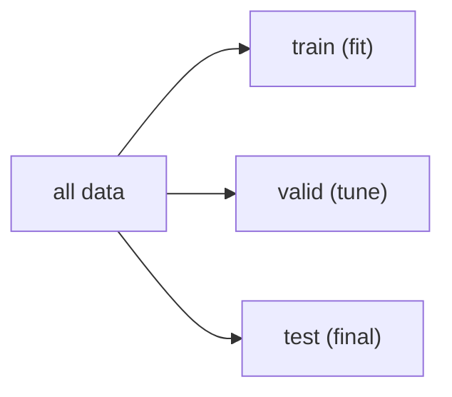

# train/validation/test

> Model Evaluation 101 시리즈 (2/10)


## 이 글에서 다룰 문제

잘못된 분할은 측정을 무효로 만들고, 모든 모델 비교를 오해로 바꿉니다.

## 전체 흐름


## Before/After

**Before**: *“전체에 fit, 일부 score”*.

**After**: *세 분할* + *분할 후 전처리*.

## 5단계 분할 패턴

### 1단계 — 기본 분할

```python
from sklearn.datasets import load_iris
from sklearn.model_selection import train_test_split
X, y = load_iris(return_X_y=True)
Xtrv, Xte, ytrv, yte = train_test_split(X, y, test_size=0.2, stratify=y, random_state=42)
Xtr, Xva, ytr, yva = train_test_split(Xtrv, ytrv, test_size=0.25, stratify=ytrv, random_state=42)
print(Xtr.shape, Xva.shape, Xte.shape)
```

### 2단계 — 누수 시연

```python
from sklearn.preprocessing import StandardScaler
sc_bad = StandardScaler().fit(X)  # 누수: 전체 데이터 사용
sc_ok = StandardScaler().fit(Xtr)  # 올바른 방식
```

### 3단계 — 시계열 분할

```python
from sklearn.model_selection import TimeSeriesSplit
import numpy as np
ts = np.arange(20).reshape(-1, 1)
for tr, te in TimeSeriesSplit(n_splits=3).split(ts):
    print(tr[-1], te[0])
```

### 4단계 — 그룹 분할

```python
from sklearn.model_selection import GroupKFold
groups = np.array([1,1,1,2,2,3,3,3,4,4])
X = np.arange(10).reshape(-1, 1); y = np.arange(10)
for tr, te in GroupKFold(n_splits=2).split(X, y, groups):
    print(set(groups[te]))
```

### 5단계 — 분할 후 학습

```python
from sklearn.linear_model import LogisticRegression
sc = StandardScaler().fit(Xtr)
m = LogisticRegression(max_iter=1000).fit(sc.transform(Xtr), ytr)
print("valid:", m.score(sc.transform(Xva), yva))
```

## 이 코드에서 주목할 점

- *전체에 fit* 하면 *통계 누수*.
- 시계열 데이터는 시간 순서를 유지해야 합니다.
- 그룹 분할은 동일 ID를 분리합니다.

## 자주 하는 실수 5가지

1. ***test 로 튜닝*.**
2. ***시계열 무작위 분할*.**
3. ***그룹 누수* 방치.**
4. **스케일러를 전체 데이터에 fit합니다.**
5. ***valid 없이* *test 로* *반복 비교*.**

## 실무에서는 이렇게 쓰입니다

추천(시간 기반), 의료(환자 그룹), 금융(고객 그룹) — *분할 전략* 이 *실서비스 성능* 의 80%.

## 체크리스트

- [ ] *세 분할* 을 사용한다.
- [ ] 전처리는 분할 후에 fit합니다.
- [ ] 시계열 데이터는 시간 기준으로 분할합니다.
- [ ] 그룹 정보를 명시합니다.

## 정리 및 다음 단계

분할 전략은 *모든 측정의 전제* 입니다. 다음 글에서는 *Accuracy 의 한계* 를 다룹니다.

<!-- toc:begin -->
- [모델 평가는 왜 어려운가?](./01-why-evaluation-is-hard.md)
- **train/validation/test (현재 글)**
- Accuracy의 한계 (예정)
- Precision과 Recall (예정)
- F1 Score (예정)
- ROC와 AUC (예정)
- Calibration (예정)
- Cross Validation (예정)
- Error Analysis (예정)
- 평가 리포트 만들기 (예정)
<!-- toc:end -->

## 참고 자료

- [scikit-learn — Cross-validation](https://scikit-learn.org/stable/modules/cross_validation.html)
- [scikit-learn — TimeSeriesSplit](https://scikit-learn.org/stable/modules/generated/sklearn.model_selection.TimeSeriesSplit.html)
- [Forecasting: Principles and Practice — Hyndman](https://otexts.com/fpp3/)
- [Google — Data leakage](https://developers.google.com/machine-learning/guides/rules-of-ml)

Tags: ModelEvaluation, TrainValTest, DataLeakage, CrossValidation, scikit-learn
