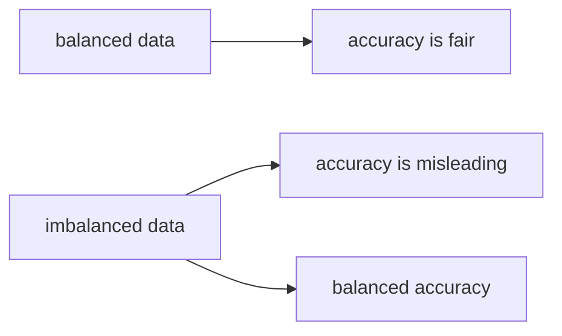

# 정확도의 한계

정확도는 가장 익숙한 분류 지표입니다. 예측이 맞았는지 틀렸는지를 세면 되니 설명도 쉽고, 숫자도 직관적입니다. 문제는 직관적이라는 이유로 너무 일찍 결론을 내려 버리기 쉽다는 점입니다. 특히 클래스 비율이 기울어진 데이터에서는 정확도가 모델의 실력을 거의 숨겨 버릴 수 있습니다.

스팸, 사기, 희귀 질환 탐지처럼 양성이 적은 문제에서는 더더욱 그렇습니다. 이 영역에서는 대부분을 음성으로 찍기만 해도 정확도는 높게 나옵니다. 그래서 정확도는 출발점일 수는 있어도, 종착점이 되어서는 안 됩니다.

이 글은 Model Evaluation 101 시리즈의 3번째 글입니다.

---

## 이 글에서 다룰 문제

- 정확도는 어떤 상황에서 공정한 지표일까요?
- 베이스레이트가 낮으면 정확도는 왜 쉽게 오해를 부를까요?
- 더미 분류기와 비교하는 습관이 왜 중요할까요?
- 균형 정확도는 무엇을 보완해 줄까요?
- 다중 분류 문제에서 정확도만 보면 무엇을 놓치게 될까요?

> 정확도는 클래스가 균형 잡혀 있을 때는 유용하지만, 데이터가 한쪽으로 기울기 시작하면 가장 먼저 의심해야 할 숫자가 됩니다. 이때는 기준선과 클래스별 성능을 함께 봐야 합니다.

## 왜 이 글이 중요한가

정확도 하나로 모델을 비교하면 팀 전체가 같은 착시를 공유하게 됩니다. 예를 들어 양성 비율이 5%인 문제에서 95% 정확도는 대단한 성능처럼 보이지만, 실제로는 아무 양성도 잡지 못한 모델일 수 있습니다.

이런 문제는 실무에서 자주 등장합니다. 이상 탐지, 의료 분류, 불량 검출처럼 중요한 이벤트가 드물수록 정확도는 더 위험해집니다. 그래서 정확도를 읽을 때는 반드시 베이스레이트, 더미 모델, 클래스별 재현율을 함께 봐야 합니다.

## 한눈에 보는 멘탈 모델



이 그림이 말하는 바는 단순합니다. 정확도가 나쁜 지표라는 뜻이 아니라, 공정하게 읽을 조건이 있다는 뜻입니다. 클래스 비율이 크게 기울면 정확도 대신 기준선 비교와 균형 정확도가 먼저 나와야 합니다.

## 핵심 용어

- **정확도(accuracy)**: `(TP+TN)/N`입니다.
- **베이스레이트(base rate)**: 각 클래스가 데이터에서 차지하는 비율입니다.
- **더미 분류기(dummy classifier)**: 상수 예측이나 단순 규칙만 쓰는 기준선 모델입니다.
- **균형 정확도(balanced accuracy)**: 클래스별 재현율의 평균입니다.
- **Top-k 정확도**: 정답이 상위 k개 예측 안에 들어오면 맞춘 것으로 보는 방식입니다.

## 정확도를 보는 방식의 차이

좋지 않은 습관은 정확도만 보고 바로 판단하는 것입니다. `acc 95%`라는 숫자는 문맥 없이 너무 강해 보입니다. 하지만 더미 분류기와 비교하지 않으면 이 숫자가 실제 개선인지, 데이터 분포가 준 착시인지 알 수 없습니다.

좋은 습관은 먼저 기준선을 세우는 것입니다. 더미 분류기가 몇 점인지 확인하고, 그 다음 균형 정확도와 클래스별 리포트를 봅니다. 그래야 모델이 실제로 어느 클래스를 놓치고 있는지 드러납니다.

## 정확도를 해부하는 다섯 단계

### 1단계 — 불균형 데이터

```python
from sklearn.datasets import make_classification
X, y = make_classification(n_samples=1000, weights=[0.95, 0.05], random_state=0)
print("base rate:", y.mean())
```

### 2단계 — 더미 분류기

```python
from sklearn.dummy import DummyClassifier
d = DummyClassifier(strategy="most_frequent").fit(X, y)
print("dummy acc:", d.score(X, y))
```

### 3단계 — 모델 학습

```python
from sklearn.model_selection import train_test_split
from sklearn.linear_model import LogisticRegression
Xtr, Xte, ytr, yte = train_test_split(X, y, test_size=0.2, stratify=y, random_state=42)
m = LogisticRegression(max_iter=1000).fit(Xtr, ytr)
print("acc:", m.score(Xte, yte))
```

### 4단계 — 균형 정확도

```python
from sklearn.metrics import balanced_accuracy_score
pred = m.predict(Xte)
print("bacc:", balanced_accuracy_score(yte, pred))
```

### 5단계 — 클래스별 리포트

```python
from sklearn.metrics import classification_report
print(classification_report(yte, pred))
```

## 이 코드에서 먼저 봐야 할 점

두 번째 코드의 더미 분류기가 가장 중요합니다. 실제 모델이 더미보다 조금만 높은 정확도를 보인다면, 겉보기 수치가 높아도 실질적인 개선은 작을 수 있습니다. 네 번째 단계의 균형 정확도는 이런 착시를 걷어내는 역할을 합니다.

다섯 번째 단계의 클래스별 리포트도 중요합니다. 소수 클래스에서 재현율이 무너지고 있다면, 전체 정확도는 그 사실을 거의 숨겨 버립니다. 운영에서는 바로 이 작은 행 하나가 가장 중요한 신호가 되는 경우가 많습니다.

## 자주 헷갈리는 지점

첫째, 더미와 비교하지 않은 정확도는 해석이 거의 불가능합니다. 둘째, 리샘플링 뒤 정확도만 비교하면 원래 데이터 분포가 가진 의미를 놓치기 쉽습니다. 셋째, 다중 분류 문제에서도 정확도 하나만 보면 어떤 클래스가 계속 무너지는지 보이지 않습니다.

또한 추천이나 검색처럼 상위 후보가 중요한 문제에서는 Top-k 정확도가 더 적절할 수 있습니다. 문제의 형태가 바뀌었는데도 정확도만 고집하면 지표가 현실을 설명하지 못합니다.

## 실무에서는 이렇게 생각한다

시니어 엔지니어는 정확도를 맨 앞에 두지 않습니다. 먼저 더미 기준선, 클래스 불균형 정도, 클래스별 재현율을 봅니다. 그다음에야 정확도를 마무리 숫자로 읽습니다. 순서가 중요합니다.

또한 정확도는 디버깅 지표가 아니라 요약 지표에 가깝게 다룹니다. 문제를 고치려면 결국 클래스별 성능, 혼동 행렬, 임계값 효과를 더 깊게 봐야 합니다. 그래서 다음 글의 정밀도와 재현율이 자연스럽게 이어집니다.

## 점검 목록

- [ ] 더미 분류기와 비교합니다.
- [ ] 균형 정확도를 함께 보고합니다.
- [ ] 클래스별 재현율을 확인합니다.
- [ ] 문제 성격에 따라 Top-k 사용 여부를 검토합니다.

## 정리

정확도는 편리하지만, 편리함 때문에 가장 쉽게 오해되는 지표이기도 합니다. 특히 불균형 데이터에서는 더미 기준선과 균형 정확도, 클래스별 분석이 함께 있어야 비로소 의미가 생깁니다. 다음 글에서는 정확도보다 더 직접적으로 오류의 성격을 보여 주는 정밀도와 재현율을 살펴보겠습니다.

<!-- toc:begin -->
- [모델 평가는 왜 어려운가?](./01-why-evaluation-is-hard.md)
- [훈련·검증·테스트 데이터 나누기](./02-train-val-test.md)
- **정확도의 한계 (현재 글)**
- 정밀도와 재현율 (예정)
- F1 점수 (예정)
- ROC와 AUC 이해하기 (예정)
- 확률 보정 이해하기 (예정)
- 교차 검증 이해하기 (예정)
- 오류 분석으로 약점 찾기 (예정)
- 평가 리포트 만들기 (예정)
<!-- toc:end -->

## 참고 자료

- [scikit-learn — Balanced accuracy](https://scikit-learn.org/stable/modules/generated/sklearn.metrics.balanced_accuracy_score.html)
- [scikit-learn — DummyClassifier](https://scikit-learn.org/stable/modules/generated/sklearn.dummy.DummyClassifier.html)
- [Wikipedia — Accuracy paradox](https://en.wikipedia.org/wiki/Accuracy_paradox)
- [Google — Classification metrics](https://developers.google.com/machine-learning/crash-course/classification/accuracy)

Tags: ModelEvaluation, Accuracy, ImbalancedData, BaselineModel, scikit-learn
