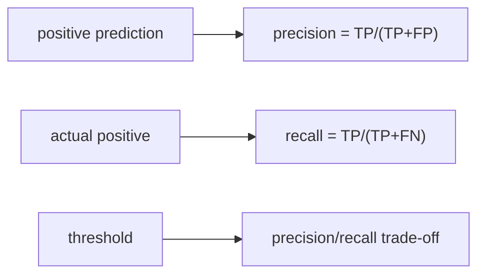

# 정밀도와 재현율

모든 분류 문제가 같은 종류의 실수를 두려워하지는 않습니다. 스팸 필터는 정상 메일을 스팸으로 잘못 보내는 일을 줄이고 싶어 하고, 암 검진은 놓치는 사례를 줄이고 싶어 합니다. 같은 모델이라도 무엇을 더 중요하게 보느냐에 따라 좋은 모델의 정의가 달라집니다.

이 지점에서 정확도는 너무 거칠고, 정밀도와 재현율이 비로소 현실적인 언어가 됩니다. 하나는 거짓 경보를 얼마나 줄였는지, 다른 하나는 실제 양성을 얼마나 놓치지 않았는지를 말해 줍니다.

이 글은 Model Evaluation 101 시리즈의 4번째 글입니다.

---

## 이 글에서 다룰 문제

- 정밀도와 재현율은 각각 무엇을 측정할까요?
- 혼동 행렬은 이 둘을 어떻게 읽게 도와줄까요?
- 왜 임계값이 두 지표의 균형을 바꿀까요?
- 불균형 데이터에서는 왜 PR 곡선이 중요할까요?
- 지표 최적화와 비즈니스 비용은 어떻게 연결해야 할까요?

> 정밀도는 잘못 울린 경보를 줄이는 지표이고, 재현율은 놓친 사례를 줄이는 지표입니다. 대부분의 분류 문제는 이 둘 사이에서 어디를 우선할지 결정하는 작업입니다.

## 왜 이 글이 중요한가

정밀도와 재현율을 읽지 못하면 모델이 어떤 방식으로 실패하는지 알 수 없습니다. 정확도는 전체 비율을 말하지만, 정밀도와 재현율은 실패의 성격을 보여 줍니다. 그래서 운영 기준선을 정할 때 훨씬 직접적인 지표가 됩니다.

사기 탐지에서는 재현율이 낮으면 위험한 사건을 놓칩니다. 반대로 광고 클릭 예측이나 알림 시스템에서는 정밀도가 낮으면 잘못된 노출과 피로가 쌓입니다. 결국 어떤 지표가 더 중요한지는 모델이 아니라 업무가 정합니다.

## 한눈에 보는 멘탈 모델



정밀도와 재현율은 따로 움직이지 않습니다. 보통 임계값을 낮추면 더 많은 양성을 잡아 재현율이 올라가지만, 동시에 거짓 양성도 늘어 정밀도가 떨어집니다.

## 핵심 용어

- **TP/FP/FN/TN**: 혼동 행렬의 네 칸입니다.
- **정밀도(precision)**: 양성으로 예측한 것 중 실제 양성의 비율입니다.
- **재현율(recall)**: 실제 양성 중에서 모델이 잡아낸 비율입니다.
- **임계값(threshold)**: 양성 판정을 내리는 확률 기준선입니다.
- **평균 정밀도(AP)**: 정밀도-재현율 곡선 아래 면적을 요약한 값입니다.

## 지표를 읽는 방식의 전환

나쁜 습관은 F1 하나만 보고 넘어가는 것입니다. F1은 유용하지만, 정밀도와 재현율의 구체적 관계를 숨겨 버립니다. 어떤 오류가 더 비싼지 모르는 상태에서 F1 하나만 보면 의사결정이 약해집니다.

좋은 습관은 먼저 정밀도와 재현율을 따로 보고, 임계값을 움직이며 둘의 변화를 확인하는 것입니다. 그래야 실제 운영 기준선을 어디에 둘지 판단할 수 있습니다.

## 임계값 분석 다섯 단계

### 1단계 — 데이터와 모델

```python
from sklearn.datasets import make_classification
from sklearn.model_selection import train_test_split
from sklearn.linear_model import LogisticRegression
X, y = make_classification(n_samples=2000, weights=[0.9, 0.1], random_state=0)
Xtr, Xte, ytr, yte = train_test_split(X, y, stratify=y, random_state=42)
m = LogisticRegression(max_iter=1000).fit(Xtr, ytr)
```

### 2단계 — 혼동 행렬

```python
from sklearn.metrics import confusion_matrix
pred = m.predict(Xte)
print(confusion_matrix(yte, pred))
```

### 3단계 — 정밀도와 재현율 계산

```python
from sklearn.metrics import precision_score, recall_score
print("precision:", precision_score(yte, pred))
print("recall:", recall_score(yte, pred))
```

### 4단계 — 임계값 조정

```python
proba = m.predict_proba(Xte)[:, 1]
for t in [0.3, 0.5, 0.7]:
    p = (proba >= t).astype(int)
    print(t, precision_score(yte, p), recall_score(yte, p))
```

### 5단계 — PR 곡선과 평균 정밀도

```python
from sklearn.metrics import precision_recall_curve, average_precision_score
prec, rec, _ = precision_recall_curve(yte, proba)
print("AP:", average_precision_score(yte, proba))
```

## 이 코드에서 먼저 봐야 할 점

네 번째 단계가 가장 중요합니다. 모델을 다시 학습하지 않았는데도 임계값만 바꿔 정밀도와 재현율이 크게 달라집니다. 즉 배포 직전의 가장 강한 손잡이 중 하나는 모델 구조가 아니라 임계값일 수 있습니다.

다섯 번째 단계의 평균 정밀도는 모든 임계값 구간을 한 번에 요약합니다. 특히 불균형 데이터에서는 ROC보다 PR 곡선이 더 현실적인 판단 기준이 되는 경우가 많습니다.

## 자주 헷갈리는 지점

첫째, 재현율만 높이면 좋은 시스템이라고 생각하기 쉽습니다. 하지만 false positive가 폭증하면 운영은 버티지 못합니다. 둘째, 정밀도만 높이면 깔끔해 보이지만 실제 양성을 놓치면 핵심 목적을 잃습니다.

셋째, 임계값 0.5를 고정 규칙처럼 쓰는 경우가 많습니다. 하지만 이 값은 기본값일 뿐이며, 문제의 비용 구조가 바뀌면 달라져야 합니다. 넷째, 불균형 데이터에서 ROC만 보고 PR을 무시하면 중요한 정보를 놓칠 수 있습니다.

## 실무에서는 이렇게 생각한다

시니어 엔지니어는 정밀도와 재현율을 비용 함수의 대리 변수로 봅니다. 어떤 오류가 더 비싼지 먼저 정리한 뒤, 그 비용에 맞춰 임계값을 정합니다. 지표는 모델이 아니라 업무의 우선순위를 반영해야 합니다.

또한 정밀도와 재현율은 항상 쌍으로 읽습니다. 둘 중 하나만 강조한 보고서는 설명력이 약합니다. 운영에서는 어느 쪽을 희생했고 왜 그렇게 했는지까지 함께 남겨야 합니다.

## 점검 목록

- [ ] 정밀도와 재현율을 함께 보고합니다.
- [ ] 임계값을 명시합니다.
- [ ] PR 곡선과 평균 정밀도를 확인합니다.
- [ ] 비용 비율과 지표 선택이 연결되어 있습니다.

## 정리

정밀도와 재현율은 분류 문제의 우선순위를 드러내는 가장 기본적인 지표 쌍입니다. 하나는 거짓 경보를, 다른 하나는 놓친 사례를 보여 줍니다. 다음 글에서는 이 둘을 하나의 숫자로 요약하는 F1 점수를 다루되, 왜 그 요약만으로는 충분하지 않은지도 함께 보겠습니다.

<!-- toc:begin -->
- [모델 평가는 왜 어려운가?](./01-why-evaluation-is-hard.md)
- [훈련·검증·테스트 데이터 나누기](./02-train-val-test.md)
- [정확도의 한계](./03-limits-of-accuracy.md)
- **정밀도와 재현율 (현재 글)**
- F1 점수 (예정)
- ROC와 AUC 이해하기 (예정)
- 확률 보정 이해하기 (예정)
- 교차 검증 이해하기 (예정)
- 오류 분석으로 약점 찾기 (예정)
- 평가 리포트 만들기 (예정)
<!-- toc:end -->

## 참고 자료

- [scikit-learn — precision_score](https://scikit-learn.org/stable/modules/generated/sklearn.metrics.precision_score.html)
- [scikit-learn — recall_score](https://scikit-learn.org/stable/modules/generated/sklearn.metrics.recall_score.html)
- [scikit-learn — Precision-Recall](https://scikit-learn.org/stable/auto_examples/model_selection/plot_precision_recall.html)
- [Wikipedia — Precision and recall](https://en.wikipedia.org/wiki/Precision_and_recall)

Tags: ModelEvaluation, Precision, Recall, ConfusionMatrix, scikit-learn
