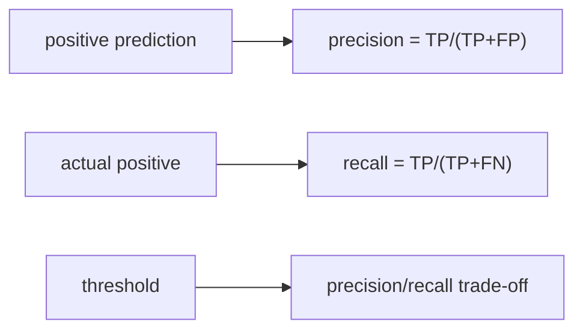

# Precision과 Recall

> Model Evaluation 101 시리즈 (4/10)


## 이 글에서 다룰 문제

*스팸 필터* 와 *암 진단* — *같은 모델* 이라도 *우선해야 할 지표* 가 다릅니다.

## 전체 흐름


## Before/After

**Before**: *“F1 한 줄” 로 끝*.

**After**: *Precision/Recall 분리 → 임계값 곡선 → 비즈니스 비용*.

## 5단계 임계값 분석

### 1단계 — 데이터와 모델

```python
from sklearn.datasets import make_classification
from sklearn.model_selection import train_test_split
from sklearn.linear_model import LogisticRegression
X, y = make_classification(n_samples=2000, weights=[0.9, 0.1], random_state=0)
Xtr, Xte, ytr, yte = train_test_split(X, y, stratify=y, random_state=42)
m = LogisticRegression(max_iter=1000).fit(Xtr, ytr)
```

### 2단계 — 혼동 행렬

```python
from sklearn.metrics import confusion_matrix
pred = m.predict(Xte)
print(confusion_matrix(yte, pred))
```

### 3단계 — Precision/Recall 점수

```python
from sklearn.metrics import precision_score, recall_score
print("precision:", precision_score(yte, pred))
print("recall:", recall_score(yte, pred))
```

### 4단계 — 임계값 조정

```python
proba = m.predict_proba(Xte)[:, 1]
for t in [0.3, 0.5, 0.7]:
    p = (proba >= t).astype(int)
    print(t, precision_score(yte, p), recall_score(yte, p))
```

### 5단계 — PR 커브와 AP

```python
from sklearn.metrics import precision_recall_curve, average_precision_score
prec, rec, _ = precision_recall_curve(yte, proba)
print("AP:", average_precision_score(yte, proba))
```

## 이 코드에서 주목할 점

- *임계값* 은 *학습 후* 조정 가능한 *핵심 손잡이*.
- *Precision* 과 *Recall* 은 *대개 반대 방향*.
- *AP* 는 *임계값 무관* 한 *요약 지표*.

## 자주 하는 실수 5가지

1. ***Recall* 만 보고 *FP 폭증* 을 무시.**
2. ***Precision* 만 보고 *놓친 양성* 을 무시.**
3. ***임계값 0.5* 를 *고정* 으로 가정.**
4. ***불균형* 에서 *ROC* 만 보고 *PR* 무시.**
5. ***비즈니스 비용* 무시한 *지표 최적화*.**

## 실무에서는 이렇게 쓰입니다

*사기 탐지* — *Recall* 우선. *광고 추천* — *Precision* 우선. *비용* 이 *임계값* 을 정합니다.

## 체크리스트

- [ ] *Precision* 과 *Recall* 을 *함께* 본다.
- [ ] *임계값* 을 명시한다.
- [ ] *PR 커브* 와 *AP* 를 본다.
- [ ] *비즈니스 비용* 을 검토한다.

## 정리 및 다음 단계

Precision 과 Recall 은 *분리해서 함께* 봅니다. 다음 글에서는 *F1 Score* 로 *둘의 조화* 를 다룹니다.

<!-- toc:begin -->
- [모델 평가는 왜 어려운가?](./01-why-evaluation-is-hard.md)
- [train/validation/test](./02-train-val-test.md)
- [Accuracy의 한계](./03-limits-of-accuracy.md)
- **Precision과 Recall (현재 글)**
- F1 Score (예정)
- ROC와 AUC (예정)
- Calibration (예정)
- Cross Validation (예정)
- Error Analysis (예정)
- 평가 리포트 만들기 (예정)
<!-- toc:end -->

## 참고 자료

- [scikit-learn — precision_score](https://scikit-learn.org/stable/modules/generated/sklearn.metrics.precision_score.html)
- [scikit-learn — recall_score](https://scikit-learn.org/stable/modules/generated/sklearn.metrics.recall_score.html)
- [scikit-learn — Precision-Recall](https://scikit-learn.org/stable/auto_examples/model_selection/plot_precision_recall.html)
- [Wikipedia — Precision and recall](https://en.wikipedia.org/wiki/Precision_and_recall)

Tags: ModelEvaluation, Precision, Recall, ConfusionMatrix, scikit-learn
