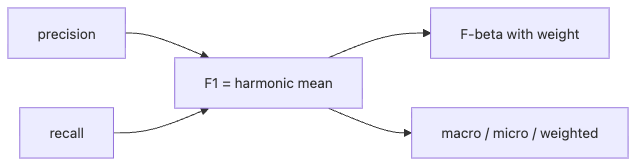

# F1 점수

이 글은 Model Evaluation 101 시리즈의 5번째 글입니다.

정밀도와 재현율을 임계값 메모로 읽고 나면, 팀은 곧바로 “그래서 하나의 숫자로 비교하면 무엇을 쓰면 되나요?”라고 묻습니다. F1은 바로 그 요구에서 자주 등장합니다. 문제는 기존 글의 이진 분류 예제가 `ko/05-f1-score.md:109-118`에서 **학습한 같은 데이터 위에서 임계값을 훑어 F1을 최대화하는 낙관적 패턴**을 가르쳤다는 점입니다.

이번 글은 그 약점을 바로잡습니다. F1은 여전히 유용한 요약 숫자이지만, 임계값 선택은 반드시 **train → validation → test** 순서로 분리해야 합니다. 동시에 macro, micro, weighted 평균이 서로 다른 질문에 답한다는 점도 운영 관점에서 다시 정리하겠습니다.

## 이 글이 답하는 질문

- macro, micro, weighted F1은 각각 어떤 리뷰 질문에 답할까요?
- 같은 데이터에서 학습과 임계값 탐색을 함께 하면 왜 낙관적일까요?
- 검증셋에서 최고 F1을 준 임계값이 왜 항상 최고의 운영 정책은 아닐까요?

## F1을 쓰기 전에 먼저 기억할 것

F1은 정밀도와 재현율의 조화평균입니다. 그래서 둘 중 하나가 크게 낮으면 점수도 함께 낮아집니다. 다만 F1은 어디까지나 **요약**입니다.

- 어떤 평균 방식을 썼는지 숨길 수 있습니다.
- 어떤 클래스가 약한지 숨길 수 있습니다.
- 어떤 임계값을 선택했는지 숨길 수 있습니다.
- 그 임계값이 검증셋이 아닌 테스트셋에 과적합했는지도 숨길 수 있습니다.

즉 F1은 편리하지만, 절차를 생략하면 쉽게 과신하게 됩니다.

## 한눈에 보는 멘탈 모델



*정밀도와 재현율을 묶는 F1과 평균 방식의 갈림길*

이 그림에서 중요한 갈림길은 두 개입니다. 첫째, 다중 분류에서는 어떤 평균을 쓸지 결정해야 합니다. 둘째, 이진 분류에서는 어떤 임계값에서 F1을 계산할지 결정해야 합니다.

## 1부 — 평균 방식이 다르면 같은 예측도 다른 점수가 됩니다

```python
from sklearn.datasets import make_classification
from sklearn.linear_model import LogisticRegression
from sklearn.metrics import f1_score, fbeta_score
from sklearn.model_selection import train_test_split

X, y = make_classification(
    n_samples=3200,
    n_features=12,
    n_informative=6,
    n_redundant=2,
    n_classes=3,
    n_clusters_per_class=1,
    weights=[0.65, 0.25, 0.10],
    class_sep=1.1,
    flip_y=0.02,
    random_state=11,
)

X_train, X_test, y_train, y_test = train_test_split(
    X,
    y,
    test_size=0.25,
    stratify=y,
    random_state=42,
)

model = LogisticRegression(max_iter=4000).fit(X_train, y_train)
pred = model.predict(X_test)

print("micro:", round(f1_score(y_test, pred, average="micro"), 3))
print("macro:", round(f1_score(y_test, pred, average="macro"), 3))
print("weighted:", round(f1_score(y_test, pred, average="weighted"), 3))
print("per class:", [round(x, 3) for x in f1_score(y_test, pred, average=None)])
print("F2 macro:", round(fbeta_score(y_test, pred, beta=2, average="macro"), 3))
print("F0.5 macro:", round(fbeta_score(y_test, pred, beta=0.5, average="macro"), 3))
```

예상 결과는 다음과 같습니다.

```text
micro: 0.927
macro: 0.881
weighted: 0.925
per class: [0.952, 0.923, 0.768]
F2 macro: 0.866
F0.5 macro: 0.900
```

이 숫자는 같은 예측을 서로 다르게 요약합니다.

- **micro F1 0.927**: 전체 빈도에 민감합니다. 다수 클래스가 잘 맞으면 높게 나옵니다.
- **macro F1 0.881**: 소수 클래스도 동등하게 한 표를 가집니다.
- **weighted F1 0.925**: 원래 클래스 비율을 반영합니다.
- **per class [0.952, 0.923, 0.768]**: 실제 약점은 세 번째 클래스에 있습니다.

즉 `F1=0.92`처럼 평균 방식을 숨긴 문장은 정보가 부족합니다.

## 2부 — 임계값 선택은 반드시 train/validation/test로 분리합니다

이제 issue #772가 직접 지적한 문제를 고칩니다. 아래 예제는 같은 데이터에서 학습과 임계값 탐색을 동시에 하지 않습니다.

```python
import numpy as np
from sklearn.datasets import make_classification
from sklearn.linear_model import LogisticRegression
from sklearn.metrics import f1_score, precision_score, recall_score
from sklearn.model_selection import train_test_split

X, y = make_classification(
    n_samples=4000,
    n_features=10,
    n_informative=5,
    n_redundant=2,
    weights=[0.88, 0.12],
    class_sep=1.0,
    flip_y=0.02,
    random_state=19,
)

X_train, X_temp, y_train, y_temp = train_test_split(
    X,
    y,
    test_size=0.4,
    stratify=y,
    random_state=42,
)
X_val, X_test, y_val, y_test = train_test_split(
    X_temp,
    y_temp,
    test_size=0.5,
    stratify=y_temp,
    random_state=42,
)

model = LogisticRegression(max_iter=4000).fit(X_train, y_train)
val_proba = model.predict_proba(X_val)[:, 1]
test_proba = model.predict_proba(X_test)[:, 1]

thresholds = np.arange(0.10, 0.91, 0.05)
rows = []
for threshold in thresholds:
    val_pred = (val_proba >= threshold).astype(int)
    rows.append(
        (
            round(float(threshold), 2),
            f1_score(y_val, val_pred),
            precision_score(y_val, val_pred, zero_division=0),
            recall_score(y_val, val_pred, zero_division=0),
        )
    )

best_threshold, best_val_f1, _, _ = max(rows, key=lambda row: row[1])
print("validation sweep:")
for threshold, f1, precision, recall in rows:
    if threshold in {0.20, 0.30, 0.50, 0.70}:
        print(threshold, round(f1, 3), round(precision, 3), round(recall, 3))

print("best validation threshold:", best_threshold, round(best_val_f1, 3))

locked_test_pred = (test_proba >= best_threshold).astype(int)
print(
    "locked test:",
    round(f1_score(y_test, locked_test_pred), 3),
    round(precision_score(y_test, locked_test_pred), 3),
    round(recall_score(y_test, locked_test_pred), 3),
)

business_pred = (test_proba >= 0.50).astype(int)
print(
    "business threshold 0.50:",
    round(f1_score(y_test, business_pred), 3),
    round(precision_score(y_test, business_pred), 3),
    round(recall_score(y_test, business_pred), 3),
)
```

예상 결과는 다음과 같습니다.

```text
validation sweep:
0.20 0.596 0.485 0.775
0.30 0.585 0.564 0.608
0.50 0.503 0.776 0.373
0.70 0.354 0.821 0.225
best validation threshold: 0.2 0.596
locked test: 0.627 0.527 0.775
business threshold 0.50: 0.490 0.717 0.373
```

## 왜 이 절차가 중요한가요?

검증셋에서 **F1이 가장 높은 임계값은 0.20**입니다. 이 값을 고른 뒤, 다시 건드리지 않고 테스트셋에 잠그면 `F1=0.627, precision=0.527, recall=0.775`가 나옵니다. 이 결과는 “검증셋에서 선택한 정책이 테스트셋에서도 어느 정도 유지되는가?”를 확인하게 해 줍니다.

반대로 같은 데이터에서 학습과 임계값 탐색을 동시에 하면, 우연한 패턴까지 흡수한 낙관적 F1을 얻게 됩니다. issue #772가 고치라고 한 부분이 바로 이 지점입니다.

## 그런데 최고의 F1 임계값이 최고의 운영 임계값일까요?

반드시 그렇지는 않습니다. 위 예제에서 0.20은 F1 기준으로 가장 좋지만, 테스트셋 기준으로 보면 양성 경보 150건 중 약 절반이 오탐입니다. 반면 **0.50**은 F1이 낮아도 정밀도가 **0.717**까지 올라갑니다.

즉 이런 질문이 따라와야 합니다.

- 목표가 놓침을 줄이는 것인가요? 그렇다면 0.20이 더 적합할 수 있습니다.
- 목표가 리뷰 팀 피로를 줄이는 것인가요? 그렇다면 0.50 쪽이 나을 수 있습니다.

F1이 말해 주는 것은 “정밀도와 재현율의 균형”이지, “비즈니스가 감당 가능한 정책” 자체는 아닙니다.

## F-beta는 비용 비중을 숨기지 않는 방법입니다

앞의 다중 분류 예제에서 `F2 macro=0.866`, `F0.5 macro=0.900`이 나온 이유는, 같은 예측도 무엇을 더 중시하느냐에 따라 점수가 달라지기 때문입니다.

- **F2**는 재현율에 더 큰 가중치를 둡니다.
- **F0.5**는 정밀도에 더 큰 가중치를 둡니다.

따라서 beta 값은 취향이 아니라 비용 구조에서 와야 합니다. 놓침이 비싸면 F2 쪽이 맞고, 거짓 경보가 비싸면 F0.5 쪽이 맞습니다.

## 실무 리뷰 문장 예시

> macro F1은 0.881이지만 소수 클래스 F1은 0.768에 그쳤습니다. 이진 운영 정책에서는 검증셋 기준 최적 F1 임계값 0.20을 테스트셋에 잠가 F1 0.627, 정밀도 0.527, 재현율 0.775를 얻었습니다. 다만 리뷰 팀의 false positive 예산을 고려하면 배포 임계값은 0.50으로 더 보수적으로 둘 가능성도 함께 검토해야 합니다.

이 문장은 F1을 요약 숫자로 쓰면서도, 평균 방식과 임계값, 운영 비용을 모두 드러냅니다.

## 점검 목록

- [ ] F1의 평균 방식을 명시합니다.
- [ ] 클래스별 F1을 함께 확인합니다.
- [ ] 임계값 선택은 train/validation/test로 분리합니다.
- [ ] 검증셋에서 고른 임계값을 테스트셋에 잠가서 평가합니다.
- [ ] F1 최댓값과 운영 최적점이 다를 수 있음을 별도로 적습니다.

## 정리

F1은 여전히 유용한 요약 지표이지만, 절차가 빠지면 금세 낙관적 숫자가 됩니다. 올바른 질문은 “F1이 몇 점인가?”가 아니라 “어떤 평균 방식으로, 어떤 검증 절차를 거쳐, 어떤 임계값에서 그 점수가 나왔는가?”입니다. 다음 글에서는 임계값 하나에 덜 묶인 순위화 관점인 ROC와 AUC를 보되, 결국 다시 운영 임계값으로 돌아오는 흐름까지 완성하겠습니다.

<!-- toc:begin -->
- [모델 평가는 왜 어려운가?](./01-why-evaluation-is-hard.md)
- [훈련·검증·테스트 데이터 나누기](./02-train-val-test.md)
- [정확도의 한계](./03-limits-of-accuracy.md)
- [정밀도와 재현율](./04-precision-and-recall.md)
- **F1 점수 (현재 글)**
- ROC와 AUC 이해하기 (예정)
- 확률 보정 이해하기 (예정)
- 교차 검증 이해하기 (예정)
- 오류 분석으로 약점 찾기 (예정)
- 평가 리포트 만들기 (예정)
<!-- toc:end -->

## 참고 자료

- [scikit-learn — f1_score](https://scikit-learn.org/stable/modules/generated/sklearn.metrics.f1_score.html)
- [scikit-learn — fbeta_score](https://scikit-learn.org/stable/modules/generated/sklearn.metrics.fbeta_score.html)
- [scikit-learn — precision_recall_fscore_support](https://scikit-learn.org/stable/modules/generated/sklearn.metrics.precision_recall_fscore_support.html)
- [Wikipedia — F-score](https://en.wikipedia.org/wiki/F-score)

Tags: ModelEvaluation, F1Score, Fbeta, ImbalancedData, scikit-learn
