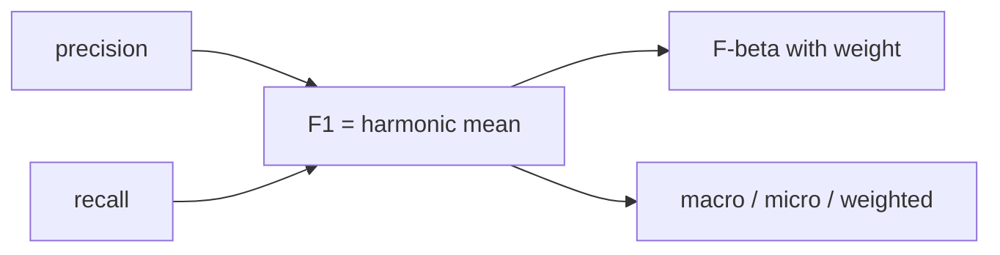

# F1 Score

> Model Evaluation 101 시리즈 (5/10)

<!-- a-grade-intro:begin -->

**핵심 질문**: *Precision* 과 *Recall* 을 *하나의 숫자* 로 만들면 어떤 *왜곡* 이 생길까요?

> *F1 은 *조화 평균*. F-beta 는 *어느 한 쪽* 에 *가중치* 를 주는 *일반화* 입니다.*

<!-- a-grade-intro:end -->

## 이 글에서 배울 것

- *F1* 의 *수식* 과 *직관*
- *F-beta* 로 *Recall* 우선 vs *Precision* 우선
- *Macro/Micro/Weighted* 평균
- *클래스 불균형* 에서의 의미
- 흔한 함정 5가지

## 왜 중요한가

*리더보드 한 줄* 에 *F1* 이 자주 쓰입니다. *어떤 F1* 인지 *명시* 하지 않으면 *비교 불가능* 합니다.

## 개념 한눈에 보기



## 핵심 용어 정리

- **F1**: *2*P*R/(P+R)*.
- **F-beta**: *β>1* 은 *Recall* 우선, *β<1* 은 *Precision* 우선.
- **Macro**: *클래스별 F1* 단순 평균.
- **Micro**: *전체 TP/FP/FN* 합산 후 계산.
- **Weighted**: *클래스 빈도* 로 가중.

## Before/After

**Before**: *“F1 = 0.78”*.

**After**: *“F1 macro = 0.78, F2 = 0.82, 클래스별 F1 = …”*.

## 실습: 5단계 F1 비교

### 1단계 — 데이터와 모델

```python
from sklearn.datasets import make_classification
from sklearn.model_selection import train_test_split
from sklearn.linear_model import LogisticRegression
X, y = make_classification(n_samples=2000, n_classes=3, n_informative=5, weights=[0.6, 0.3, 0.1], random_state=0)
Xtr, Xte, ytr, yte = train_test_split(X, y, stratify=y, random_state=42)
m = LogisticRegression(max_iter=1000).fit(Xtr, ytr)
pred = m.predict(Xte)
```

### 2단계 — F1 기본

```python
from sklearn.metrics import f1_score
print("micro:", f1_score(yte, pred, average="micro"))
print("macro:", f1_score(yte, pred, average="macro"))
print("weighted:", f1_score(yte, pred, average="weighted"))
```

### 3단계 — 클래스별 F1

```python
print("per class:", f1_score(yte, pred, average=None))
```

### 4단계 — F-beta

```python
from sklearn.metrics import fbeta_score
print("F2 (recall heavy):", fbeta_score(yte, pred, beta=2, average="macro"))
print("F0.5 (precision heavy):", fbeta_score(yte, pred, beta=0.5, average="macro"))
```

### 5단계 — 임계값 vs F1 (이진 케이스)

```python
import numpy as np
from sklearn.datasets import make_classification
Xb, yb = make_classification(n_samples=1000, weights=[0.8, 0.2], random_state=1)
mb = LogisticRegression(max_iter=1000).fit(Xb, yb)
proba = mb.predict_proba(Xb)[:, 1]
for t in np.arange(0.2, 0.9, 0.1):
    p = (proba >= t).astype(int)
    print(round(t, 1), round(f1_score(yb, p), 3))
```

## 이 코드에서 주목할 점

- *Macro F1* 은 *작은 클래스* 도 *동등* 취급.
- *Micro F1* 은 *큰 클래스* 의 영향이 큼.
- *Weighted F1* 은 *분포 편향* 을 그대로 반영.

## 자주 하는 실수 5가지

1. ***평균 종류* 를 *명시* 하지 않음.**
2. ***Macro F1* 을 *불균형* 에서 *오해*.**
3. ***F1* 만 보고 *Precision/Recall* 분리 무시.**
4. ***F-beta* 의 *β* 를 *임의* 로 선택.**
5. ***임계값* 별 *F1* 을 *그래프* 로 보지 않음.**

## 실무에서는 이렇게 쓰입니다

*경진대회* 와 *리더보드* — 단일 숫자 비교에 *F1* 이 자주 등장. *프로덕션* 에서는 *클래스별* 이 더 중요.

## 시니어 엔지니어는 이렇게 생각합니다

- *F1 한 줄* 은 *리포트의 시작* 일 뿐.
- *β* 는 *비용* 으로 정한다.
- *Macro vs Micro* 는 *질문* 이 다르다.
- *임계값별 F1* 으로 *최댓값* 을 찾는다.
- *클래스별 F1* 으로 *약점* 을 본다.

## 체크리스트

- [ ] *평균 방식* 을 명시한다.
- [ ] *클래스별 F1* 을 본다.
- [ ] *β* 선택 근거를 적는다.
- [ ] *임계값별* 곡선을 본다.

## 연습 문제

1. *3-클래스* 문제에서 *macro/micro/weighted* F1 차이를 설명하세요.
2. *Recall* 이 *2배 중요* 한 문제의 *F-beta β* 를 정하세요.
3. *임계값별 F1* 곡선의 *최댓값* 을 찾으세요.

## 정리 및 다음 단계

F1 은 *요약* 일 뿐 *진단* 이 아닙니다. 다음 글은 *ROC와 AUC* 로 *임계값 무관 평가* 를 다룹니다.

<!-- toc:begin -->
- [모델 평가는 왜 어려운가?](./01-why-evaluation-is-hard.md)
- [train/validation/test](./02-train-val-test.md)
- [Accuracy의 한계](./03-limits-of-accuracy.md)
- [Precision과 Recall](./04-precision-and-recall.md)
- **F1 Score (현재 글)**
- ROC와 AUC (예정)
- Calibration (예정)
- Cross Validation (예정)
- Error Analysis (예정)
- 평가 리포트 만들기 (예정)
<!-- toc:end -->

## 참고 자료

- [scikit-learn — f1_score](https://scikit-learn.org/stable/modules/generated/sklearn.metrics.f1_score.html)
- [scikit-learn — fbeta_score](https://scikit-learn.org/stable/modules/generated/sklearn.metrics.fbeta_score.html)
- [Wikipedia — F-score](https://en.wikipedia.org/wiki/F-score)
- [Google — Classification metrics](https://developers.google.com/machine-learning/crash-course/classification/precision-and-recall)

Tags: ModelEvaluation, F1Score, Fbeta, ImbalancedData, scikit-learn
