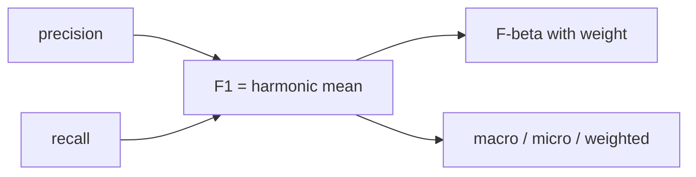

# F1 점수

정밀도와 재현율을 둘 다 봐야 한다는 사실을 이해한 뒤에는 자연스럽게 한 가지 유혹이 생깁니다. 둘을 하나의 숫자로 요약하고 싶어지는 것입니다. 그 요구에 가장 자주 등장하는 답이 F1 점수입니다. 간결하고 비교하기도 쉬워서 리더보드와 보고서에서 자주 쓰입니다.

하지만 요약은 늘 정보를 덜어 냅니다. F1은 정밀도와 재현율의 균형을 한 숫자로 압축해 주지만, 어떤 평균 방식을 썼는지, 어떤 클래스가 약한지, 비용 구조가 무엇인지까지는 대신 말해 주지 못합니다. 그래서 F1은 편리한 출발점이지만, 그 자체가 진단 결과는 아닙니다.

이 글은 Model Evaluation 101 시리즈의 5번째 글입니다.

---

## 이 글에서 다룰 문제

- F1 점수는 정밀도와 재현율을 어떻게 묶을까요?
- F-beta는 어떤 상황에서 더 적절할까요?
- macro, micro, weighted 평균은 무엇이 다를까요?
- 불균형 데이터에서 F1은 어떤 점을 숨길 수 있을까요?
- F1 하나만 보고 비교하면 어떤 오해가 생길까요?

> F1은 정밀도와 재현율의 조화평균입니다. 그래서 둘 중 하나가 크게 낮으면 점수도 함께 낮아집니다. 다만 어떤 평균 방식과 어떤 비용 가정 위에서 읽는지까지 함께 밝혀야 해석이 가능합니다.

## 왜 이 글이 중요한가

실무에서 F1은 자주 쓰이지만, 같은 F1이라도 의미가 다를 수 있습니다. macro F1과 micro F1은 같은 문제를 보고 있어도 전혀 다른 질문에 답합니다. 이를 구분하지 않으면 두 모델을 비교하고도 엉뚱한 결론을 내릴 수 있습니다.

특히 불균형 데이터에서는 더 조심해야 합니다. 다수 클래스를 잘 맞힌 덕분에 micro F1이 높게 나와도, 소수 클래스는 거의 포착하지 못할 수 있습니다. 그래서 F1은 하나의 숫자로 읽기보다, 어떤 평균 방식을 썼고 클래스별 성능이 어땠는지 함께 봐야 합니다.

## 한눈에 보는 멘탈 모델



이 그림은 F1이 끝점이 아니라 갈림길이라는 점을 보여 줍니다. 기본 F1이 있고, 비용 구조에 따라 F-beta로 확장할 수 있으며, 다중 분류에서는 어떤 평균을 쓸지도 결정해야 합니다.

## 핵심 용어

- **F1**: `2*P*R/(P+R)`입니다.
- **F-beta**: `beta>1`이면 재현율에 더 큰 가중치를 둡니다.
- **macro 평균**: 클래스별 점수를 단순 평균합니다.
- **micro 평균**: 전체 TP, FP, FN을 먼저 합친 뒤 계산합니다.
- **weighted 평균**: 클래스 빈도로 가중 평균합니다.

## F1을 읽는 방식의 차이

좋지 않은 습관은 F1 숫자만 적고 설명을 끝내는 것입니다. `F1 0.78`만으로는 어떤 평균인지, 어떤 클래스가 약한지, 정밀도와 재현율이 어떻게 생겼는지 알 수 없습니다.

좋은 습관은 F1을 요약 숫자로만 쓰고, 반드시 평균 방식과 클래스별 점수, 필요하다면 F-beta까지 함께 제시하는 것입니다. 그래야 이 숫자가 무엇을 말하고 무엇을 숨기는지 분명해집니다.

## F1 변형을 비교하는 다섯 단계

### 1단계 — 데이터와 모델

```python
from sklearn.datasets import make_classification
from sklearn.model_selection import train_test_split
from sklearn.linear_model import LogisticRegression
X, y = make_classification(n_samples=2000, n_classes=3, n_informative=5, weights=[0.6, 0.3, 0.1], random_state=0)
Xtr, Xte, ytr, yte = train_test_split(X, y, stratify=y, random_state=42)
m = LogisticRegression(max_iter=1000).fit(Xtr, ytr)
pred = m.predict(Xte)
```

### 2단계 — 평균 방식 비교

```python
from sklearn.metrics import f1_score
print("micro:", f1_score(yte, pred, average="micro"))
print("macro:", f1_score(yte, pred, average="macro"))
print("weighted:", f1_score(yte, pred, average="weighted"))
```

### 3단계 — 클래스별 F1

```python
print("per class:", f1_score(yte, pred, average=None))
```

### 4단계 — F-beta

```python
from sklearn.metrics import fbeta_score
print("F2 (recall heavy):", fbeta_score(yte, pred, beta=2, average="macro"))
print("F0.5 (precision heavy):", fbeta_score(yte, pred, beta=0.5, average="macro"))
```

### 5단계 — 임계값과 F1

```python
import numpy as np
from sklearn.datasets import make_classification
Xb, yb = make_classification(n_samples=1000, weights=[0.8, 0.2], random_state=1)
mb = LogisticRegression(max_iter=1000).fit(Xb, yb)
proba = mb.predict_proba(Xb)[:, 1]
for t in np.arange(0.2, 0.9, 0.1):
    p = (proba >= t).astype(int)
    print(round(t, 1), round(f1_score(yb, p), 3))
```

## 이 코드에서 먼저 봐야 할 점

두 번째 단계의 세 숫자는 같은 예측 결과를 서로 다른 방식으로 요약합니다. macro는 소수 클래스를 동등하게 다루고, micro는 전체 빈도에 크게 끌려가며, weighted는 원래 분포를 더 많이 반영합니다. 어떤 평균을 택했는지 밝히지 않으면 비교가 성립하지 않습니다.

네 번째 단계는 비용 구조가 F1의 일반화 형태를 바꾼다는 점을 보여 줍니다. 다섯 번째 단계는 임계값이 F1 자체도 흔든다는 사실을 보여 줍니다. 따라서 F1은 모델 구조만이 아니라 후처리 선택에도 영향을 받습니다.

## 자주 헷갈리는 지점

첫째, F1이 높으면 균형 잡힌 모델이라고 단정하기 쉽습니다. 하지만 클래스별로 보면 특정 소수 클래스만 계속 약할 수 있습니다. 둘째, macro와 micro를 섞어 비교하면서도 같은 숫자인 것처럼 해석하는 경우가 많습니다.

셋째, F-beta의 beta 값을 취향처럼 정하면 안 됩니다. 이 값은 비용 구조에서 와야 합니다. 넷째, F1을 임계값 0.5에서만 보고 끝내면 실제로 더 나은 운영점을 놓칠 수 있습니다.

## 실무에서는 이렇게 생각한다

시니어 엔지니어는 F1을 판결문이 아니라 요약문으로 봅니다. 이 숫자는 빠르게 비교할 때 유용하지만, 진단을 대신하지는 못합니다. 그래서 클래스별 정밀도와 재현율, 평균 방식, 임계값 민감도를 함께 읽습니다.

또한 beta 값은 업무 비용에서 가져옵니다. 놓치는 사례가 더 비싸면 F2처럼 재현율 쪽에 무게를 두고, 거짓 경보가 더 비싸면 F0.5처럼 정밀도 쪽을 더 중시합니다. 숫자의 형태보다 결정 맥락이 먼저입니다.

## 점검 목록

- [ ] F1의 평균 방식을 명시합니다.
- [ ] 클래스별 F1을 함께 확인합니다.
- [ ] beta 선택 이유를 설명할 수 있습니다.
- [ ] 임계값에 따른 F1 변화를 확인합니다.

## 정리

F1은 정밀도와 재현율을 한 번에 요약해 주는 유용한 지표입니다. 다만 무엇을 요약했는지까지 함께 말해야 합니다. 평균 방식, beta 값, 클래스별 약점, 임계값 효과가 빠지면 F1은 편리하지만 얕은 숫자가 됩니다. 다음 글에서는 특정 임계값에 묶이지 않고 모델의 순위 능력을 보는 ROC와 AUC를 살펴보겠습니다.

<!-- toc:begin -->
- [모델 평가는 왜 어려운가?](./01-why-evaluation-is-hard.md)
- [훈련·검증·테스트 데이터 나누기](./02-train-val-test.md)
- [정확도의 한계](./03-limits-of-accuracy.md)
- [정밀도와 재현율](./04-precision-and-recall.md)
- **F1 점수 (현재 글)**
- ROC와 AUC 이해하기 (예정)
- 확률 보정 이해하기 (예정)
- 교차 검증 이해하기 (예정)
- 오류 분석으로 약점 찾기 (예정)
- 평가 리포트 만들기 (예정)
<!-- toc:end -->

## 참고 자료

- [scikit-learn — f1_score](https://scikit-learn.org/stable/modules/generated/sklearn.metrics.f1_score.html)
- [scikit-learn — fbeta_score](https://scikit-learn.org/stable/modules/generated/sklearn.metrics.fbeta_score.html)
- [Wikipedia — F-score](https://en.wikipedia.org/wiki/F-score)
- [Google — Classification metrics](https://developers.google.com/machine-learning/crash-course/classification/precision-and-recall)

Tags: ModelEvaluation, F1Score, Fbeta, ImbalancedData, scikit-learn
