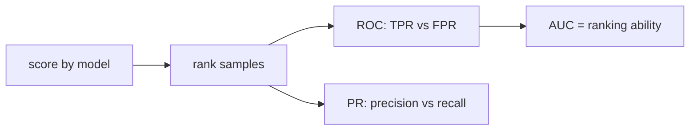

# ROC와 AUC 이해하기

임계값을 어디에 둘지 아직 정하지 않았는데도 모델을 비교하고 싶을 때가 있습니다. 이때 자주 등장하는 도구가 ROC 곡선과 AUC입니다. 둘은 특정 기준선 하나에 묶이지 않고, 모델이 양성과 음성을 얼마나 잘 순위화하는지를 보게 해 줍니다.

그래서 AUC는 편리합니다. 하지만 편리함이 곧 배포 기준을 대신해 주지는 않습니다. 실제 운영은 언제나 어떤 임계값 하나에서 동작하고, 그 지점의 false positive와 recall이 비즈니스 결과를 결정합니다. ROC와 AUC는 그 판단을 돕는 요약이지, 배포 버튼을 대신 누르는 숫자는 아닙니다.

이 글은 Model Evaluation 101 시리즈의 6번째 글입니다.

---

## 이 글에서 다룰 문제

- ROC 곡선의 두 축은 각각 무엇을 뜻할까요?
- AUC는 모델의 어떤 능력을 요약할까요?
- ROC와 PR 곡선은 언제 다른 결론을 줄까요?
- 불균형 데이터에서는 왜 PR-AUC도 함께 봐야 할까요?
- 운영 임계값은 ROC에서 어떻게 고를 수 있을까요?

> ROC는 모든 임계값을 훑으면서 재현율과 거짓 양성 비율의 관계를 그린 곡선입니다. AUC는 그 곡선을 한 숫자로 압축한 값이며, 본질적으로는 모델의 순위화 능력을 요약합니다.

## 왜 이 글이 중요한가

모델을 비교할 때 임계값 하나에 너무 일찍 묶이면 전체적인 순위 성능을 놓치기 쉽습니다. 반대로 AUC만 보고 배포를 결정하면 특정 운영점에서의 성능을 놓칩니다. 이 둘 사이의 역할 구분을 아는 것이 중요합니다.

특히 불균형 데이터에서는 ROC가 꽤 좋아 보여도 실제 양성 탐지 품질은 기대보다 낮을 수 있습니다. 그래서 ROC-AUC와 함께 PR-AUC, 그리고 실제 운영 임계값에서의 정밀도와 재현율을 함께 보는 습관이 필요합니다.

## 한눈에 보는 멘탈 모델



이 그림이 보여 주는 핵심은 점수의 역할입니다. ROC와 PR은 둘 다 확률 점수나 결정 함수 점수를 정렬해 만든 곡선입니다. 즉 이 단계에서는 아직 최종 클래스 예측을 고정하지 않았습니다.

## 핵심 용어

- **TPR**: 재현율과 같은 값입니다.
- **FPR**: `FP/(FP+TN)`입니다.
- **ROC**: 임계값을 바꾸며 TPR과 FPR의 관계를 그린 곡선입니다.
- **AUC-ROC**: 임의의 양성이 임의의 음성보다 더 높은 점수를 받을 확률로 해석할 수 있습니다.
- **AUC-PR**: 정밀도-재현율 곡선 아래 면적이며, 불균형 데이터에서 더 민감합니다.

## ROC를 읽는 방식의 전환

좋지 않은 습관은 `AUC 0.9`만 보고 모델이 훌륭하다고 결론 내리는 것입니다. 이 숫자는 분명 유용하지만, 배포 임계값에서의 실제 의사결정 비용을 보여 주지는 않습니다.

좋은 습관은 AUC를 비교용 요약 숫자로 쓰고, 그다음 실제 운영 제한 조건을 곡선 위에 얹어 읽는 것입니다. 예를 들어 false positive 비율을 5% 이하로 제한해야 한다면, 그 조건에서 얻을 수 있는 TPR을 보는 식입니다.

## ROC와 AUC를 보는 다섯 단계

### 1단계 — 데이터와 모델

```python
from sklearn.datasets import make_classification
from sklearn.model_selection import train_test_split
from sklearn.linear_model import LogisticRegression
X, y = make_classification(n_samples=2000, weights=[0.9, 0.1], random_state=0)
Xtr, Xte, ytr, yte = train_test_split(X, y, stratify=y, random_state=42)
m = LogisticRegression(max_iter=1000).fit(Xtr, ytr)
proba = m.predict_proba(Xte)[:, 1]
```

### 2단계 — ROC 곡선

```python
from sklearn.metrics import roc_curve
fpr, tpr, thr = roc_curve(yte, proba)
print("first 3 thresholds:", thr[:3])
```

### 3단계 — AUC 계산

```python
from sklearn.metrics import roc_auc_score
print("AUC-ROC:", roc_auc_score(yte, proba))
```

### 4단계 — PR-AUC와 비교

```python
from sklearn.metrics import average_precision_score
print("AUC-PR:", average_precision_score(yte, proba))
```

### 5단계 — 운영 임계값 선택

```python
import numpy as np
target_fpr = 0.05
idx = np.searchsorted(fpr, target_fpr)
print("threshold for FPR<=0.05:", thr[idx], "TPR:", tpr[idx])
```

## 이 코드에서 먼저 봐야 할 점

세 번째 단계는 모델의 전반적인 순위 능력을 요약합니다. 네 번째 단계는 같은 모델이라도 불균형 상황에서 PR-AUC가 훨씬 더 민감하게 반응할 수 있음을 보여 줍니다. 둘을 함께 봐야 곡선을 오해하지 않습니다.

다섯 번째 단계는 운영 관점에서 중요합니다. 실제 배포에서는 대개 `FPR <= 0.05`처럼 허용 가능한 조건이 먼저 정해지고, 그 안에서 얻을 수 있는 재현율을 읽습니다. 곡선을 숫자로 연결하는 순간입니다.

## 자주 헷갈리는 지점

첫째, AUC만 높으면 좋은 배포라고 생각하기 쉽습니다. 하지만 특정 임계값에서 정밀도나 재현율이 부족하면 운영은 실패합니다. 둘째, ROC와 PR을 섞어 비교하면서도 같은 이야기를 한다고 오해하기 쉽습니다.

셋째, 확률 보정이 충분하지 않은 상태에서 임계값을 세밀하게 고정하면 해석이 흔들릴 수 있습니다. 넷째, 불균형 데이터에서는 AUC-ROC가 낙관적으로 보일 수 있으므로 PR-AUC를 함께 확인해야 합니다.

## 실무에서는 이렇게 생각한다

시니어 엔지니어는 AUC를 비교 요약으로 사용합니다. 여러 후보 모델을 빠르게 줄일 때는 유용하지만, 최종 배포 기준은 항상 별도로 세웁니다. 즉 AUC는 모델의 순위 능력을 말하고, 임계값은 운영 결정을 말합니다.

또한 시간이 지나며 AUC 자체가 드리프트하는지도 봅니다. 같은 모델이라도 데이터 분포가 바뀌면 순위화 능력과 운영 임계값이 함께 흔들릴 수 있기 때문입니다.

## 점검 목록

- [ ] AUC-ROC를 보고합니다.
- [ ] 불균형 데이터에서는 AUC-PR도 함께 봅니다.
- [ ] 운영 임계값과 선택 이유를 남깁니다.
- [ ] 시간에 따른 AUC 드리프트를 모니터링합니다.

## 정리

ROC와 AUC는 임계값을 고정하지 않은 상태에서 모델의 순위 능력을 비교하게 해 주는 도구입니다. 다만 배포는 결국 특정 임계값에서 이뤄지므로, 곡선 요약과 운영 기준선을 함께 읽어야 합니다. 다음 글에서는 순위를 넘어 확률값 자체를 얼마나 믿을 수 있는지 묻는 보정 문제를 다루겠습니다.

<!-- toc:begin -->
- [모델 평가는 왜 어려운가?](./01-why-evaluation-is-hard.md)
- [훈련·검증·테스트 데이터 나누기](./02-train-val-test.md)
- [정확도의 한계](./03-limits-of-accuracy.md)
- [정밀도와 재현율](./04-precision-and-recall.md)
- [F1 점수](./05-f1-score.md)
- **ROC와 AUC 이해하기 (현재 글)**
- 확률 보정 이해하기 (예정)
- 교차 검증 이해하기 (예정)
- 오류 분석으로 약점 찾기 (예정)
- 평가 리포트 만들기 (예정)
<!-- toc:end -->

## 참고 자료

- [scikit-learn — roc_curve](https://scikit-learn.org/stable/modules/generated/sklearn.metrics.roc_curve.html)
- [scikit-learn — roc_auc_score](https://scikit-learn.org/stable/modules/generated/sklearn.metrics.roc_auc_score.html)
- [Wikipedia — ROC curve](https://en.wikipedia.org/wiki/Receiver_operating_characteristic)
- [Google — ROC and AUC](https://developers.google.com/machine-learning/crash-course/classification/roc-and-auc)

Tags: ModelEvaluation, ROC, AUC, PRCurve, scikit-learn
