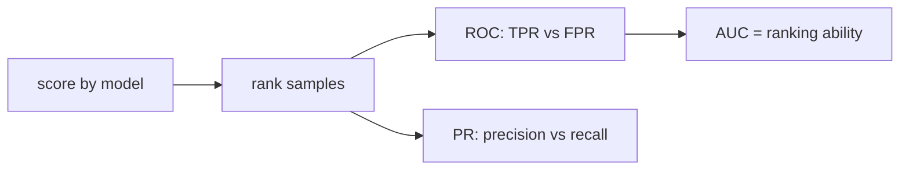

# ROC와 AUC

> Model Evaluation 101 시리즈 (6/10)


## 이 글에서 다룰 문제

AUC는 임계값과 무관해서 모델 비교에는 편리하지만, 비즈니스에서는 특정 임계값에서의 성능이 더 중요합니다.

## 전체 흐름


## Before/After

**Before**: *AUC 0.9 → 좋은 모델*.

**After**: *AUC 0.9 + 운영 임계값에서의 P/R + 불균형이면 PR-AUC*.

## 5단계 ROC/AUC

### 1단계 — 데이터와 모델

```python
from sklearn.datasets import make_classification
from sklearn.model_selection import train_test_split
from sklearn.linear_model import LogisticRegression
X, y = make_classification(n_samples=2000, weights=[0.9, 0.1], random_state=0)
Xtr, Xte, ytr, yte = train_test_split(X, y, stratify=y, random_state=42)
m = LogisticRegression(max_iter=1000).fit(Xtr, ytr)
proba = m.predict_proba(Xte)[:, 1]
```

### 2단계 — ROC 커브

```python
from sklearn.metrics import roc_curve
fpr, tpr, thr = roc_curve(yte, proba)
print("first 3 thresholds:", thr[:3])
```

### 3단계 — AUC

```python
from sklearn.metrics import roc_auc_score
print("AUC-ROC:", roc_auc_score(yte, proba))
```

### 4단계 — PR-AUC와 비교

```python
from sklearn.metrics import average_precision_score
print("AUC-PR:", average_precision_score(yte, proba))
```

### 5단계 — 운영 임계값 선택

```python
import numpy as np
target_fpr = 0.05
idx = np.searchsorted(fpr, target_fpr)
print("threshold for FPR<=0.05:", thr[idx], "TPR:", tpr[idx])
```

## 이 코드에서 주목할 점

- AUC는 순위 품질을 보여 주며 분포 변화에 덜 민감합니다.
- PR-AUC는 불균형 데이터에 더 민감해서 현실적인 판단에 도움이 됩니다.
- *운영 임계값* 은 *FPR 또는 Recall 제약* 으로 정한다.

## 자주 하는 실수 5가지

1. **AUC만 보고 불균형 데이터에 대해 낙관합니다.**
2. **ROC와 PR을 섞어서 비교합니다.**
3. **임계값 없이 배포를 결정합니다.**
4. **확률 보정 없이 임계값만 조정합니다.**
5. ***AUC 0.5* 를 *항상 무작위* 로 단정.**

## 실무에서는 이렇게 쓰입니다

*위험 점수 모델* — *AUC* 로 *모델 선정*. *알람 시스템* — *고정 FPR* 에서 *TPR* 을 본다.

## 체크리스트

- [ ] *AUC-ROC* 를 보고
- [ ] *AUC-PR* 도 본다.
- [ ] *운영 임계값* 을 명시한다.
- [ ] 드리프트를 모니터링합니다.

## 정리 및 다음 단계

ROC와 AUC는 순위의 언어입니다. 다음 글은 Calibration으로 확률 자체의 신뢰성을 다룹니다.

<!-- toc:begin -->
- [모델 평가는 왜 어려운가?](./01-why-evaluation-is-hard.md)
- [train/validation/test](./02-train-val-test.md)
- [Accuracy의 한계](./03-limits-of-accuracy.md)
- [Precision과 Recall](./04-precision-and-recall.md)
- [F1 Score](./05-f1-score.md)
- **ROC와 AUC (현재 글)**
- Calibration (예정)
- Cross Validation (예정)
- Error Analysis (예정)
- 평가 리포트 만들기 (예정)
<!-- toc:end -->

## 참고 자료

- [scikit-learn — roc_curve](https://scikit-learn.org/stable/modules/generated/sklearn.metrics.roc_curve.html)
- [scikit-learn — roc_auc_score](https://scikit-learn.org/stable/modules/generated/sklearn.metrics.roc_auc_score.html)
- [Wikipedia — ROC curve](https://en.wikipedia.org/wiki/Receiver_operating_characteristic)
- [Google — ROC and AUC](https://developers.google.com/machine-learning/crash-course/classification/roc-and-auc)

Tags: ModelEvaluation, ROC, AUC, PRCurve, scikit-learn
