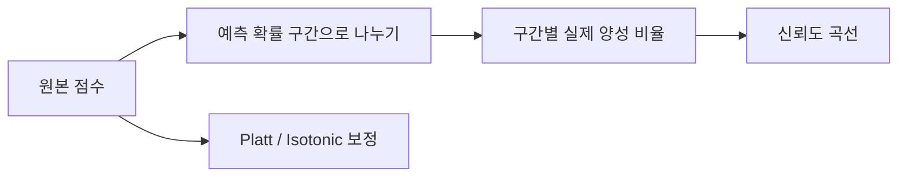

# Calibration

## 이 글에서 다룰 문제

- 모델이 `0.8` 확률을 예측했다면, 실제로도 10번 중 8번은 맞아야 할까요?
- AUC가 높은 모델이라도 확률 자체는 왜 믿기 어려울 수 있을까요?
- 신뢰도 곡선(reliability diagram)과 Brier Score는 각각 무엇을 보여 줄까요?
- Platt scaling과 isotonic regression은 어떤 상황에서 선택해야 할까요?
- 보정 뒤에는 임계값을 왜 다시 잡아야 할까요?

분류 모델을 처음 다룰 때는 대개 순위 성능부터 봅니다. ROC-AUC가 높고, F1도 나쁘지 않으면 모델이 꽤 괜찮아 보입니다. 그런데 운영 환경에서는 여기서 한 걸음 더 들어가야 합니다. 모델이 내놓는 숫자가 단순한 점수인지, 아니면 실제 의사결정에 곧바로 곱해 쓸 수 있는 확률인지가 중요해지기 때문입니다.

특히 광고 입찰, 보험 심사, 사기 탐지, 알림 우선순위처럼 **확률에 비용을 곱해 결정을 내리는 시스템**에서는 calibration이 핵심입니다. 0.9라고 말한 샘플이 실제로는 절반만 맞는다면, 모델은 순위를 잘 세우더라도 돈과 리스크를 잘못 배분하게 됩니다.

이 글에서는 calibration을 “확률이 현실을 얼마나 정직하게 반영하는가”라는 관점에서 설명하겠습니다. 신뢰도 곡선과 Brier Score를 읽는 법, Platt scaling과 isotonic regression의 차이, 그리고 실무에서 자주 틀리는 지점을 함께 정리하겠습니다.

> Calibration은 점수의 순위를 보는 작업이 아니라, 확률이라는 숫자가 현실 빈도와 얼마나 맞는지 확인하는 작업입니다.

---

## 왜 중요한가

많은 팀이 평가 지표를 볼 때 AUC나 정확도에 먼저 익숙해집니다. 이 지표들은 모델이 양성과 음성을 얼마나 잘 구분하는지, 혹은 특정 임계값에서 얼마나 많이 맞히는지 알려 줍니다. 하지만 **모델이 말한 확률값 자체가 믿을 만한지**는 별개의 문제입니다.

예를 들어 두 모델이 똑같이 AUC 0.90을 낼 수는 있습니다. 그런데 한 모델은 0.8 확률을 준 샘플이 실제로 80% 맞고, 다른 모델은 같은 구간이 실제로 55%만 맞을 수 있습니다. 전자는 가격 책정이나 리스크 추정에 바로 쓰기 좋지만, 후자는 그대로 배포하면 의사결정이 흔들립니다.

즉 calibration은 “분류를 잘하느냐”와는 다른 축입니다. 순위 품질이 좋다고 확률 품질도 좋다고 가정하면, 평가 단계에서는 괜찮아 보여도 운영에서 손실이 커질 수 있습니다.

---

## 개념 한눈에 보기



Calibration을 가장 간단히 말하면 이렇습니다. **예측 확률과 실제 빈도가 일치하면 잘 보정된 모델**입니다. 모델이 0.2라고 말한 사례들이 장기적으로 20% 정도만 발생하고, 0.8이라고 말한 사례들이 80% 정도 발생한다면 그 모델의 확률은 해석 가능한 숫자입니다.

이 일치 여부를 보는 대표 도구가 신뢰도 곡선입니다. 예측 확률을 여러 구간(bin)으로 나눈 뒤, 각 구간의 평균 예측 확률과 실제 양성 비율을 비교합니다. 대각선에 가까울수록 잘 보정된 상태입니다.

---

## 핵심 용어

- **Calibration**: 예측 확률과 실제 발생 빈도가 잘 맞는 상태입니다.
- **Reliability diagram**: 예측 확률과 실제 빈도를 구간별로 비교하는 그래프입니다.
- **Brier Score**: `(p - y)^2`의 평균입니다. 낮을수록 좋습니다.
- **Platt scaling**: 원래 모델의 점수를 시그모이드 함수로 다시 매핑하는 방법입니다.
- **Isotonic regression**: 단조 증가 조건만 두고 더 유연하게 확률을 다시 맞추는 방법입니다.

이 다섯 용어를 함께 기억하면 calibration을 보는 관점이 정리됩니다. 신뢰도 곡선은 모양을, Brier Score는 숫자를, Platt와 isotonic은 수정 방법을 뜻합니다.

---

## Before / After

**Before**: `proba = 0.9`라는 숫자를 보고 “거의 확실하네”라고 바로 해석합니다.

**After**: 신뢰도 곡선을 먼저 확인하고, Brier Score를 비교한 뒤, 필요하면 보정 모델을 적용하고 임계값도 다시 조정합니다.

이 차이는 작아 보이지만 운영에서는 큽니다. 전자는 모델이 스스로 말한 확률을 무비판적으로 믿는 방식이고, 후자는 그 숫자가 실제 세계에서 얼마나 정직했는지 검증한 뒤 쓰는 방식입니다.

---

## 실습: Calibration을 5단계로 살펴보기

### 1단계 — 데이터와 모델 준비

```python
from sklearn.datasets import make_classification
from sklearn.model_selection import train_test_split
from sklearn.ensemble import RandomForestClassifier
X, y = make_classification(n_samples=3000, weights=[0.7, 0.3], random_state=0)
Xtr, Xte, ytr, yte = train_test_split(X, y, stratify=y, random_state=42)
rf = RandomForestClassifier(n_estimators=100, random_state=0).fit(Xtr, ytr)
proba = rf.predict_proba(Xte)[:, 1]
```

여기서는 RandomForest의 예측 확률을 그대로 사용합니다. 트리 기반 앙상블은 순위 성능이 좋더라도 확률이 과신되거나 과소신되는 경우가 자주 있어서 calibration 예제로 적합합니다.

### 2단계 — 신뢰도 곡선 계산

```python
from sklearn.calibration import calibration_curve
frac_pos, mean_pred = calibration_curve(yte, proba, n_bins=10)
for mp, fp in zip(mean_pred, frac_pos):
    print(round(mp, 2), round(fp, 2))
```

각 구간에서 `mean_pred`는 모델이 평균적으로 얼마나 자신 있어 했는지, `frac_pos`는 실제 양성이 얼마나 나왔는지 보여 줍니다. 두 값이 비슷하면 그 구간은 잘 보정된 것입니다. 차이가 크면 그 구간에서 모델이 지나치게 낙관적이거나 비관적이라는 뜻입니다.

### 3단계 — Brier Score 확인

```python
from sklearn.metrics import brier_score_loss
print("brier:", brier_score_loss(yte, proba))
```

Brier Score는 확률 오차를 제곱으로 벌점 주는 지표입니다. 잘못된 확률을 강하게 패널티 주기 때문에 calibration 비교에 유용합니다. 단, 이 숫자 하나만 맹신하기보다는 신뢰도 곡선과 함께 보는 편이 좋습니다.

### 4단계 — Platt scaling 적용

```python
from sklearn.calibration import CalibratedClassifierCV
platt = CalibratedClassifierCV(rf, method="sigmoid", cv=5).fit(Xtr, ytr)
print("brier (platt):", brier_score_loss(yte, platt.predict_proba(Xte)[:, 1]))
```

Platt scaling은 시그모이드 형태로 확률을 다시 맞춥니다. 구조가 단순해서 데이터가 많지 않을 때도 비교적 안정적입니다. 원래 점수 분포가 크게 비틀리지 않은 경우에는 좋은 기본 선택이 됩니다.

### 5단계 — Isotonic calibration 적용

```python
iso = CalibratedClassifierCV(rf, method="isotonic", cv=5).fit(Xtr, ytr)
print("brier (isotonic):", brier_score_loss(yte, iso.predict_proba(Xte)[:, 1]))
```

Isotonic regression은 더 유연한 방식입니다. 데이터가 충분할 때는 복잡한 왜곡도 잘 흡수할 수 있습니다. 대신 표본이 작으면 너무 예민하게 맞춰서 과적합하기 쉽습니다. 그래서 “항상 isotonic이 더 낫다”라고 생각하면 안 됩니다.

---

## 이 코드에서 주목할 점

- RandomForest의 원래 확률은 순위는 괜찮아도 과신 또는 과소신 경향을 보일 수 있습니다.
- Platt scaling은 데이터가 적을 때 비교적 안정적입니다.
- Isotonic regression은 충분한 표본이 있을 때 더 유연하게 맞출 수 있습니다.

실무에서는 “원본 모델이 더 좋으냐, 보정 모델이 더 좋으냐”보다 **어떤 확률이 실제 의사결정을 더 덜 왜곡하느냐**를 먼저 봐야 합니다. 특히 임계값 기반 시스템이라면 calibration 뒤에 threshold를 다시 조정해야 전체 성능이 맞습니다.

---

## 자주 하는 실수 5가지

1. AUC가 높으면 확률도 믿을 만하다고 단정합니다.
2. 훈련 데이터로 calibration까지 같이 학습합니다.
3. 신뢰도 곡선의 bin 수를 너무 적게 또는 너무 많이 잡습니다.
4. 작은 데이터에서 isotonic regression을 바로 사용합니다.
5. 보정이 끝났는데도 예전 임계값을 그대로 씁니다.

가장 흔한 실수는 1번과 5번입니다. 모델이 더 잘 분류된다고 해서 확률이 더 정직해지는 것은 아니며, calibration은 확률 분포를 바꾸기 때문에 운영 임계값도 다시 최적화해야 합니다.

---

## 실무에서는 이렇게 보게 됩니다

광고 입찰이나 보험 가격 책정처럼 기대값을 계산하는 시스템에서는 calibration이 곧 매출과 손실로 이어집니다. 사기 탐지나 의료 분류처럼 위험도를 사람에게 전달하는 시스템에서도 마찬가지입니다. 사용자는 “높다”라는 말보다 “70%면 정말 70%에 가까운가”를 더 궁금해합니다.

시니어 엔지니어는 보통 다음 순서로 생각합니다.

- AUC와 calibration은 독립적인 품질 축입니다.
- calibration용 데이터는 별도로 떼어 두는 편이 안전합니다.
- Brier Score는 편리하지만, 신뢰도 곡선과 함께 해석해야 합니다.
- calibration 뒤에는 임계값을 다시 튜닝해야 합니다.
- 데이터 분포가 변하면 재보정도 계획해야 합니다.

즉 calibration은 “마지막에 예쁘게 다듬는 작업”이 아니라, 확률을 운영에 쓸 수 있게 만드는 핵심 단계입니다.

---

## 체크리스트

- [ ] 신뢰도 곡선을 직접 확인했습니다.
- [ ] 원본 모델과 보정 모델의 Brier Score를 비교했습니다.
- [ ] calibration용 데이터가 훈련 데이터와 분리되어 있습니다.
- [ ] 보정 후 임계값 재조정을 계획했습니다.

---

## 연습 문제

1. Logistic Regression과 RandomForest의 신뢰도 곡선을 같은 데이터에서 비교해 보세요.
2. `sigmoid`와 `isotonic`의 Brier Score 차이를 측정해 보세요.
3. calibration 전후에 ROC-AUC가 얼마나 달라지는지 확인해 보세요.

---

## 정리 및 다음 글

Calibration은 확률 그 자체의 진실성을 다루는 주제입니다. 모델이 “얼마나 잘 구분하느냐”와는 다른 질문이고, 운영에서는 오히려 더 직접적인 질문일 때가 많습니다. 신뢰도 곡선은 어느 구간이 과신되었는지 보여 주고, Brier Score는 그 오차를 숫자로 요약해 줍니다. Platt scaling과 isotonic regression은 그 문제를 고치는 대표 도구입니다.

다음 글에서는 Cross Validation으로 넘어가겠습니다. 한 번의 분할에서 얻은 점수 하나를 얼마나 믿어도 되는지, 그리고 평가의 분산을 어떻게 읽어야 하는지 살펴보겠습니다.

<!-- toc:begin -->
- [모델 평가는 왜 어려운가?](./01-why-evaluation-is-hard.md)
- [train/validation/test](./02-train-val-test.md)
- [Accuracy의 한계](./03-limits-of-accuracy.md)
- [Precision과 Recall](./04-precision-and-recall.md)
- [F1 Score](./05-f1-score.md)
- [ROC와 AUC](./06-roc-and-auc.md)
- **Calibration (현재 글)**
- Cross Validation (예정)
- Error Analysis (예정)
- 평가 리포트 만들기 (예정)
<!-- toc:end -->

## 참고 자료

- [scikit-learn — Calibration](https://scikit-learn.org/stable/modules/calibration.html)
- [scikit-learn — calibration_curve](https://scikit-learn.org/stable/modules/generated/sklearn.calibration.calibration_curve.html)
- [Wikipedia — Brier score](https://en.wikipedia.org/wiki/Brier_score)
- [Niculescu-Mizil & Caruana 2005](https://www.cs.cornell.edu/~alexn/papers/calibration.icml05.crc.rev3.pdf)

Tags: ModelEvaluation, Calibration, BrierScore, Reliability, scikit-learn
