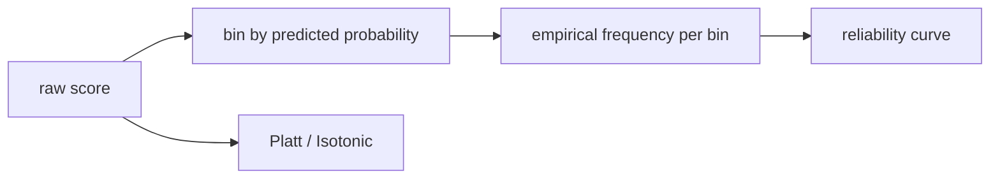

# 확률 보정 이해하기

모델이 0.8의 확률을 예측했다고 할 때, 우리는 보통 그 숫자를 직관적으로 받아들입니다. 하지만 그 0.8이 실제로도 10번 중 8번 정도 맞는지를 확인하지 않으면, 그 숫자는 점수처럼 보일 뿐 확률이라고 부르기 어렵습니다. 바로 이 지점을 다루는 개념이 calibration입니다.

순위 성능이 좋은 모델이 곧 확률까지 정직한 모델인 것은 아닙니다. AUC가 높아도 확률값은 과신하거나 과소신할 수 있습니다. 광고 입찰, 보험 심사, 리스크 스코어링처럼 확률값 그 자체를 비용 계산에 쓰는 시스템에서는 이 차이가 곧 손실로 이어집니다.

이 글은 Model Evaluation 101 시리즈의 7번째 글입니다.

---

## 이 글에서 다룰 문제

- 모델이 예측한 확률을 왜 그대로 믿으면 안 될까요?
- 신뢰도 곡선은 무엇을 보여 줄까요?
- Brier 점수는 어떤 종류의 오류를 요약할까요?
- Platt 보정과 isotonic 보정은 언제 다르게 쓰일까요?
- 보정 뒤에 임계값을 다시 조정해야 하는 이유는 무엇일까요?

> 보정은 모델이 양성과 음성을 잘 가르는지 묻는 작업이 아닙니다. 모델이 말한 확률이 실제 빈도와 얼마나 맞는지 묻는 작업입니다. 그래서 AUC와는 다른 축의 평가입니다.

## 왜 이 글이 중요한가

순위가 좋은 모델은 후보를 줄이는 데는 쓸 만할 수 있습니다. 그러나 확률값 자체를 가격 결정이나 경보 우선순위에 쓰려면 이야기가 달라집니다. 0.9라고 말한 사례가 실제로는 절반만 맞는다면, 시스템은 꾸준히 잘못된 의사결정을 하게 됩니다.

보정은 그래서 운영에서 특히 중요합니다. 예측 확률에 비용을 곱하거나, 기대값을 계산하거나, 여러 모델의 점수를 조합하는 순간부터는 점수의 순서뿐 아니라 숫자 자체의 의미가 중요해집니다.

## 한눈에 보는 멘탈 모델



예측 확률 구간별 평균과 실제 양성 빈도를 나란히 놓고 비교해야 합니다. 두 값이 대각선 위에 가깝게 맞아야 확률이 정직하다고 말할 수 있습니다.

## 핵심 용어

- **보정(calibration)**: 예측 확률과 실제 빈도가 잘 맞는 상태입니다.
- **신뢰도 곡선(reliability diagram)**: 확률 구간별 예측값과 실제 빈도를 비교하는 그래프입니다.
- **Brier 점수**: `(p - y)^2`의 평균이며 낮을수록 좋습니다.
- **Platt 보정**: 시그모이드 함수를 이용한 후처리 방식입니다.
- **Isotonic 회귀**: 단조 증가 제약만 두고 더 유연하게 맞추는 방식입니다.

## 보정을 읽는 방식의 전환

좋지 않은 습관은 확률값을 점수처럼만 보는 것입니다. `0.93`이 높아 보인다고 해서 실제로 93% 정도 맞는다고 가정하면 곧바로 해석 오류가 생깁니다.

좋은 습관은 확률값의 순위와 진실성을 분리해 보는 것입니다. 순위는 ROC나 PR이 말해 주고, 진실성은 보정이 말해 줍니다. 이 둘을 따로 읽을 수 있어야 확률 기반 의사결정이 안정해집니다.

## 보정을 살펴보는 다섯 단계

### 1단계 — 데이터와 모델

```python
from sklearn.datasets import make_classification
from sklearn.model_selection import train_test_split
from sklearn.ensemble import RandomForestClassifier
X, y = make_classification(n_samples=3000, weights=[0.7, 0.3], random_state=0)
Xtr, Xte, ytr, yte = train_test_split(X, y, stratify=y, random_state=42)
rf = RandomForestClassifier(n_estimators=100, random_state=0).fit(Xtr, ytr)
proba = rf.predict_proba(Xte)[:, 1]
```

### 2단계 — 신뢰도 곡선

```python
from sklearn.calibration import calibration_curve
frac_pos, mean_pred = calibration_curve(yte, proba, n_bins=10)
for mp, fp in zip(mean_pred, frac_pos):
    print(round(mp, 2), round(fp, 2))
```

### 3단계 — Brier 점수

```python
from sklearn.metrics import brier_score_loss
print("brier:", brier_score_loss(yte, proba))
```

### 4단계 — Platt 보정

```python
from sklearn.calibration import CalibratedClassifierCV
platt = CalibratedClassifierCV(rf, method="sigmoid", cv=5).fit(Xtr, ytr)
print("brier (platt):", brier_score_loss(yte, platt.predict_proba(Xte)[:, 1]))
```

### 5단계 — Isotonic 보정

```python
iso = CalibratedClassifierCV(rf, method="isotonic", cv=5).fit(Xtr, ytr)
print("brier (isotonic):", brier_score_loss(yte, iso.predict_proba(Xte)[:, 1]))
```

## 이 코드에서 먼저 봐야 할 점

두 번째 단계는 확률 구간별로 실제 빈도가 얼마나 따라오는지 보여 줍니다. 대각선에서 멀어질수록 과신하거나 과소신하는 구간이 있다는 뜻입니다. 세 번째 단계의 Brier 점수는 이 차이를 한 숫자로 요약합니다.

네 번째와 다섯 번째 단계는 보정 방식의 차이를 보여 줍니다. 일반적으로 작은 데이터에서는 sigmoid 방식이 더 안정적이고, 데이터가 충분할 때는 isotonic이 더 유연하게 맞을 수 있습니다. 다만 유연함이 곧 안전함은 아닙니다.

## 자주 헷갈리는 지점

첫째, AUC가 높으면 확률도 믿을 만하다고 생각하기 쉽습니다. 하지만 둘은 다른 축입니다. 둘째, 훈련 데이터에 바로 보정을 맞추면 과적합 위험이 커집니다. 보정도 별도의 검증 절차가 필요합니다.

셋째, 신뢰도 곡선의 구간 수를 너무 적거나 많게 잡으면 해석이 흔들립니다. 넷째, 보정 후에도 예전 임계값을 그대로 쓰면 운영 성능이 어긋날 수 있습니다. 확률 분포가 바뀌었기 때문입니다.

## 실무에서는 이렇게 생각한다

시니어 엔지니어는 확률을 돈과 연결하는 순간부터 보정을 필수 항목으로 봅니다. 순위 성능이 충분하더라도, 확률이 거짓말하면 기대값 계산은 모두 틀어집니다. 그래서 보정은 선택적 미세 조정이 아니라 의사결정 품질 관리에 가깝습니다.

또한 보정은 한 번 하고 끝나지 않습니다. 데이터 분포가 바뀌면 확률 해석도 바뀔 수 있으므로, 드리프트가 생기면 다시 확인하고 필요하면 재보정해야 합니다.

## 점검 목록

- [ ] 신뢰도 곡선을 확인합니다.
- [ ] Brier 점수를 비교합니다.
- [ ] 보정용 데이터 분리를 지킵니다.
- [ ] 보정 후 임계값을 다시 검토합니다.

## 정리

보정은 모델이 얼마나 잘 맞히는가보다, 모델이 말한 확률을 얼마나 믿을 수 있는가를 다룹니다. 순위 성능과 확률 성능은 다르며, 운영에서는 둘 다 중요합니다. 다음 글에서는 한 번의 분할에 기대지 않고 평가 추정치의 안정성을 보는 교차 검증으로 넘어가겠습니다.

<!-- toc:begin -->
- [모델 평가는 왜 어려운가?](./01-why-evaluation-is-hard.md)
- [훈련·검증·테스트 데이터 나누기](./02-train-val-test.md)
- [정확도의 한계](./03-limits-of-accuracy.md)
- [정밀도와 재현율](./04-precision-and-recall.md)
- [F1 점수](./05-f1-score.md)
- [ROC와 AUC 이해하기](./06-roc-and-auc.md)
- **확률 보정 이해하기 (현재 글)**
- 교차 검증 이해하기 (예정)
- 오류 분석으로 약점 찾기 (예정)
- 평가 리포트 만들기 (예정)
<!-- toc:end -->

## 참고 자료

- [scikit-learn — Calibration](https://scikit-learn.org/stable/modules/calibration.html)
- [scikit-learn — calibration_curve](https://scikit-learn.org/stable/modules/generated/sklearn.calibration.calibration_curve.html)
- [Wikipedia — Brier score](https://en.wikipedia.org/wiki/Brier_score)
- [Niculescu-Mizil & Caruana 2005](https://www.cs.cornell.edu/~alexn/papers/calibration.icml05.crc.rev3.pdf)

Tags: ModelEvaluation, Calibration, BrierScore, Reliability, scikit-learn
