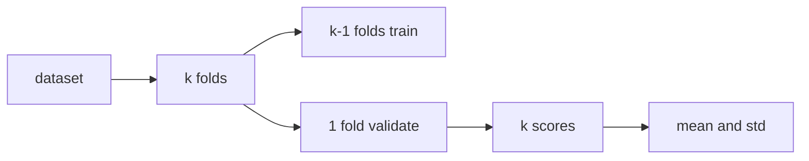

# 교차 검증 이해하기

train/test를 한 번 나눠 점수 하나를 얻으면 평가가 끝난 것처럼 느껴질 수 있습니다. 작은 실습에서는 그 방식도 충분합니다. 그러나 모델 비교나 하이퍼파라미터 조정이 시작되면, 단 한 번의 분할에서 나온 숫자는 생각보다 시끄럽습니다. 데이터가 조금만 달라져도 순위가 뒤집히기 때문입니다.

그래서 교차 검증은 점수를 더 많이 만드는 기술이 아니라, 그 점수를 얼마나 믿어도 되는지 추정하는 기술에 가깝습니다. 평균은 물론이고 분산까지 함께 봐야 비교가 비로소 해석 가능해집니다.

이 글은 Model Evaluation 101 시리즈의 8번째 글입니다.

---

## 이 글에서 다룰 문제

- 테스트 세트 점수 하나만으로 모델을 고르면 왜 불안정할까요?
- K-Fold는 어떤 아이디어 위에서 동작할까요?
- 왜 분류 문제에서는 stratified가 기본 선택이 될까요?
- GroupKFold와 TimeSeriesSplit은 어떤 누수를 막아 줄까요?
- 평균과 표준편차를 함께 보는 습관은 왜 중요할까요?

> 교차 검증은 점수 하나를 반복 측정해 평균을 내는 절차가 아닙니다. 분할에 따라 평가가 얼마나 흔들리는지까지 드러내어, 현재 점수가 얼마나 안정적인 추정치인지 보여 주는 절차입니다.

## 왜 이 글이 중요한가

모델 A가 0.842, 모델 B가 0.846이라면 얼핏 B가 더 좋아 보입니다. 하지만 분할이 달라질 때 점수가 0.02씩 흔들린다면 이 차이는 거의 의미가 없습니다. 교차 검증은 바로 이런 해석 문제를 줄여 줍니다.

또한 교차 검증은 누수 검출에도 도움을 줍니다. 그룹이 섞였거나 시간 순서를 깨뜨렸을 때 점수가 비정상적으로 좋아지는 경우가 많기 때문입니다. 그래서 평균 점수만이 아니라 올바른 분할 전략을 선택하는 일이 함께 중요합니다.

## 한눈에 보는 멘탈 모델



교차 검증에서는 하나의 검증 점수 대신 여러 분할에서 얻은 점수 묶음을 봅니다. 이 묶음이 있어야 평균뿐 아니라 흔들림도 읽을 수 있습니다.

## 핵심 용어

- **K-Fold**: 데이터를 k개로 나누고 k번 학습과 검증을 반복하는 방식입니다.
- **Stratified**: 각 폴드의 클래스 비율을 원본과 비슷하게 맞추는 방식입니다.
- **GroupKFold**: 같은 그룹이 서로 다른 폴드에 새지 않도록 막는 방식입니다.
- **TimeSeriesSplit**: 과거로 학습하고 미래로 검증하는 시간 순서 기반 분할입니다.
- **Repeated K-Fold**: 여러 시드로 K-Fold를 반복해 우연성을 줄이는 방식입니다.

## 교차 검증을 읽는 방식의 전환

좋지 않은 습관은 평균만 보고 표준편차를 숨기는 것입니다. 평균이 좋아 보여도 흔들림이 크면 모델 비교는 약합니다. 반대로 평균은 조금 낮아도 분산이 작고 누수 위험이 적은 평가가 더 믿을 만할 수 있습니다.

좋은 습관은 항상 두 가지를 함께 묻는 것입니다. 첫째, 이 분할 방식이 데이터의 구조를 제대로 보존하는가. 둘째, 점수의 평균과 분산이 비교 가능한 수준인가. 이 두 질문이 교차 검증의 핵심입니다.

## 교차 검증을 보는 다섯 단계

### 1단계 — 데이터와 모델

```python
from sklearn.datasets import make_classification
from sklearn.linear_model import LogisticRegression
X, y = make_classification(n_samples=2000, weights=[0.7, 0.3], random_state=0)
m = LogisticRegression(max_iter=1000)
```

### 2단계 — Stratified K-Fold

```python
from sklearn.model_selection import cross_val_score, StratifiedKFold
cv = StratifiedKFold(n_splits=5, shuffle=True, random_state=0)
scores = cross_val_score(m, X, y, cv=cv, scoring="f1_macro")
print("mean:", scores.mean(), "std:", scores.std())
```

### 3단계 — GroupKFold

```python
import numpy as np
from sklearn.model_selection import GroupKFold
groups = np.repeat(np.arange(100), 20)
gkf = GroupKFold(n_splits=5)
scores = cross_val_score(m, X, y, cv=gkf, groups=groups, scoring="f1_macro")
print("group cv:", scores.mean(), scores.std())
```

### 4단계 — TimeSeriesSplit

```python
from sklearn.model_selection import TimeSeriesSplit
tscv = TimeSeriesSplit(n_splits=5)
scores = cross_val_score(m, X, y, cv=tscv, scoring="f1_macro")
print("time cv:", scores.mean(), scores.std())
```

### 5단계 — 여러 지표 함께 보기

```python
from sklearn.model_selection import cross_validate
out = cross_validate(m, X, y, cv=cv, scoring=["f1_macro", "roc_auc"])
print({k: v.mean() for k, v in out.items() if k.startswith("test_")})
```

## 이 코드에서 먼저 봐야 할 점

두 번째 단계는 분류 문제에서 왜 stratified가 기본값에 가까운지 보여 줍니다. 클래스 비율을 각 폴드에 비슷하게 유지해야 평균 점수도 더 안정적으로 읽을 수 있습니다. 세 번째와 네 번째 단계는 교차 검증에서도 여전히 누수가 가장 큰 적이라는 점을 드러냅니다.

다섯 번째 단계는 교차 검증이 지표 하나만을 위한 도구가 아니라는 점을 보여 줍니다. 같은 분할 전략 안에서 여러 지표를 함께 읽어야 평가가 더 입체적이 됩니다.

## 자주 헷갈리는 지점

첫째, 일반 K-Fold를 모든 데이터에 그대로 적용해도 된다고 생각하기 쉽습니다. 하지만 시계열과 그룹 데이터에는 곧바로 누수가 들어옵니다. 둘째, 평균만 보고 표준편차를 무시하면 작은 차이를 과대해석하기 쉽습니다.

셋째, 교차 검증 점수가 많아 보인다고 해서 테스트 세트가 필요 없다고 오해하기도 합니다. 그러나 최종 보고를 위한 별도의 홀드아웃 세트는 여전히 중요합니다. 넷째, 매우 느린 모델에 무조건 큰 k를 쓰면 실험 속도가 지나치게 떨어질 수 있습니다.

## 실무에서는 이렇게 생각한다

시니어 엔지니어는 교차 검증을 평균 점수 생산기가 아니라 불확실성 측정기로 봅니다. 점수 차이가 작을수록 분산과 누수 여부를 더 꼼꼼히 봅니다. 안정적인 비교가 안 되면 모델 선택도 보류합니다.

또한 튜닝용 교차 검증과 최종 평가를 분리합니다. 내부 선택에는 교차 검증을 쓰고, 최종 보고에는 별도 테스트 세트를 남겨 둡니다. 이 선을 넘지 않아야 결과가 오래 버팁니다.

## 점검 목록

- [ ] 데이터 성격에 맞는 교차 검증 방식을 선택합니다.
- [ ] 평균과 표준편차를 함께 보고합니다.
- [ ] 그룹 누수와 시간 누수를 먼저 점검합니다.
- [ ] 최종 홀드아웃 세트를 별도로 유지합니다.

## 정리

교차 검증은 모델 점수의 평균을 보기 위한 도구이면서, 동시에 그 평균이 얼마나 흔들리는지 보여 주는 도구입니다. 올바른 분할 전략과 분산 해석이 함께 있어야 비교가 의미를 가집니다. 다음 글에서는 평균 점수 뒤에 숨은 실패 패턴을 꺼내는 오류 분석으로 넘어가겠습니다.

<!-- toc:begin -->
- [모델 평가는 왜 어려운가?](./01-why-evaluation-is-hard.md)
- [훈련·검증·테스트 데이터 나누기](./02-train-val-test.md)
- [정확도의 한계](./03-limits-of-accuracy.md)
- [정밀도와 재현율](./04-precision-and-recall.md)
- [F1 점수](./05-f1-score.md)
- [ROC와 AUC 이해하기](./06-roc-and-auc.md)
- [확률 보정 이해하기](./07-calibration.md)
- **교차 검증 이해하기 (현재 글)**
- 오류 분석으로 약점 찾기 (예정)
- 평가 리포트 만들기 (예정)
<!-- toc:end -->

## 참고 자료

- [scikit-learn — Cross-validation](https://scikit-learn.org/stable/modules/cross_validation.html)
- [scikit-learn — StratifiedKFold](https://scikit-learn.org/stable/modules/generated/sklearn.model_selection.StratifiedKFold.html)
- [scikit-learn — TimeSeriesSplit](https://scikit-learn.org/stable/modules/generated/sklearn.model_selection.TimeSeriesSplit.html)
- [Wikipedia — Cross-validation](https://en.wikipedia.org/wiki/Cross-validation_(statistics))

Tags: ModelEvaluation, CrossValidation, KFold, Stratified, scikit-learn
