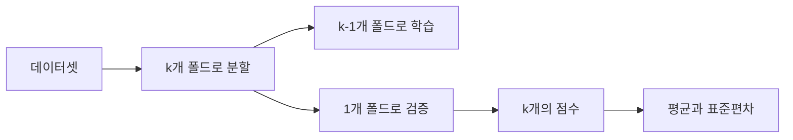

# Cross Validation

## 이 글에서 다룰 문제

- test set 점수 하나만으로 두 모델을 비교해도 될까요?
- K-Fold는 어떤 장단점을 가지며, 왜 stratified가 기본 선택이 될까요?
- GroupKFold와 TimeSeriesSplit은 언제 반드시 써야 할까요?
- 평균 점수뿐 아니라 표준편차까지 같이 봐야 하는 이유는 무엇일까요?
- 튜닝용 평가와 최종 보고용 평가는 어떻게 분리해야 할까요?

평가를 처음 배울 때는 train/test 한 번 나누고 점수 하나를 보는 흐름이 가장 익숙합니다. 작은 실습에서는 그 방식으로도 감을 잡을 수 있습니다. 하지만 모델을 실제로 비교하거나 하이퍼파라미터를 조정하기 시작하면, **한 번의 분할에서 나온 숫자 하나는 우연의 영향이 너무 큽니다.**

어떤 분할에서는 모델 A가 더 좋아 보이고, 다른 분할에서는 모델 B가 더 좋아 보일 수 있습니다. 데이터가 조금만 바뀌어도 결과가 흔들린다면, 그 평가는 의사결정의 근거로 쓰기 어렵습니다. 그래서 cross validation은 “평균 성능”뿐 아니라 **평가의 안정성**까지 함께 보는 도구입니다.

이 글에서는 K-Fold, Stratified K-Fold, GroupKFold, TimeSeriesSplit의 차이를 정리하고, 실무에서 점수의 평균과 분산을 어떻게 해석해야 하는지 살펴보겠습니다.

> Cross validation은 점수 하나를 더 만드는 절차가 아니라, 그 점수를 얼마나 믿어도 되는지 추정하는 절차입니다.

---

## 왜 중요한가

단일 split 평가는 간단하지만 시끄럽습니다. 특히 데이터가 작거나 클래스 불균형이 있거나, 같은 사용자·문서·세션이 여러 샘플로 퍼져 있을 때는 더 그렇습니다. 이때 점수 하나만 보고 모델을 고르면, 실제로는 데이터 분할 운이 좋았던 모델을 선택할 수 있습니다.

cross validation은 이 문제를 줄입니다. 데이터를 여러 번 나눠 학습과 검증을 반복하고, 각 분할의 점수를 모아 평균과 표준편차를 계산합니다. 평균은 전반적인 성능을, 표준편차는 결과가 얼마나 흔들리는지를 보여 줍니다.

즉 cross validation의 핵심은 “점수를 더 많이 만든다”가 아닙니다. **평가 추정치의 신뢰도를 드러낸다**는 점이 중요합니다. 점수 차이가 0.003인데 표준편차가 0.02라면, 그 비교는 사실상 의미가 약할 수 있습니다.

---

## 개념 한눈에 보기



cross validation은 하나의 데이터를 여러 관점에서 반복 검사하는 절차입니다. 각 폴드가 번갈아 검증 세트가 되므로, 특정 split 하나에만 의존하지 않게 됩니다.

여기서 중요한 포인트는 모든 CV가 같은 뜻이 아니라는 점입니다. 일반 K-Fold, stratified, group, time-series split은 모두 “무엇을 보호해야 하느냐”가 다릅니다. 클래스 비율을 보존해야 하는지, 같은 그룹이 새어 나가면 안 되는지, 시간 순서를 깨면 안 되는지에 따라 방법이 달라집니다.

---

## 핵심 용어

- **K-Fold**: 데이터를 k개로 나누고 k번 학습·검증을 반복하는 방법입니다.
- **Stratified**: 각 폴드의 클래스 비율을 원본과 비슷하게 맞추는 방식입니다.
- **GroupKFold**: 같은 그룹이 학습과 검증 양쪽에 동시에 등장하지 않도록 막는 방식입니다.
- **TimeSeriesSplit**: 과거로 학습하고 미래로 검증하는 시간 순서를 지키는 방식입니다.
- **Repeated K-Fold**: 여러 random seed로 K-Fold를 반복해 seed 의존성을 줄이는 방식입니다.

용어만 보면 비슷해 보이지만, 실제로는 누수를 막는 방식이 다릅니다. 그래서 cross validation에서는 “평균 점수 얼마였나”보다 먼저 “올바른 분할 전략을 썼나”를 확인해야 합니다.

---

## Before / After

**Before**: train/test 한 번 나누고 점수 하나를 보고 모델을 고릅니다.

**After**: 5-fold 평균과 표준편차를 함께 보고, 그룹 누수나 시간 누수가 없는지 먼저 확인한 뒤 모델을 비교합니다.

이 차이가 중요한 이유는 비교의 단단함이 달라지기 때문입니다. 전자는 결과가 우연에 흔들릴 수 있고, 후자는 그 흔들림까지 숫자로 드러냅니다.

---

## 실습: Cross Validation을 5단계로 살펴보기

### 1단계 — 데이터와 모델 준비

```python
from sklearn.datasets import make_classification
from sklearn.linear_model import LogisticRegression
X, y = make_classification(n_samples=2000, weights=[0.7, 0.3], random_state=0)
m = LogisticRegression(max_iter=1000)
```

간단한 Logistic Regression을 사용해 분할 전략만 바꿔 보겠습니다. 모델보다 평가 절차가 결과 해석에 얼마나 큰 영향을 주는지 보는 것이 목적입니다.

### 2단계 — Stratified K-Fold

```python
from sklearn.model_selection import cross_val_score, StratifiedKFold
cv = StratifiedKFold(n_splits=5, shuffle=True, random_state=0)
scores = cross_val_score(m, X, y, cv=cv, scoring="f1_macro")
print("mean:", scores.mean(), "std:", scores.std())
```

분류 문제에서는 stratified가 기본값에 가깝습니다. 클래스 비율이 폴드마다 크게 흔들리면 점수 변동이 불필요하게 커지고, 특히 소수 클래스 평가가 왜곡되기 쉽기 때문입니다.

### 3단계 — GroupKFold 적용

```python
import numpy as np
from sklearn.model_selection import GroupKFold
groups = np.repeat(np.arange(100), 20)
gkf = GroupKFold(n_splits=5)
scores = cross_val_score(m, X, y, cv=gkf, groups=groups, scoring="f1_macro")
print("group cv:", scores.mean(), scores.std())
```

같은 사용자, 같은 문서, 같은 장비에서 파생된 샘플이 여럿 있다면 GroupKFold가 중요합니다. 이 그룹이 학습과 검증에 동시에 섞이면 모델이 진짜 일반화한 것이 아니라 같은 대상의 흔적을 외운 것일 수 있습니다.

### 4단계 — TimeSeriesSplit 적용

```python
from sklearn.model_selection import TimeSeriesSplit
tscv = TimeSeriesSplit(n_splits=5)
scores = cross_val_score(m, X, y, cv=tscv, scoring="f1_macro")
print("time cv:", scores.mean(), scores.std())
```

시계열에서는 미래 데이터가 과거 학습에 섞이면 안 됩니다. TimeSeriesSplit은 훈련 구간이 점점 늘어나고 검증 구간은 미래 쪽으로 이동합니다. 운영 환경과 비슷한 방향의 평가를 만들 수 있다는 점이 장점입니다.

### 5단계 — 여러 지표 함께 보기

```python
from sklearn.model_selection import cross_validate
out = cross_validate(m, X, y, cv=cv, scoring=["f1_macro", "roc_auc"])
print({k: v.mean() for k, v in out.items() if k.startswith("test_")})
```

실무에서는 하나의 지표만 보고 끝내지 않습니다. F1과 ROC-AUC를 함께 보거나, 문제에 따라 precision·recall·log loss를 함께 봅니다. 이렇게 해야 “모델이 어느 면에서 좋아졌는가”를 더 정확히 설명할 수 있습니다.

---

## 이 코드에서 주목할 점

- 분류 문제에서는 Stratified K-Fold가 기본 선택입니다.
- 같은 사용자나 문서가 여러 샘플로 퍼져 있다면 Group leakage가 가장 흔한 함정입니다.
- TimeSeriesSplit은 시간이 흐를수록 훈련 창이 커지는 구조를 가집니다.

여기서 핵심은 CV 기법을 외우는 것이 아닙니다. **이 데이터에서 무엇이 새어 나가면 안 되는가**를 먼저 묻는 습관이 더 중요합니다. 클래스 비율, 그룹 정체성, 시간 순서 중 무엇을 지켜야 하는지에 따라 좋은 평가와 나쁜 평가가 갈립니다.

---

## 자주 하는 실수 5가지

1. 시계열 데이터에 일반 K-Fold를 그대로 씁니다.
2. 같은 사용자나 문서가 여러 폴드에 동시에 들어갑니다.
3. 평균 점수만 보고 표준편차를 숨깁니다.
4. `k`를 너무 작게 또는 너무 크게 잡습니다.
5. test set으로 반복 검증한 뒤 그 숫자를 최종 성능처럼 보고합니다.

특히 5번은 평가 체계를 망가뜨리는 지름길입니다. CV는 모델 선택과 튜닝에 쓰고, 최종 보고는 별도의 hold-out test set에서 해야 합니다. 그래야 마지막 숫자의 의미가 유지됩니다.

---

## 실무에서는 이렇게 보게 됩니다

하이퍼파라미터 튜닝 과정에서는 cross validation이 내부 평가 역할을 맡습니다. 그 뒤에는 손대지 않은 별도 test set으로 한 번만 최종 수치를 냅니다. 이 분리가 무너지면 모델은 점점 평가 절차에 과적합됩니다.

시니어 엔지니어는 보통 다음을 먼저 점검합니다.

- 표준편차가 큰 두 모델은 사실상 비교가 어려울 수 있습니다.
- 그룹 누수와 시간 누수는 다른 어떤 지표보다 먼저 확인해야 합니다.
- 모델 학습이 빠르다면 repeated CV로 seed 의존성을 줄일 수 있습니다.
- 튜닝과 최종 평가는 nested CV 또는 hold-out으로 분리하는 편이 안전합니다.
- 아주 느린 모델은 3-fold부터 시작해 비용과 안정성의 균형을 봅니다.

cross validation은 점수를 “좋게 만드는 기술”이 아니라, 점수를 **덜 속이게 만드는 기술**에 가깝습니다.

---

## 체크리스트

- [ ] 문제 유형에 맞는 stratified, group, time CV를 선택했습니다.
- [ ] 평균과 표준편차를 함께 보고합니다.
- [ ] 튜닝용 평가와 최종 평가를 분리했습니다.
- [ ] 마지막 hold-out test set이 따로 있습니다.

---

## 연습 문제

1. 같은 데이터에서 `K=2`와 `K=10`의 분산 차이를 비교해 보세요.
2. GroupKFold와 일반 K-Fold의 점수 차이를 측정해 보세요.
3. 시계열 데이터에서 일반 K-Fold가 얼마나 낙관적인지 실험해 보세요.

---

## 정리 및 다음 글

Cross validation은 평가 점수의 평균만이 아니라, 그 점수가 얼마나 흔들리는지까지 보여 주는 도구입니다. K-Fold, stratified, GroupKFold, TimeSeriesSplit은 모두 “무엇을 보호해야 하느냐”에 따라 선택이 갈립니다. 평균이 높아도 분산이 크면 비교가 약하고, 분할 전략이 잘못되면 높은 점수 자체가 의미를 잃습니다.

다음 글에서는 Error Analysis로 넘어가겠습니다. 전체 점수 뒤에 숨어 있는 약한 슬라이스와 반복되는 오류 유형을 어떻게 찾아내는지 살펴보겠습니다.

<!-- toc:begin -->
- [모델 평가는 왜 어려운가?](./01-why-evaluation-is-hard.md)
- [train/validation/test](./02-train-val-test.md)
- [Accuracy의 한계](./03-limits-of-accuracy.md)
- [Precision과 Recall](./04-precision-and-recall.md)
- [F1 Score](./05-f1-score.md)
- [ROC와 AUC](./06-roc-and-auc.md)
- [Calibration](./07-calibration.md)
- **Cross Validation (현재 글)**
- Error Analysis (예정)
- 평가 리포트 만들기 (예정)
<!-- toc:end -->

## 참고 자료

- [scikit-learn — Cross-validation](https://scikit-learn.org/stable/modules/cross_validation.html)
- [scikit-learn — StratifiedKFold](https://scikit-learn.org/stable/modules/generated/sklearn.model_selection.StratifiedKFold.html)
- [scikit-learn — TimeSeriesSplit](https://scikit-learn.org/stable/modules/generated/sklearn.model_selection.TimeSeriesSplit.html)
- [Wikipedia — Cross-validation](https://en.wikipedia.org/wiki/Cross-validation_(statistics))

Tags: ModelEvaluation, CrossValidation, KFold, Stratified, scikit-learn
