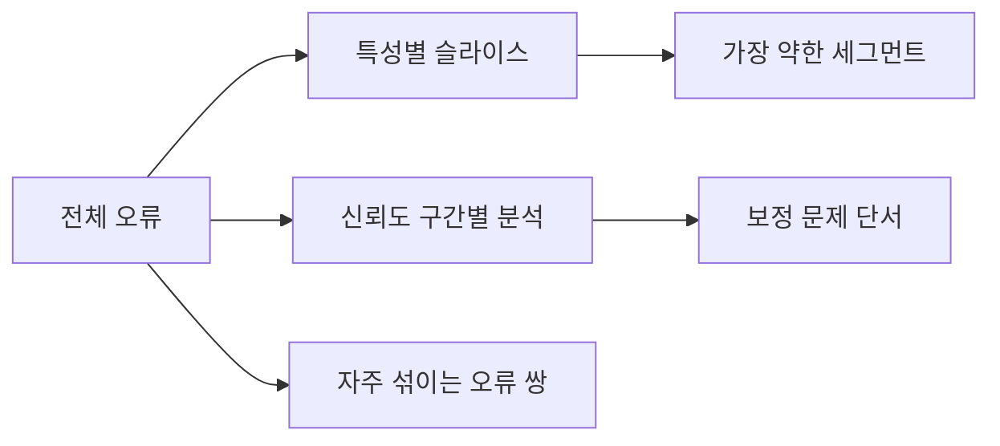

# Error Analysis

## 이 글에서 다룰 문제

- 전체 점수가 비슷한 두 모델은 어디에서 다르게 실패하는지 어떻게 찾을까요?
- 특정 사용자 집단이나 조건에서만 성능이 나빠지는 문제는 어떻게 드러낼까요?
- False Positive와 False Negative를 왜 따로 봐야 할까요?
- confidence bucket 분석은 임계값 조정에 어떤 단서를 줄까요?
- 모델 문제와 라벨 품질 문제를 어떻게 구분할 수 있을까요?

모델 평가를 처음 배울 때는 보통 정확도, F1, AUC처럼 전체 집계를 먼저 봅니다. 이 숫자들은 분명 중요합니다. 다만 운영에서 문제를 고칠 때는 곧바로 한계가 드러납니다. 전체 점수는 **무엇이 잘못됐는지**를 말해 주지 않기 때문입니다.

예를 들어 정확도 92%라는 숫자만으로는 특정 지역 사용자에서만 실패하는지, 희귀 클래스에서만 놓치는지, 임계값이 너무 공격적인지, 라벨 자체가 흔들리는지 알 수 없습니다. 그래서 모델 개선의 출발점은 종종 “점수를 더 잘 계산하는 일”이 아니라 **틀린 예측을 더 잘 분해하는 일**입니다.

이 글에서는 error analysis를 슬라이스 분석, 오류 유형 분리, confidence bucket 분석, 애매한 샘플 점검이라는 네 가지 관점으로 정리하겠습니다. 좋은 에러 분석은 모델을 비난하는 보고서가 아니라, 다음 실험의 방향을 정하는 지도에 가깝습니다.

> Error analysis의 핵심은 평균 점수 뒤에 숨어 있는 실패 패턴을 드러내고, 다음 수정 실험의 우선순위를 정하는 데 있습니다.

---

## 왜 중요한가

전체 정확도 92%는 좋아 보입니다. 하지만 어떤 사용자 집단에서는 60%만 맞고 있다면 이야기가 달라집니다. 이 경우는 단순한 성능 이슈를 넘어서 신뢰성 문제나 공정성 문제로 이어질 수 있습니다.

실무에서는 “평균적으로 괜찮다”보다 “어디서 위험하게 무너지는가”가 더 중요할 때가 많습니다. 고객 지원 분류기라면 특정 상품군에서만 계속 틀릴 수 있고, 리스크 모델이라면 특정 입력 범위에서만 과도한 false positive를 낼 수 있습니다.

error analysis의 목적은 점수를 더 많이 만드는 것이 아니라, **평균 뒤에 숨은 패턴을 꺼내는 것**입니다. 그래야 데이터 보강을 할지, 특성을 손볼지, 임계값을 바꿀지, 라벨을 다시 검수할지 결정할 수 있습니다.

---

## 개념 한눈에 보기



error analysis는 평균을 쪼개는 작업입니다. 어떤 특성 구간에서 틀리는지, 어떤 유형의 실수가 많은지, 모델이 자신 있어 할수록 더 자주 틀리는지 살펴봅니다.

이런 분석이 중요한 이유는 개선책이 문제 유형마다 다르기 때문입니다. false positive가 많으면 threshold 조정이나 규칙 결합이 필요할 수 있고, 특정 슬라이스만 약하면 데이터 수집 전략을 바꾸는 편이 더 효과적일 수 있습니다.

---

## 핵심 용어

- **Slice**: 특정 조건으로 정의한 데이터 부분집합입니다.
- **Confusion pair**: 서로 자주 헷갈리는 클래스 쌍입니다.
- **Confidence histogram**: 예측 확률이 어떤 구간에 몰리는지 보여 주는 분포입니다.
- **Hard example**: 반복해서 오분류되는 샘플입니다.
- **Label noise**: 정답 라벨 자체가 잘못되었거나 일관되지 않은 상태입니다.

이 용어들을 함께 보면 error analysis가 단순한 오류 수집이 아니라는 점이 보입니다. 모델의 약점, 데이터의 부족, 라벨의 흔들림을 구분해야 다음 액션이 정확해집니다.

---

## Before / After

**Before**: “정확도 92%니까 꽤 괜찮다”라고 판단하고 넘어갑니다.

**After**: 슬라이스별 표를 만들고, 가장 약한 구간을 찾고, false positive와 false negative를 분리해 보고, 데이터 보강 또는 모델 수정 계획으로 연결합니다.

점수 하나에서 멈추면 문제의 위치를 모릅니다. 반대로 error analysis를 하면 같은 92%라는 숫자도 전혀 다른 두 모델을 구분할 수 있습니다.

---

## 실습: Error Analysis를 5단계로 살펴보기

### 1단계 — 데이터와 모델 준비

```python
import numpy as np
from sklearn.datasets import make_classification
from sklearn.model_selection import train_test_split
from sklearn.linear_model import LogisticRegression
X, y = make_classification(n_samples=3000, n_features=8, weights=[0.7, 0.3], random_state=0)
Xtr, Xte, ytr, yte = train_test_split(X, y, stratify=y, random_state=42)
m = LogisticRegression(max_iter=1000).fit(Xtr, ytr)
proba = m.predict_proba(Xte)[:, 1]
pred = (proba >= 0.5).astype(int)
```

기본 모델과 예측 결과를 준비합니다. error analysis의 핵심은 여기서 끝난 뒤입니다. 모델을 새로 만드는 것이 아니라, 이미 나온 예측을 어떻게 분해해 읽을지에 초점을 둡니다.

### 2단계 — 슬라이스 점수 확인

```python
from sklearn.metrics import f1_score
slice_mask = Xte[:, 0] > 0
print("slice + :", f1_score(yte[slice_mask], pred[slice_mask]))
print("slice - :", f1_score(yte[~slice_mask], pred[~slice_mask]))
```

슬라이스 분석은 가장 먼저 해 볼 만한 작업입니다. 여기서는 단순히 `Xte[:, 0] > 0`이라는 조건으로 둘로 나눴지만, 실제로는 사용자 유형, 지역, 상품군, 입력 길이, 장비 종류 같은 의미 있는 기준을 씁니다.

### 3단계 — 오류 유형 분리

```python
fp = (pred == 1) & (yte == 0)
fn = (pred == 0) & (yte == 1)
print("FP:", fp.sum(), "FN:", fn.sum())
```

false positive와 false negative를 따로 보는 이유는 대응 전략이 다르기 때문입니다. 사기 탐지에서는 false negative가 더 위험할 수 있고, 콘텐츠 필터링에서는 false positive가 사용자 경험을 해칠 수 있습니다.

### 4단계 — 신뢰도 구간별 오류율 확인

```python
bins = np.linspace(0, 1, 6)
for lo, hi in zip(bins[:-1], bins[1:]):
    m_ = (proba >= lo) & (proba < hi)
    if m_.sum():
        err = (pred[m_] != yte[m_]).mean()
        print(round(lo, 1), round(hi, 1), "err:", round(err, 3))
```

confidence bucket 분석은 calibration 문제와 threshold 문제를 함께 떠올리게 해 줍니다. 높은 확률 구간에서도 오류율이 높다면 모델이 과신하는 것일 수 있고, 중간 구간에서만 흔들린다면 임계값 조정이 더 직접적인 해결책일 수 있습니다.

### 5단계 — 가장 애매한 샘플 추출

```python
order = np.argsort(np.abs(proba - 0.5))[:10]
print("ambiguous indices:", order.tolist())
```

0.5 근처에 몰린 샘플은 모델이 스스로도 확신하지 못하는 사례입니다. 이런 샘플을 수동 검토하면 라벨 오류, 경계 사례, 특성 부족 같은 문제를 자주 발견할 수 있습니다.

---

## 이 코드에서 주목할 점

- 슬라이스 점수는 공정성과 신뢰성 점검의 출발점이 됩니다.
- false positive와 false negative 분리는 임계값 조정 방향을 알려 줍니다.
- 애매한 샘플은 라벨 검수 후보로 매우 유용합니다.

실제로 모델 개선 속도를 높이는 팀은 전체 점수보다 이런 보조 표를 더 자주 봅니다. 평균은 문제의 존재를 알려 주고, error analysis는 문제의 위치를 알려 줍니다.

---

## 자주 하는 실수 5가지

1. 전체 점수만 보고 세그먼트별 차이를 무시합니다.
2. false positive와 false negative를 섞어서 봅니다.
3. 라벨 노이즈를 모델 문제로만 단정합니다.
4. confidence bucket 분석 없이 임계값부터 조정합니다.
5. 결과를 본 뒤에 슬라이스를 정의해 cherry-picking을 합니다.

5번은 특히 조심해야 합니다. 사후적으로 슬라이스를 계속 만들면 어떤 모델이든 약해 보이는 구간을 찾을 수 있습니다. 그래서 중요한 슬라이스는 가능한 한 사전에 정의해 두는 편이 좋습니다.

---

## 실무에서는 이렇게 보게 됩니다

금융, 의료, 채용처럼 설명 가능성과 감사 가능성이 중요한 영역에서는 세그먼트별 리포트가 사실상 필수입니다. 제품 운영 관점에서도 고객 불만은 평균보다 특정 사례에서 집중해서 발생하는 경우가 많습니다.

시니어 엔지니어는 보통 다음을 함께 봅니다.

- 가장 약한 슬라이스가 전체 평균보다 더 위험합니다.
- 서로 다른 오류 유형에는 서로 다른 수정 방법이 필요합니다.
- 라벨 품질이 낮으면 모델 품질도 그 سقास에서 멈춥니다.
- 슬라이스 기준은 사전에 정의해야 해석이 덜 흔들립니다.
- confidence와 error rate의 관계를 보면 calibration 문제를 의심할 수 있습니다.

좋은 error analysis는 “모델이 형편없다”는 결론으로 끝나지 않습니다. 어떤 데이터를 더 모아야 하는지, 어떤 임계값을 다시 검토해야 하는지, 어떤 라벨을 재점검해야 하는지로 이어져야 합니다.

---

## 체크리스트

- [ ] 최소 두 개 이상의 의미 있는 슬라이스를 보고합니다.
- [ ] false positive와 false negative를 분리해 봤습니다.
- [ ] confidence bucket별 오류율을 확인했습니다.
- [ ] 애매한 샘플의 라벨을 점검할 계획이 있습니다.

---

## 연습 문제

1. 연속형 특성 하나를 세 구간으로 나눠 슬라이스 점수를 비교해 보세요.
2. 임계값을 바꿀 때 false positive와 false negative 비율이 어떻게 달라지는지 표로 정리해 보세요.
3. 가장 애매한 샘플 10개를 직접 확인해 라벨 품질 이슈가 있는지 점검해 보세요.

---

## 정리 및 다음 글

Error analysis는 “왜 틀리는가”를 묻는 과정입니다. 전체 점수는 모델의 평균적인 상태를 보여 주지만, 실제 개선은 슬라이스 분석과 오류 유형 분리에서 시작하는 경우가 많습니다. confidence bucket은 calibration과 threshold 문제를 함께 비추고, 애매한 샘플 검토는 라벨 품질 이슈를 드러내 줍니다.

다음 글에서는 평가 리포트 만들기로 넘어가겠습니다. 지금까지 살펴본 지표, 임계값, 슬라이스, 재현성 정보를 한 문서로 어떻게 정리하는지 살펴보겠습니다.

<!-- toc:begin -->
- [모델 평가는 왜 어려운가?](./01-why-evaluation-is-hard.md)
- [train/validation/test](./02-train-val-test.md)
- [Accuracy의 한계](./03-limits-of-accuracy.md)
- [Precision과 Recall](./04-precision-and-recall.md)
- [F1 Score](./05-f1-score.md)
- [ROC와 AUC](./06-roc-and-auc.md)
- [Calibration](./07-calibration.md)
- [Cross Validation](./08-cross-validation.md)
- **Error Analysis (현재 글)**
- 평가 리포트 만들기 (예정)
<!-- toc:end -->

## 참고 자료

- [scikit-learn — Model evaluation](https://scikit-learn.org/stable/modules/model_evaluation.html)
- [Google — Model debugging](https://developers.google.com/machine-learning/testing-debugging)
- [Kaggle — Error analysis tutorial](https://www.kaggle.com/learn/intermediate-machine-learning)
- [Andrew Ng — Error analysis](https://www.deeplearning.ai/the-batch/issue-115/)

Tags: ModelEvaluation, ErrorAnalysis, Slicing, Debugging, scikit-learn
