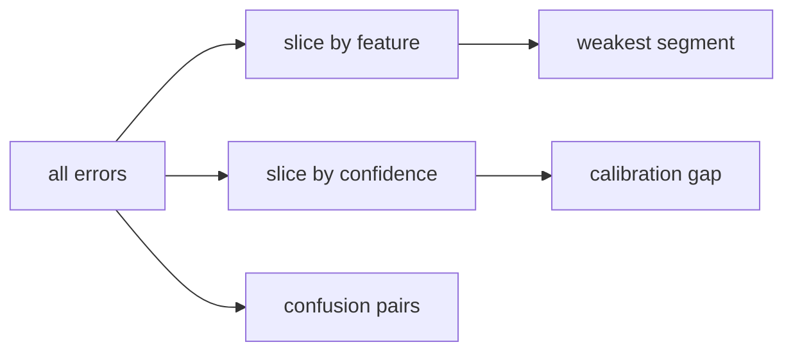

# Error Analysis

> Model Evaluation 101 시리즈 (9/10)

<!-- a-grade-intro:begin -->

**핵심 질문**: *전체 점수* 가 같아 보이는 두 모델이 *어디서 다르게 틀리는지* 어떻게 찾을까요?

> *Error Analysis 는 *집단 평균* 을 *서브 그룹* 으로 *분해* 해 *약점의 패턴* 을 드러내는 작업입니다.*

<!-- a-grade-intro:end -->

## 이 글에서 배울 것

- *Slice* 별 *성능 분해*
- *오류 유형* 분류 (FP/FN, 클래스 혼동)
- *Confidence* 별 분석
- *데이터 vs 모델* 문제 구분
- 흔한 함정 5가지

## 왜 중요한가

*전체 정확도 92%* 라도 *특정 사용자 집단* 에서 *60%* 라면 *공정성 문제* 가 됩니다.

## 개념 한눈에 보기



## 핵심 용어 정리

- **Slice**: *특정 조건* 의 부분 집합.
- **Confusion pair**: *자주 혼동되는* 클래스 쌍.
- **Confidence histogram**: *예측 확률* 분포.
- **Hard example**: *반복적으로 틀리는* 샘플.
- **Label noise**: *정답 자체* 가 틀린 경우.

## Before/After

**Before**: *“정확도 92% — 좋다”*.

**After**: *세그먼트별 표 → 가장 약한 슬라이스 식별 → 데이터 보강 또는 모델 수정*.

## 실습: 5단계 에러 분석

### 1단계 — 데이터와 모델

```python
import numpy as np
from sklearn.datasets import make_classification
from sklearn.model_selection import train_test_split
from sklearn.linear_model import LogisticRegression
X, y = make_classification(n_samples=3000, n_features=8, weights=[0.7, 0.3], random_state=0)
Xtr, Xte, ytr, yte = train_test_split(X, y, stratify=y, random_state=42)
m = LogisticRegression(max_iter=1000).fit(Xtr, ytr)
proba = m.predict_proba(Xte)[:, 1]
pred = (proba >= 0.5).astype(int)
```

### 2단계 — 슬라이스 점수

```python
from sklearn.metrics import f1_score
slice_mask = Xte[:, 0] > 0
print("slice + :", f1_score(yte[slice_mask], pred[slice_mask]))
print("slice - :", f1_score(yte[~slice_mask], pred[~slice_mask]))
```

### 3단계 — 오류 유형

```python
fp = (pred == 1) & (yte == 0)
fn = (pred == 0) & (yte == 1)
print("FP:", fp.sum(), "FN:", fn.sum())
```

### 4단계 — 신뢰도별 오류율

```python
bins = np.linspace(0, 1, 6)
for lo, hi in zip(bins[:-1], bins[1:]):
    m_ = (proba >= lo) & (proba < hi)
    if m_.sum():
        err = (pred[m_] != yte[m_]).mean()
        print(round(lo, 1), round(hi, 1), "err:", round(err, 3))
```

### 5단계 — 가장 자주 혼동된 샘플

```python
order = np.argsort(np.abs(proba - 0.5))[:10]
print("ambiguous indices:", order.tolist())
```

## 이 코드에서 주목할 점

- *슬라이스 점수* 는 *공정성* 의 출발점.
- *FP/FN 분리* 는 *임계값 조정* 의 단서.
- *애매 샘플* 은 *라벨 점검* 후보.

## 자주 하는 실수 5가지

1. ***전체 점수* 만 보고 *세그먼트* 를 무시.**
2. ***FP, FN* 을 *합쳐 놓고* 분석.**
3. ***라벨 노이즈* 를 *모델 오류* 로 단정.**
4. ***신뢰도* 별 분석 없이 *임계값* 조정.**
5. ***슬라이스 정의* 를 *결과 본 뒤* 정함 (cherry-picking).**

## 실무에서는 이렇게 쓰입니다

*제품 신뢰성* 과 *공정성 감사* — *세그먼트별 리포트* 가 *법적 요구* 가 되는 경우도 있다.

## 시니어 엔지니어는 이렇게 생각합니다

- *전체* 보다 *약한 슬라이스* 가 *위험*.
- *오류 유형* 별로 *대책* 이 다르다.
- *라벨 품질* 이 *모델 품질* 의 상한.
- *슬라이스* 는 *사전* 에 정의.
- *신뢰도* 와 *오류율* 의 *상관* 을 본다.

## 체크리스트

- [ ] *2개 이상* 슬라이스를 본다.
- [ ] *FP/FN* 분리.
- [ ] *신뢰도별 오류율* 을 본다.
- [ ] *애매 샘플* 의 라벨을 검수한다.

## 연습 문제

1. *연속형 피처* 를 *3구간* 으로 나눠 *슬라이스 점수* 를 비교.
2. *임계값* 변경이 *FP vs FN* 비율을 어떻게 바꾸는지 표로 만드세요.
3. *상위 10개 애매 샘플* 의 *라벨* 을 직접 점검하세요.

## 정리 및 다음 단계

에러 분석은 *“왜 틀리는가”* 의 답입니다. 다음 글은 *평가 리포트* 로 *모든 결과를 한 문서에* 묶는 법을 다룹니다.

<!-- toc:begin -->
- [모델 평가는 왜 어려운가?](./01-why-evaluation-is-hard.md)
- [train/validation/test](./02-train-val-test.md)
- [Accuracy의 한계](./03-limits-of-accuracy.md)
- [Precision과 Recall](./04-precision-and-recall.md)
- [F1 Score](./05-f1-score.md)
- [ROC와 AUC](./06-roc-and-auc.md)
- [Calibration](./07-calibration.md)
- [Cross Validation](./08-cross-validation.md)
- **Error Analysis (현재 글)**
- 평가 리포트 만들기 (예정)
<!-- toc:end -->

## 참고 자료

- [scikit-learn — Model evaluation](https://scikit-learn.org/stable/modules/model_evaluation.html)
- [Google — Model debugging](https://developers.google.com/machine-learning/testing-debugging)
- [Kaggle — Error analysis tutorial](https://www.kaggle.com/learn/intermediate-machine-learning)
- [Andrew Ng — Error analysis](https://www.deeplearning.ai/the-batch/issue-115/)

Tags: ModelEvaluation, ErrorAnalysis, Slicing, Debugging, scikit-learn
