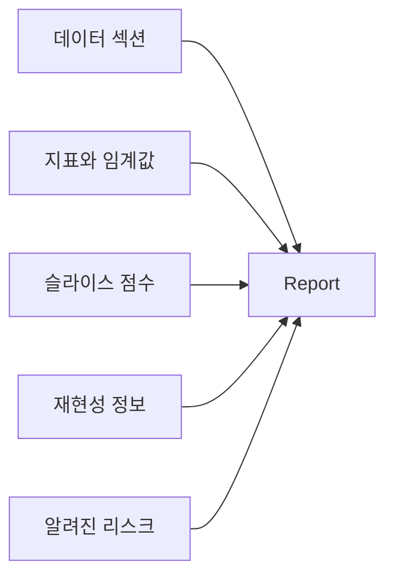

# 평가 리포트 만들기

## 이 글에서 다룰 문제

- 모델을 배포할 때 한 장짜리 평가 리포트에는 무엇이 들어가야 할까요?
- Model Card와 평가 리포트는 어떻게 다를까요?
- 데이터, 지표, 임계값, 슬라이스, 재현성 정보는 왜 한곳에 모아야 할까요?
- 사람이 손으로 쓰는 보고서 대신 자동 생성 방식을 왜 권장할까요?
- 리뷰, 감사, 사고 후 분석이 같은 문서를 볼 때 얻는 이점은 무엇일까요?

모델을 학습시키고 점수를 계산하는 일까지는 많은 팀이 잘합니다. 그런데 막상 배포 직전이 되면 결과를 Slack 메시지 한 줄이나 회의용 표 한 장으로 공유하고 끝내는 경우가 적지 않습니다. 그 순간에는 충분해 보여도, 며칠만 지나면 곧 문제가 생깁니다. **어떤 데이터로 계산했는지, 임계값이 얼마였는지, 어떤 슬라이스가 약했는지**가 금방 사라지기 때문입니다.

운영, 리뷰, 감사, 사고 후 분석은 모두 같은 질문을 다시 던집니다. “이 모델을 왜 배포했는가?” “어떤 한계를 알고 있었는가?” “이 숫자는 재현 가능한가?” 이런 질문에 매번 구두로 답하면 팀 속도는 떨어지고, 중요한 맥락도 빠지기 쉽습니다.

그래서 평가 리포트는 문서화의 형식 문제가 아니라 **의사결정의 기억 장치**라고 보는 편이 맞습니다. 이 글에서는 평가 리포트의 다섯 구성 요소와 자동 생성 패턴을 정리하겠습니다.

> 좋은 평가 리포트는 숫자 나열이 아니라, 배포 판단에 필요한 맥락과 재현성 정보를 한 번에 모아 두는 운영 문서입니다.

---

## 왜 중요한가

리뷰, 감사, 사고 후 분석은 서로 다른 목적을 가집니다. 하지만 모두 같은 자료를 찾습니다. 데이터 범위는 무엇이었는지, 어떤 지표를 썼는지, 운영 임계값은 얼마였는지, 취약한 슬라이스는 어디였는지, 재현성 정보는 남아 있는지 확인하려 합니다.

이 정보가 한 문서에 일관된 형식으로 모여 있으면 팀이 훨씬 빨라집니다. 반대로 어떤 실험은 노트북에 있고, 어떤 숫자는 슬라이드에 있고, 어떤 위험은 구두로만 전달되면 배포 결정이 사람 기억에 의존하게 됩니다.

좋은 평가 리포트는 완벽한 백과사전이 아닙니다. 대신 **배포 판단에 필요한 최소 핵심을 빠짐없이 모은 문서**여야 합니다. 짧아도 되지만, 반드시 반복 가능하고 비교 가능해야 합니다.

---

## 개념 한눈에 보기



평가 리포트는 다섯 가지를 한곳에 모읍니다. 어떤 데이터로 평가했는지, 어떤 숫자를 어떤 임계값에서 계산했는지, 어떤 세그먼트가 약한지, 같은 결과를 다시 만들 수 있는지, 그리고 이미 알고 있는 리스크가 무엇인지입니다.

이 다섯 요소가 모이면 리포트는 단순한 결과 요약을 넘어 “이 모델을 지금 상태로 어디까지 믿어도 되는가”를 설명하는 문서가 됩니다.

---

## 핵심 용어

- **Model Card**: 모델의 목적, 사용 범위, 한계를 설명하는 문서입니다.
- **Datasheet**: 데이터셋의 출처와 편향 가능성을 설명하는 문서입니다.
- **Operating threshold**: 운영 환경에서 실제 의사결정에 사용하는 임계값입니다.
- **Reproducibility hash**: 코드·데이터 버전을 다시 식별할 수 있게 돕는 해시나 버전 정보입니다.
- **Risk register**: 이미 알고 있는 실패 모드와 주의사항 목록입니다.

여기서 평가 리포트는 Model Card와 겹치지만 같지는 않습니다. Model Card가 더 넓은 설명 문서라면, 평가 리포트는 특정 평가 결과와 운영 기준을 촘촘하게 기록하는 문서에 가깝습니다.

---

## Before / After

**Before**: “acc 0.92, 배포하자”라는 Slack 메시지 한 줄로 결정을 내립니다.

**After**: 다섯 섹션으로 구성된 정형 리포트를 자동 생성해 리뷰, 배포 게이트, 사고 분석까지 같은 문서를 봅니다.

이 차이는 단지 보기 좋은 문서를 만드는 문제가 아닙니다. 숫자가 바뀌었을 때 왜 바뀌었는지 추적할 수 있고, 팀이 같은 기준으로 비교할 수 있게 된다는 점이 핵심입니다.

---

## 실습: 평가 리포트를 5단계로 만들기

### 1단계 — 지표 수집

```python
from sklearn.datasets import make_classification
from sklearn.model_selection import train_test_split
from sklearn.linear_model import LogisticRegression
from sklearn.metrics import f1_score, roc_auc_score, brier_score_loss
X, y = make_classification(n_samples=3000, weights=[0.7, 0.3], random_state=0)
Xtr, Xte, ytr, yte = train_test_split(X, y, stratify=y, random_state=42)
m = LogisticRegression(max_iter=1000).fit(Xtr, ytr)
proba = m.predict_proba(Xte)[:, 1]
pred = (proba >= 0.5).astype(int)
metrics = {
    "f1_macro": f1_score(yte, pred, average="macro"),
    "auc_roc": roc_auc_score(yte, proba),
    "brier": brier_score_loss(yte, proba),
}
```

리포트의 출발점은 핵심 지표입니다. 중요한 점은 숫자만 적는 것이 아니라, 어떤 임계값과 어떤 데이터에서 계산했는지 나중에 함께 연결할 수 있어야 한다는 점입니다.

### 2단계 — 슬라이스 점수 추가

```python
slice_mask = Xte[:, 0] > 0
slices = {
    "slice_pos": f1_score(yte[slice_mask], pred[slice_mask]),
    "slice_neg": f1_score(yte[~slice_mask], pred[~slice_mask]),
}
```

전체 점수만으로는 운영 리스크를 읽기 어렵습니다. 최소한 몇 개의 중요한 슬라이스는 함께 기록해야 “평균은 괜찮지만 어디가 약한가”를 바로 볼 수 있습니다.

### 3단계 — 메타데이터 기록

```python
import hashlib, sys, sklearn
meta = {
    "python": sys.version.split()[0],
    "sklearn": sklearn.__version__,
    "data_hash": hashlib.sha1(X.tobytes()).hexdigest()[:10],
    "threshold": 0.5,
}
```

재현성 정보는 자주 빠지지만, 시간이 지나면 가장 먼저 찾게 되는 항목입니다. Python 버전, 라이브러리 버전, 데이터 해시, 운영 임계값 정도만 있어도 “같은 실험이 맞는가”를 훨씬 빠르게 확인할 수 있습니다.

### 4단계 — 리포트 직렬화

```python
import json
report = {"metrics": metrics, "slices": slices, "meta": meta,
          "risks": ["minor calibration drift", "slice_neg lower F1"]}
print(json.dumps(report, indent=2))
```

먼저 JSON 같은 구조화된 형식으로 리포트를 만들면 재사용이 쉬워집니다. 이후 Markdown, HTML, Slack 메시지, 대시보드 등 여러 출력 형식으로 바꾸기 편합니다.

### 5단계 — Markdown으로 렌더링

```python
def to_md(rep):
    lines = ["# Evaluation Report", "## Metrics"]
    for k, v in rep["metrics"].items():
        lines.append(f"- {k}: {round(v, 3)}")
    lines.append("## Slices")
    for k, v in rep["slices"].items():
        lines.append(f"- {k}: {round(v, 3)}")
    lines.append("## Meta")
    for k, v in rep["meta"].items():
        lines.append(f"- {k}: {v}")
    return "\n".join(lines)

print(to_md(report))
```

사람이 읽는 최종 결과물은 Markdown이든 HTML이든 상관없습니다. 중요한 것은 **원본 데이터 구조를 먼저 만들고, 사람이 읽는 형식은 그다음에 렌더링**하는 패턴입니다. 그래야 수기 편집 때문에 재현성이 깨지는 일을 줄일 수 있습니다.

---

## 이 코드에서 주목할 점

- JSON을 먼저 만들고 Markdown을 나중에 렌더링하는 구조가 재사용에 유리합니다.
- 데이터 해시는 재현성의 뼈대가 됩니다.
- 임계값을 명시해야 숫자 해석이 흔들리지 않습니다.

이 구조를 CI 파이프라인에 연결하면, 모델 학습이 끝날 때마다 같은 형식의 리포트를 자동으로 남길 수 있습니다. 그 순간부터 평가는 개인 노트북의 임시 결과가 아니라 팀의 공식 산출물이 됩니다.

---

## 자주 하는 실수 5가지

1. 임계값을 기록하지 않습니다.
2. 슬라이스 점수를 생략합니다.
3. 버전 정보와 데이터 식별자를 남기지 않습니다.
4. 리스크 섹션을 비워 둡니다.
5. 사람이 손으로만 문서를 써서 재현성을 깨뜨립니다.

이 다섯 가지는 하나하나가 작아 보여도, 나중에 “왜 이 모델을 배포했지?”라는 질문이 나왔을 때 큰 공백이 됩니다. 특히 리스크 섹션은 나쁜 소식을 적는 칸이 아니라, 알고 있는 한계를 솔직하게 남기는 칸입니다.

---

## 실무에서는 이렇게 보게 됩니다

많은 팀이 평가 리포트를 출시 게이트의 기준 문서로 씁니다. 모니터링 알람을 설계할 때도 같은 문서를 참조합니다. 어떤 지표를 얼마나 허용할지, 어떤 슬라이스를 별도 감시할지, 이미 알고 있는 위험은 무엇인지가 여기에 모이기 때문입니다.

시니어 엔지니어는 보통 다음 원칙을 중시합니다.

- 리포트는 회의 자료가 아니라 빌드 산출물이어야 합니다.
- Model Card와 평가 리포트는 목적이 다르므로 분리하는 편이 좋습니다.
- 모든 숫자는 데이터 범위와 임계값을 함께 가져야 합니다.
- 리스크 섹션이 가장 실무적인 가치가 큽니다.
- 드리프트 추적을 위해 주기적으로 다시 생성해야 합니다.

결국 좋은 리포트는 “배포해도 되는가”뿐 아니라 “배포 후 무엇을 감시해야 하는가”까지 이어 줍니다.

---

## 체크리스트

- [ ] 지표와 임계값을 함께 기록했습니다.
- [ ] 중요한 슬라이스 점수를 포함했습니다.
- [ ] 버전과 해시 같은 재현성 메타데이터를 남겼습니다.
- [ ] 알려진 리스크를 명시했습니다.

---

## 연습 문제

1. 최근 팀 모델 하나를 골라 같은 템플릿으로 리포트를 채워 보세요.
2. 같은 모델에 대해 서로 다른 두 임계값으로 리포트를 두 개 만들어 보세요.
3. 이 리포트 생성기를 CI 파이프라인에 연결하는 스크립트를 구상해 보세요.

---

## 정리 및 다음 글

평가 리포트는 데이터, 지표, 임계값, 슬라이스, 재현성, 리스크를 한곳에 묶는 문서입니다. 핵심은 길게 쓰는 것이 아니라 빠짐없이, 반복 가능하게, 자동으로 남기는 데 있습니다. JSON 같은 구조화된 중간 표현을 먼저 만들고 Markdown으로 렌더링하면 재현성과 재사용성이 함께 좋아집니다.

이 글로 Model Evaluation 101 시리즈를 마무리합니다. 이제 평가의 기본 어휘와 주요 함정을 한 번 훑었습니다. 다음 단계로는 MLOps, 운영 모니터링, 더 깊은 error analysis 같은 주제로 자연스럽게 확장할 수 있습니다.

<!-- toc:begin -->
- [모델 평가는 왜 어려운가?](./01-why-evaluation-is-hard.md)
- [train/validation/test](./02-train-val-test.md)
- [Accuracy의 한계](./03-limits-of-accuracy.md)
- [Precision과 Recall](./04-precision-and-recall.md)
- [F1 Score](./05-f1-score.md)
- [ROC와 AUC](./06-roc-and-auc.md)
- [Calibration](./07-calibration.md)
- [Cross Validation](./08-cross-validation.md)
- [Error Analysis](./09-error-analysis.md)
- **평가 리포트 만들기 (현재 글)**
<!-- toc:end -->

## 참고 자료

- [Google — Model Cards](https://modelcards.withgoogle.com/about)
- [Datasheets for Datasets](https://arxiv.org/abs/1803.09010)
- [scikit-learn — Model evaluation](https://scikit-learn.org/stable/modules/model_evaluation.html)
- [MLOps — Production ML guide](https://ml-ops.org/)

Tags: ModelEvaluation, Reporting, ModelCard, Reproducibility, scikit-learn
