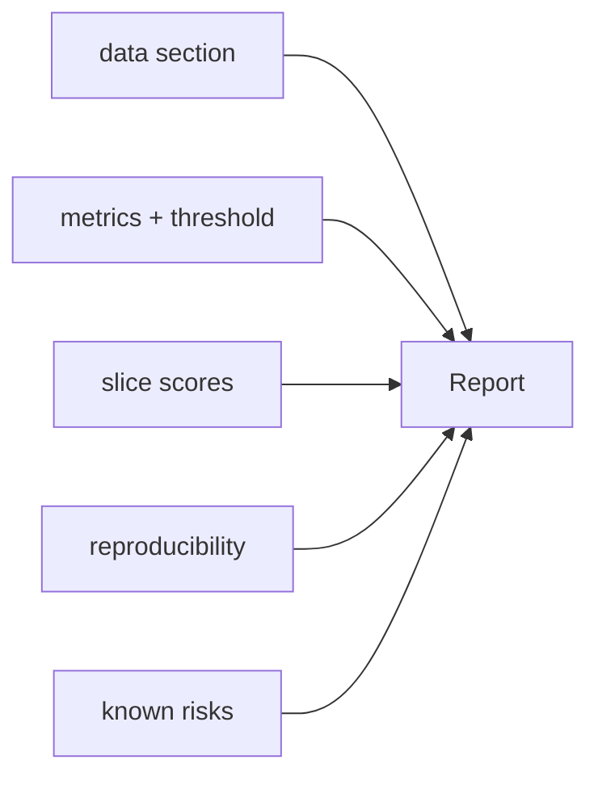

# 평가 리포트 만들기

모델 학습과 평가까지는 많은 팀이 잘합니다. 문제는 배포 직전입니다. 이때 결과가 슬라이드 한 장이나 메시지 한 줄로 축약되면, 며칠 뒤에는 가장 중요한 맥락이 사라집니다. 어떤 데이터에서 계산했는지, 임계값은 얼마였는지, 어떤 슬라이스가 약했는지, 재현성 정보가 남아 있는지 다시 묻게 됩니다.

좋은 평가 리포트는 그래서 문서 작업이 아니라 의사결정 기록입니다. 리뷰, 감사, 사고 후 분석이 모두 같은 문서를 참고할 수 있어야 팀의 속도도 유지되고 책임 경계도 분명해집니다.

이 글은 Model Evaluation 101 시리즈의 10번째 글입니다.

---

## 이 글에서 다룰 문제

- 모델 배포 전에 어떤 평가 정보를 한곳에 모아야 할까요?
- 평가 리포트와 Model Card는 무엇이 다를까요?
- 임계값, 슬라이스, 재현성 정보는 왜 빠지면 안 될까요?
- 리포트를 사람이 손으로 쓰지 말고 자동 생성해야 하는 이유는 무엇일까요?
- 팀 리뷰와 감사 대응에서 일관된 형식이 왜 중요할까요?

> 좋은 평가 리포트는 숫자만 모아 둔 문서가 아닙니다. 데이터, 지표, 임계값, 약한 슬라이스, 재현성 정보를 한 번에 모아 배포 판단의 근거를 남기는 운영 문서입니다.

## 왜 이 글이 중요한가

평가 리포트가 없으면 같은 질문에 팀이 계속 같은 답을 다시 만들어야 합니다. 어떤 모델을 왜 선택했는지, 어떤 한계를 알고도 배포했는지, 나중에 같은 결과를 다시 재현할 수 있는지 확인하기가 어려워집니다.

반대로 리포트 형식이 일정하면 리뷰와 감사가 훨씬 빨라집니다. 어떤 숫자가 어디서 왔는지 추적하기 쉬워지고, 비교 기준도 안정됩니다. 결국 리포트는 문서 정리의 문제가 아니라 팀 메모리의 문제입니다.

## 한눈에 보는 멘탈 모델



이 다섯 요소가 한곳에 모여야 리포트가 완성됩니다. 데이터, 지표, 슬라이스, 재현성, 리스크 중 하나라도 빠지면 배포 판단의 근거가 비어 버립니다.

## 핵심 용어

- **Model Card**: 모델의 의도와 한계를 설명하는 문서입니다.
- **Datasheet**: 데이터셋의 출처와 편향 가능성을 설명하는 문서입니다.
- **운영 임계값**: 실제 배포 환경에서 사용하는 결정 기준선입니다.
- **재현성 해시**: 코드와 데이터 버전을 다시 식별할 수 있는 값입니다.
- **리스크 등록부**: 이미 알고 있는 실패 모드 목록입니다.

## 리포트를 읽는 방식의 전환

좋지 않은 습관은 점수 하나만 전달하고 끝내는 것입니다. `acc 0.92` 혹은 `F1 0.81`만으로는 배포 판단의 맥락이 남지 않습니다. 누가 봐도 다시 계산할 수 있고, 같은 질문에 같은 답을 줄 수 있어야 합니다.

좋은 습관은 리포트를 산출물로 다루는 것입니다. 모델을 다시 학습하면 리포트도 다시 생성되고, 숫자마다 어떤 데이터와 임계값에서 나왔는지 추적할 수 있어야 합니다.

## 평가 리포트를 만드는 다섯 단계

### 1단계 — 지표 수집

```python
from sklearn.datasets import make_classification
from sklearn.model_selection import train_test_split
from sklearn.linear_model import LogisticRegression
from sklearn.metrics import f1_score, roc_auc_score, brier_score_loss
X, y = make_classification(n_samples=3000, weights=[0.7, 0.3], random_state=0)
Xtr, Xte, ytr, yte = train_test_split(X, y, stratify=y, random_state=42)
m = LogisticRegression(max_iter=1000).fit(Xtr, ytr)
proba = m.predict_proba(Xte)[:, 1]
pred = (proba >= 0.5).astype(int)
metrics = {
    "f1_macro": f1_score(yte, pred, average="macro"),
    "auc_roc": roc_auc_score(yte, proba),
    "brier": brier_score_loss(yte, proba),
}
```

### 2단계 — 슬라이스 점수 수집

```python
slice_mask = Xte[:, 0] > 0
slices = {
    "slice_pos": f1_score(yte[slice_mask], pred[slice_mask]),
    "slice_neg": f1_score(yte[~slice_mask], pred[~slice_mask]),
}
```

### 3단계 — 메타데이터 기록

```python
import hashlib, sys, sklearn
meta = {
    "python": sys.version.split()[0],
    "sklearn": sklearn.__version__,
    "data_hash": hashlib.sha1(X.tobytes()).hexdigest()[:10],
    "threshold": 0.5,
}
```

### 4단계 — 리포트 직렬화

```python
import json
report = {"metrics": metrics, "slices": slices, "meta": meta,
          "risks": ["minor calibration drift", "slice_neg lower F1"]}
print(json.dumps(report, indent=2))
```

### 5단계 — 마크다운 렌더링

```python
def to_md(rep):
    lines = ["# Evaluation Report", "## Metrics"]
    for k, v in rep["metrics"].items():
        lines.append(f"- {k}: {round(v, 3)}")
    lines.append("## Slices")
    for k, v in rep["slices"].items():
        lines.append(f"- {k}: {round(v, 3)}")
    lines.append("## Meta")
    for k, v in rep["meta"].items():
        lines.append(f"- {k}: {v}")
    return "\n".join(lines)

print(to_md(report))
```

## 이 코드에서 먼저 봐야 할 점

첫 번째와 두 번째 단계는 리포트가 단순한 점수 표가 아니라는 점을 보여 줍니다. 전체 지표와 슬라이스 지표가 함께 있어야 약한 구간을 숨기지 않을 수 있습니다. 세 번째 단계의 메타데이터는 나중에 재현성을 복원하는 뼈대가 됩니다.

네 번째와 다섯 번째 단계는 생성 순서도 중요하다는 점을 보여 줍니다. 먼저 구조화된 JSON을 만들고, 그다음 사람이 읽을 마크다운으로 바꾸는 편이 자동화와 검증에 유리합니다.

## 자주 헷갈리는 지점

첫째, 임계값을 기록하지 않으면 숫자의 의미가 흔들립니다. 둘째, 슬라이스 점수를 빼면 평균 뒤의 위험이 사라집니다. 셋째, 버전과 해시 정보를 빼면 같은 결과를 다시 만들 수 없습니다.

또한 리스크 섹션을 비워 두는 실수도 많습니다. 하지만 배포 판단에서 가장 중요한 것은 이미 알고 있는 약점을 숨기지 않는 일입니다. 좋은 리포트는 자신감보다 제약을 더 또렷하게 남깁니다.

## 실무에서는 이렇게 생각한다

시니어 엔지니어는 평가 리포트를 빌드 산출물처럼 다룹니다. 모델이 새로 학습되면 리포트도 함께 다시 생성되어야 하고, 숫자마다 출처가 분명해야 합니다. 손으로 작성한 요약은 빠를 수 있지만 오래 버티지 못합니다.

또한 Model Card와 평가 리포트를 구분합니다. Model Card가 더 넓은 설명 문서라면, 평가 리포트는 특정 실험과 배포 판단을 뒷받침하는 좁고 단단한 운영 문서입니다.

## 점검 목록

- [ ] 지표와 임계값을 함께 기록합니다.
- [ ] 슬라이스 점수를 포함합니다.
- [ ] 버전과 해시 정보를 남깁니다.
- [ ] 알려진 리스크를 숨기지 않고 적습니다.

## 정리

좋은 평가 리포트는 한 장짜리 요약이면서도, 배포 판단에 필요한 맥락을 빠짐없이 담고 있어야 합니다. 데이터, 지표, 임계값, 슬라이스, 재현성, 리스크가 한곳에 모여야 숫자가 의사결정의 근거가 됩니다. 여기까지가 Model Evaluation 101의 기본 어휘이며, 이후에는 MLOps와 더 깊은 오류 분석으로 자연스럽게 이어질 수 있습니다.

<!-- toc:begin -->
- [모델 평가는 왜 어려운가?](./01-why-evaluation-is-hard.md)
- [훈련·검증·테스트 데이터 나누기](./02-train-val-test.md)
- [정확도의 한계](./03-limits-of-accuracy.md)
- [정밀도와 재현율](./04-precision-and-recall.md)
- [F1 점수](./05-f1-score.md)
- [ROC와 AUC 이해하기](./06-roc-and-auc.md)
- [확률 보정 이해하기](./07-calibration.md)
- [교차 검증 이해하기](./08-cross-validation.md)
- [오류 분석으로 약점 찾기](./09-error-analysis.md)
- **평가 리포트 만들기 (현재 글)**
<!-- toc:end -->

## 참고 자료

- [Google — Model Cards](https://modelcards.withgoogle.com/about)
- [Datasheets for Datasets](https://arxiv.org/abs/1803.09010)
- [scikit-learn — Model evaluation](https://scikit-learn.org/stable/modules/model_evaluation.html)
- [MLOps — Production ML guide](https://ml-ops.org/)

Tags: ModelEvaluation, Reporting, ModelCard, Reproducibility, scikit-learn
