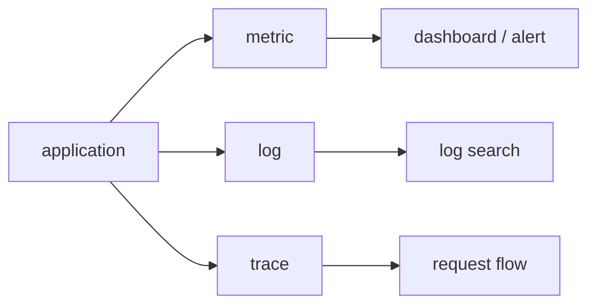

# What Is Observability?

This is the first post in the Observability 101 series.

> Observability 101 series (1/10)

<!-- a-grade-intro:begin -->

**Core question**: When systems *fail quietly*, how do we *understand the inside from the outside*?

> *Observability is the ability to *understand a system's internal state from external signals alone*. Monitoring *watches known problems*; observability *asks unknown questions*.*

<!-- a-grade-intro:end -->

## What You Will Learn

- The difference between *monitoring* and *observability*
- The three pillars: *metrics, logs, traces*
- *Known unknowns* vs *unknown unknowns*
- Five steps to your first signals
- Five common pitfalls

## Why It Matters

Production systems break in *unpredictable ways*. Pre-built dashboards cannot explain *failures you have never seen*. Observability gives you a system you can *ask questions of*.

> *Dashboards are *answers*; observability is *questions*.*

## Concept at a Glance



## Key Terms

- **Metric**: a *number* that changes over time. Example: requests per second.
- **Log**: a *text line* recording an event.
- **Trace**: the *path* a single request takes across services.
- **Cardinality**: the number of *unique label combinations*.
- **SLO**: a *numeric promise* the service must keep.

## Before/After

**Before**: An alert fires and you have *no idea where it started*. You *grep* logs and flail.

**After**: You see the *symptom* on a dashboard, find the *responsible service* with a trace, and read *context* from logs.

## Hands-on: Your First Signals in 5 Steps

### Step 1 — The simplest metric

```python
import time
counter = 0

def handle_request():
    global counter
    counter += 1
    return f"requests_total {counter}"
```

### Step 2 — Structured logs

```python
import json, time

def log_event(event, **fields):
    print(json.dumps({"ts": time.time(), "event": event, **fields}))

log_event("request_received", path="/health", status=200)
```

### Step 3 — A simple trace

```python
import uuid

def handle(req):
    trace_id = req.get("trace_id") or str(uuid.uuid4())
    log_event("auth_start", trace_id=trace_id)
    log_event("db_query", trace_id=trace_id)
    log_event("response_sent", trace_id=trace_id)
```

### Step 4 — Reading the three together

```bash
# metric: requests in the last minute
# log: search by trace_id
grep '"trace_id": "abc-123"' app.log
```

### Step 5 — Answer one question

```text
"Why did checkout get slow?"
1. metric: latency curve rises
2. trace: payment span is long
3. log: db connection timeout
```

## What to Notice in This Code

- The three signals *complement each other*. None of them is *enough alone*.
- *trace_id* is what *links* metrics, logs, and traces.
- Structured logs are *machine-readable data*.

## Five Common Mistakes

1. **Treating monitoring and observability as *synonyms*.** One is *answers*, the other is *the ability to ask*.
2. **Collecting only metrics.** You cannot answer *why*.
3. **Writing logs as *unstructured text*.** Search becomes *hell*.
4. **Not propagating *trace_id* across services.** Traces *break*.
5. **Storing every signal *forever*.** Cost *explodes*.

## How This Shows Up in Production

Most SRE teams treat the *three pillars* as their *minimum signal set* and then design alerts on top of *SLOs*.

## How a Senior Engineer Thinks

- *Systems should be *glass boxes*, not *black boxes*.*
- *Dashboards are *answers to questions*, not decoration.*
- *Cardinality is *cost*.*
- *Propagate *trace_id* through every signal.*
- *The real test is whether you can *ask about an unknown failure*.*

## Checklist

- [ ] You can explain *monitoring* vs *observability*.
- [ ] You can name the *three pillars*.
- [ ] You can write one structured log line.
- [ ] You understand the role of *trace_id*.

## Practice Problems

1. Pick a recent incident. Decompose it into the *three pillars*.
2. Rewrite one unstructured log line as *JSON*.
3. Give two examples each of *known unknown* and *unknown unknown*.

## Wrap-up and Next Steps

Observability is the discipline of *asking inside from outside*. Next we look deeper into *the three pillars*.

<!-- toc:begin -->
- **What Is Observability? (current)**
- Metrics, Logs, and Traces (upcoming)
- Collecting and Visualizing Metrics (upcoming)
- Structured Logging (upcoming)
- Distributed Tracing Basics (upcoming)
- Dashboard Design (upcoming)
- Alerts and On-Call (upcoming)
- SLI and SLO Basics (upcoming)
- Cost and Cardinality (upcoming)
- A Production-Ready Observability Stack (upcoming)
<!-- toc:end -->

## References

- [OpenTelemetry overview](https://opentelemetry.io/docs/concepts/)
- [Google SRE Book — Monitoring](https://sre.google/sre-book/monitoring-distributed-systems/)
- [Three Pillars of Observability](https://www.cncf.io/blog/2022/05/24/observability-cloud-native/)
- [Observability vs Monitoring](https://www.honeycomb.io/blog/observability-101)

Tags: Observability, Monitoring, SRE, DevOps, Metrics
