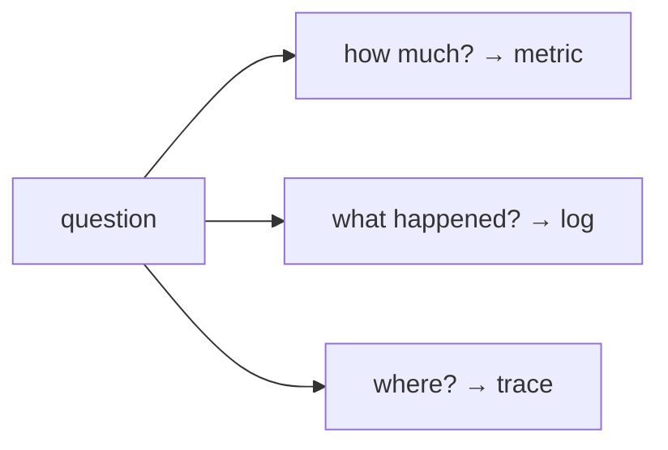

# Metrics, Logs, and Traces

This is post 2 in the Observability 101 series.

This is post 2 in the Observability 101 series.

> Observability 101 series (2/10)

<!-- a-grade-intro:begin -->

**Core question**: How do the three signals *differ*, and *when do you reach for which*?

> *Metrics answer *how much*, logs answer *what happened*, traces answer *where and how*. None of them *replaces* the others.*

<!-- a-grade-intro:end -->

## What You Will Learn

- The *question domain* of each signal
- Each signal's *data model*
- *Cardinality* and *cost*
- A decision rule for *when to use what*
- Five common pitfalls

## Why It Matters

Picking the *wrong signal* makes cost *explode* and answers *vanish*. Knowing the *boundary* between the three buys you *more answers for less money*.

> *One right signal beats *ten wrong dashboards*.*

## Concept at a Glance



## Key Terms

- **Counter / Gauge / Histogram**: the three *shapes* of metrics.
- **Sampling**: *cost reduction* by collecting only a portion.
- **Span**: a single segment of a trace.
- **Label / Tag**: an *identifier* attached to a signal.
- **Retention**: how *long* a signal is kept.

## Before/After

**Before**: Everything goes into logs. Search is *slow* and the bill is *huge*.

**After**: *Trends* go into metrics, *causal context* into logs, *flow* into traces.

## Hands-on: Compare the Three in 5 Steps

### Step 1 — Counter

```python
http_requests_total = 0

def on_request():
    global http_requests_total
    http_requests_total += 1
```

### Step 2 — Histogram

```python
import time
buckets = {0.1: 0, 0.5: 0, 1.0: 0, "inf": 0}

def observe(d):
    for b in [0.1, 0.5, 1.0]:
        if d <= b: buckets[b] += 1; return
    buckets["inf"] += 1
```

### Step 3 — Structured log

```python
import json
def log(event, **f):
    print(json.dumps({"event": event, **f}))

log("payment_failed", order_id=42, reason="card_declined")
```

### Step 4 — Simple trace

```python
import uuid, time

def span(name, trace_id):
    s = time.time()
    log("span_start", trace_id=trace_id, name=name)
    yield
    log("span_end", trace_id=trace_id, name=name, dur=time.time()-s)
```

### Step 5 — Decision rule

```text
"overall throughput" → metric
"why this order failed" → log
"which service was slow for this request" → trace
```

## What to Notice in This Code

- A *counter* only goes *up*. A *gauge* moves *up and down*.
- A *histogram* shows *distribution*: p50/p95/p99.
- *trace_id* is the *thread* that ties signals together.

## Five Common Mistakes

1. **Putting everything in logs.** Cost *explodes*, search becomes *hell*.
2. **Confusing counter and gauge.** Your graph stops *making sense*.
3. **Watching only the *average*.** You miss the *long tail*.
4. **Putting *user_id* in a label.** *Cardinality* explodes.
5. **Reading only traces, ignoring metrics.** You miss *overall trend*.

## How This Shows Up in Production

Most teams use a three-step pattern: *metrics for alerts*, *logs for debugging*, *traces for finding the responsible service*.

## How a Senior Engineer Thinks

- *The three signals have *different question domains*. They are not substitutes.*
- *Cardinality is *tax*.*
- *p99 dwarfs the average.*
- *Without *trace_id* you cannot untangle a distributed system.*
- *Sampling is *not shameful*; it is cost control.*

## Checklist

- [ ] You can distinguish *counter, gauge, histogram*.
- [ ] You know what *cardinality* means.
- [ ] You understand the role of *trace_id*.
- [ ] You can *decide* which signal answers a question.

## Practice Problems

1. Give three examples each of *counter* and *gauge*.
2. Describe a case where the average *hides p99*.
3. Sketch the *trace_id* flow for one request through *three services*.

## Wrap-up and Next Steps

The three signals are tools with *different boundaries*. Next we look at *collecting and visualizing metrics*.

<!-- toc:begin -->
- [What Is Observability?](./01-what-is-observability.md)
- **Metrics, Logs, and Traces (current)**
- Collecting and Visualizing Metrics (upcoming)
- Structured Logging (upcoming)
- Distributed Tracing Basics (upcoming)
- Dashboard Design (upcoming)
- Alerts and On-Call (upcoming)
- SLI and SLO Basics (upcoming)
- Cost and Cardinality (upcoming)
- A Production-Ready Observability Stack (upcoming)
<!-- toc:end -->

## References

- [Prometheus metric types](https://prometheus.io/docs/concepts/metric_types/)
- [Structured logging](https://www.datadoghq.com/blog/structured-logging/)
- [OpenTelemetry traces](https://opentelemetry.io/docs/concepts/signals/traces/)
- [Histograms vs averages](https://prometheus.io/docs/practices/histograms/)

Tags: Observability, Metrics, Logging, Tracing, SRE
