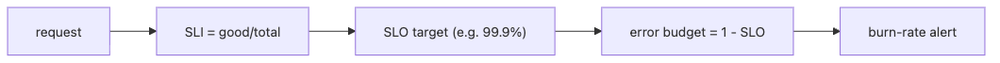

# SLI and SLO Basics

Reliability conversations often go in circles because each side is speaking from instinct. One team says the service is fine, another says it is already risky, and nobody has a shared threshold for when feature work should slow down.

SLIs and SLOs solve that by turning service quality into a number, a target, and a budget the team can spend or protect.

This is post 8 in the Observability 101 series.

## What You Will Learn

- The definition of *SLI* ("good / total")
- The *language* an *SLO* creates
- The meaning of *error budget*
- *Burn-rate* alerts
- Five common pitfalls

## Why It Matters

"Stable" is *subjective*. 99.9% is *agreement*. With SLOs, the *features vs reliability* fight is settled *with data*.

> *An SLO is *the shared language between engineers and the business*.*

## Concept at a Glance


*Measured reliability becomes an SLI, the target becomes an SLO, and the remaining room for failure becomes an error budget that alerts can track.*

## Key Terms

- **SLI**: a *measurable ratio* (e.g., success rate).
- **SLO**: a *target value* (e.g., 99.9%).
- **SLA**: a *contract*, breach has *penalty*.
- **Error budget**: the allowed *amount of failure*.
- **Burn rate**: how *fast* the budget is consumed.

## Before/After

**Before**: "It's slow" vs "it's fine" — a *word fight*.

**After**: "This month availability is *99.87%*, below the *99.9%* SLO" — *debate over*.

## Hands-on: SLOs in 5 Steps

### Step 1 — Define an SLI

```promql
# Availability SLI = good / total
sli_good = sum(rate(http_requests_total{status!~"5.."}[5m]))
sli_total = sum(rate(http_requests_total[5m]))
sli = sli_good / sli_total
```

### Step 2 — Pick an SLO target

```text
SLO: 99.9% availability over 30 days
That allows 30 * 24 * 60 * 0.001 = 43.2 minutes/month
```

### Step 3 — Error budget

```promql
1 - (sli_good / sli_total)         # current failure rate
# remaining 30-day budget = 0.001 * total - errors
```

### Step 4 — Burn-rate alert (multi-window)

```yaml
- alert: FastBurn
  expr: error_rate_5m > 14.4 * 0.001
        and error_rate_1h > 14.4 * 0.001
  for: 2m
  labels: { severity: page }
```

### Step 5 — Monthly SLO report

```text
- Availability: 99.92% (target 99.9% PASS)
- Latency: p95 320ms (target <= 500ms PASS)
- Budget burned: 38%
```

## How to Operate an Error Budget

An SLO matters only if it changes release behavior and incident response.

```text
30-day SLO target: 99.9%
allowed downtime: 43.2m
this month burned: 31.4m (72.7%)
current burn rate: 2.1x
decision: keep routine deploys, hold risky changes
```

```text
Expected output:
- The team shares one number for the target, one for remaining budget, and one for burn rate.
- Burn-rate alerts catch both fast incidents and slow degradation.
- Monthly reviews use budget consumption to decide whether feature velocity should slow down.
```

## What to Notice in This Code

- An *SLI* is always a *ratio*.
- *Burn rate* uses a *short window AND a long window*.
- If the budget *remains*, ship faster; if low, *freeze*.

## Five Common Mistakes

1. **Setting SLO to *100%*.** *Unreachable*.
2. **Using an *internal metric* as SLI.** Disconnected from user experience.
3. **Only thresholds, no *burn rate*.** Slow burns *go unnoticed*.
4. **Not using budget for *feature decisions*.** SLO becomes *decoration*.
5. **Multiple SLOs *breaking at once*.** Priority is *unclear*.

## How This Shows Up in Production

Most companies start with *availability + latency* SLOs and use them as the *criterion* for product decisions like deploys and feature additions.

## How a Senior Engineer Thinks

- *100% is *impossible*. 99.9% is a *choice*.*
- *SLI is *user-facing*.*
- *Budget is *budget*. When spent, you *stop*.*
- *Burn rate is *early warning*.*
- *Without an SLO, there is no *priority*.*

## Checklist

- [ ] You have *defined* one SLI.
- [ ] You have *agreed* on one SLO.
- [ ] You can *compute* the error budget.
- [ ] One burn-rate alert exists.

## Practice Problems

1. Write *Availability SLI* for one service in PromQL.
2. Compute the *monthly budget* (minutes) for SLO 99.9%.
3. Write a fast and slow *burn-rate* alert pair.

## Wrap-up and Next Steps

SLOs are a *shared language*. Next: *cost and cardinality*.

<!-- toc:begin -->
- [What Is Observability?](./01-what-is-observability.md)
- [Metrics, Logs, and Traces](./02-metric-log-trace.md)
- [Collecting and Visualizing Metrics](./03-metric-collection.md)
- [Structured Logging](./04-structured-logging.md)
- [Distributed Tracing Basics](./05-distributed-tracing.md)
- [Dashboard Design](./06-dashboard-design.md)
- [Alerts and On-Call](./07-alert-and-oncall.md)
- **SLI and SLO Basics (current)**
- Cost and Cardinality (upcoming)
- A Production-Ready Observability Stack (upcoming)
<!-- toc:end -->

## References

- [Google SRE — SLO chapter](https://sre.google/sre-book/service-level-objectives/)
- [The SRE Workbook — Implementing SLOs](https://sre.google/workbook/implementing-slos/)
- [Multi-window burn rate](https://sre.google/workbook/alerting-on-slos/)
- [Sloth — SLO generator](https://sloth.dev/)
- [Google Cloud — Service monitoring SLO overview](https://cloud.google.com/stackdriver/docs/solutions/slo-monitoring)

Tags: Observability, SLO, SLI, SRE, Reliability
