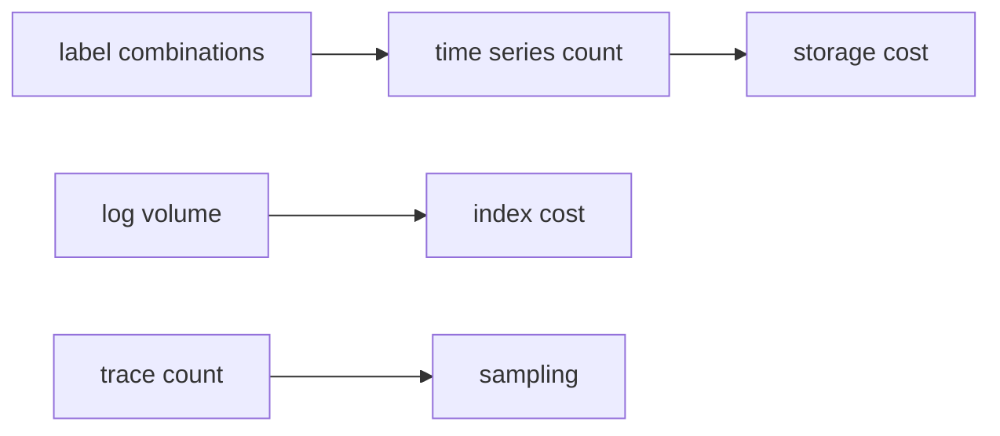

# Cost and Cardinality

> Observability 101 series (9/10)

<!-- a-grade-intro:begin -->

**Core question**: Why does observability cost *suddenly* go up *10x*?

> *Cardinality explosion, retention, and missing sampling — these three account for *99% of cost bombs*.*

<!-- a-grade-intro:end -->

## What You Will Learn

- How *cardinality* drives cost
- Tiered *retention* policy
- Two models of *sampling*
- The *cost curve* of each signal
- Five common pitfalls

## Why It Matters

In young companies the *#1 line on the AWS bill* is often *observability*. When monitoring costs *more than the product*, it becomes politics.

> *If you do not know the cost of measurement, *measurement becomes the enemy*.*

## Concept at a Glance



## Key Terms

- **Cardinality**: number of *unique label combinations*.
- **Retention tier**: hot / warm / cold *separation*.
- **Head sampling**: decided at the *start*.
- **Tail sampling**: decided after the trace finishes (slow / error first).
- **Aggregation**: shrink volume by *aggregating before retention*.

## Before/After

**Before**: `user_id` as a label, *50M series*, cost *explodes*.

**After**: `user_id` in *logs only*, labels stay *finite*, cost *predictable*.

## Hands-on: Cost Control in 5 Steps

### Step 1 — Measure cardinality

```promql
count({__name__=~".+"})              # total series
topk(20, count by (__name__) (...))  # top metrics
```

### Step 2 — Remove dangerous labels

```python
# Bad: per-user series
http_requests_total{user_id="42", path="/buy"}
# Good: dimension reduction
http_requests_total{path="/buy"}      # user_id goes to logs
```

### Step 3 — Retention tiers

```yaml
prometheus:  retention: 15d
thanos:      retention.resolution-raw: 30d
             retention.resolution-5m: 90d
             retention.resolution-1h: 1y
```

### Step 4 — Tail sampling

```yaml
processors:
  tail_sampling:
    policies:
      - name: errors
        type: status_code
        status_code: { status_codes: [ERROR] }
      - name: slow
        type: latency
        latency: { threshold_ms: 500 }
      - name: random
        type: probabilistic
        probabilistic: { sampling_percentage: 5 }
```

### Step 5 — Per-signal budget

```text
metric:  <= X million series
log:     <= Y GB per day
trace:   <= Z traces per minute after sampling
```

## What to Notice in This Code

- *Cardinality* explodes via *label multiplication*.
- *Resolution downsampling* shrinks volume of *older data*.
- *Tail sampling* keeps only *valuable traces*.

## Five Common Mistakes

1. **`user_id`, `request_id` as *labels*.** Cardinality explosion.
2. **Keeping every signal *forever*.** Cost compounds.
3. **Treating sampling as *bad*.** Risk of insolvency.
4. **Embedding *binaries* in logs.** Volume explosion.
5. **No *team-level* cost view.** Accountability dilutes.

## How This Shows Up in Production

Most companies combine *team cardinality budgets*, *retention tiers*, and *tail sampling* to make observability cost *predictable*.

## How a Senior Engineer Thinks

- *Cardinality is *tax*.*
- *Old data lives at *lower resolution*.*
- *Sampling is *not shameful*.*
- *Cost must have an *owner*.*
- *Measure the cost of measurement.*

## Checklist

- [ ] You know the *top-cardinality* metrics.
- [ ] *Retention tiers* are layered.
- [ ] Traces have *sampling*.
- [ ] Each team has a *cost budget*.

## Practice Problems

1. Find three labels that risk cardinality explosion.
2. Design a 3-tier retention plan.
3. Write a tail-sampling policy for *errors / slow / random*.

## Wrap-up and Next Steps

Without cost awareness, *observability becomes the enemy*. Next: *a production-ready stack*.

<!-- toc:begin -->
- [What Is Observability?](./01-what-is-observability.md)
- [Metrics, Logs, and Traces](./02-metric-log-trace.md)
- [Collecting and Visualizing Metrics](./03-metric-collection.md)
- [Structured Logging](./04-structured-logging.md)
- [Distributed Tracing Basics](./05-distributed-tracing.md)
- [Dashboard Design](./06-dashboard-design.md)
- [Alerts and On-Call](./07-alert-and-oncall.md)
- [SLI and SLO Basics](./08-sli-and-slo.md)
- **Cost and Cardinality (current)**
- A Production-Ready Observability Stack (upcoming)
<!-- toc:end -->

## References

- [Cardinality is the enemy](https://www.robustperception.io/cardinality-is-key/)
- [Thanos downsampling](https://thanos.io/tip/components/compact.md/)
- [OpenTelemetry tail sampling](https://opentelemetry.io/docs/collector/configuration/#processors)
- [Honeycomb on cost](https://www.honeycomb.io/blog/observability-cost)

Tags: Observability, Cost, Cardinality, Metrics, Sampling
