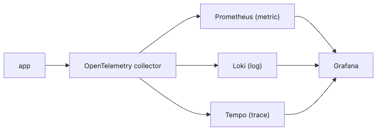

# A Production-Ready Observability Stack

The most common small-team mistake is waiting for the perfect observability stack. The perfect mix of features, cost, and future-proofing never arrives, and the team delays the first usable setup for too long.

A good first stack is less about completeness and more about operability. Collection should be standardized, the three signals should meet in one place, and the team should be able to replace parts later without rewriting the application.

This is the final post in the Observability 101 series.

## Questions this article answers

- What does the minimum viable observability stack for a small team look like?
- Why is it better to put the OpenTelemetry Collector at the center?
- What do you need to connect metrics, logs, and traces on one screen?
- Why should operators define service-level objectives for the observability stack itself?
- What should you evaluate when you want practical choices without deep vendor lock-in?

## Why It Matters

There is no *perfect* stack for a small team. The best stack is *operable* and *replaceable*. Avoid lock-in and start *today*.

> *The perfect stack *will not arrive tomorrow*. Build the operable one *today*.*

## Concept at a Glance


*A practical small-team stack: OpenTelemetry standardizes collection, Prometheus/Loki/Tempo store the three signals, and Grafana brings them back together.*

## Key Terms

- **Collector**: a gateway that *receives and routes* signals.
- **Backend**: storage (Prometheus / Loki / Tempo).
- **Correlation**: linking the three signals via *trace_id*.
- **Datasource**: a backend wired into Grafana.
- **Exemplar**: a *representative trace_id* attached to a metric point.

## Before/After

**Before**: five tools, *not connected*; you juggle *five screens*.

**After**: *one Grafana*; click between *trace ↔ log ↔ metric*.

## Hands-on: Baseline Stack in 5 Steps

### Step 1 — Collector

```yaml
receivers:
  otlp: { protocols: { grpc: {}, http: {} } }
exporters:
  prometheus:    { endpoint: ":9464" }
  loki:          { endpoint: http://loki:3100/loki/api/v1/push }
  otlp/tempo:    { endpoint: tempo:4317, tls: { insecure: true } }
service:
  pipelines:
    metrics:  { receivers: [otlp], exporters: [prometheus] }
    logs:     { receivers: [otlp], exporters: [loki] }
    traces:   { receivers: [otlp], exporters: [otlp/tempo] }
```

### Step 2 — Docker Compose

```yaml
services:
  otel-collector: { image: otel/opentelemetry-collector }
  prometheus:     { image: prom/prometheus }
  loki:           { image: grafana/loki }
  tempo:          { image: grafana/tempo }
  grafana:        { image: grafana/grafana, ports: ["3000:3000"] }
```

### Step 3 — App emission

```python
from opentelemetry.exporter.otlp.proto.grpc.metric_exporter import OTLPMetricExporter
from opentelemetry.exporter.otlp.proto.grpc.trace_exporter import OTLPSpanExporter
# OTEL_EXPORTER_OTLP_ENDPOINT=http://otel-collector:4317
```

### Step 4 — Grafana correlation

```text
Datasources: Prometheus, Loki, Tempo
Tempo -> Loki: derived field "trace_id" -> log search
Loki  -> Tempo: log "trace_id" -> trace view
```

### Step 5 — Five operator SLOs

```text
1) /metrics scrape success > 99.5%
2) Loki ingest p95 < 5s
3) Tempo trace arrival > 99%
4) Grafana dashboard p95 < 2s
5) Alertmanager dispatch latency < 30s
```

## How to Verify the Stack Is Actually Connected

The first success criterion is not feature count. It is whether all five core components are healthy and whether one request can move across all three signals.

```bash
docker compose ps
curl -s http://localhost:9464/metrics | grep otelcol
curl -s http://localhost:3000/api/health
```

```text
Expected output:
- collector, prometheus, loki, tempo, and grafana all report `running`.
- Collector metrics show exporter send counters increasing.
- Grafana health returns `ok`, and one `trace_id` lets you jump between traces and logs.
```

## What to Notice in This Code

- *Unified collector* gives *standard collection*.
- *Trace_id correlation* turns debugging into one screen.
- *Exemplars* let you jump from metric to trace.

## Five Common Mistakes

1. **A different collector per signal.** Ops burden *triples*.
2. **No correlation set up.** You bounce between screens.
3. **No backup or retention policy.** Cost is *unpredictable*.
4. **Deep *vendor lock-in*.** *Replacement impossible*.
5. **No operator SLO.** Observability itself is a *black box*.

## How This Shows Up in Production

Small teams start with *OTel + LGTM (Loki/Grafana/Tempo/Mimir)*. As they scale, some move to *managed* (Grafana Cloud, Datadog, Honeycomb).

## How a Senior Engineer Thinks

- *Collection is *OTel*, backends are *replaceable*.*
- *Without trace_id correlation, you have *half a stack*.*
- *Observability is also a *product* — it has SLOs.*
- *Start small and *measure as you grow*.*
- *Vendor lock-in is *cost + risk*.*

## Checklist

- [ ] Collection is unified through one OTel collector.
- [ ] *All three signals* are visible in Grafana.
- [ ] Trace ↔ log jump works.
- [ ] Five operator SLOs are defined.

## Practice Problems

1. Bring up the baseline stack with Compose.
2. Trace a single request through the *three signals*.
3. Write the five operator SLOs in *PromQL*.

## Wrap-up and Next Steps

A small team's first stack must be *replaceable*. From here: *incident response*, *capacity planning*, *cost FinOps*.

<!-- toc:begin -->
- [What Is Observability?](./01-what-is-observability.md)
- [Metrics, Logs, and Traces](./02-metric-log-trace.md)
- [Collecting and Visualizing Metrics](./03-metric-collection.md)
- [Structured Logging](./04-structured-logging.md)
- [Distributed Tracing Basics](./05-distributed-tracing.md)
- [Dashboard Design](./06-dashboard-design.md)
- [Alerts and On-Call](./07-alert-and-oncall.md)
- [SLI and SLO Basics](./08-sli-and-slo.md)
- [Cost and Cardinality](./09-cost-and-cardinality.md)
- **A Production-Ready Observability Stack (current)**
<!-- toc:end -->

## References

- [OpenTelemetry Collector](https://opentelemetry.io/docs/collector/)
- [Grafana LGTM stack](https://grafana.com/oss/)
- [Tempo docs](https://grafana.com/docs/tempo/latest/)
- [Loki docs](https://grafana.com/docs/loki/latest/)

Tags: Observability, SRE, OpenTelemetry, Grafana, Prometheus
