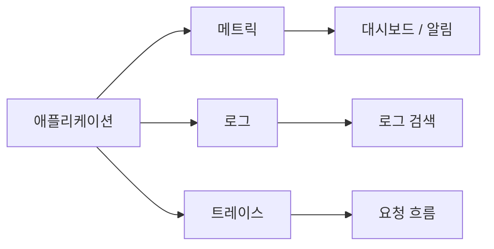

# Observability란 무엇인가?

## 이 글에서 다룰 문제

운영 시스템은 늘 예상한 방식으로만 무너지지 않습니다. 이미 알고 있던 장애라면 대시보드와 알람만으로도 대응할 수 있지만, 처음 보는 증상은 다릅니다. 그래프 몇 장으로는 어디서부터 이상해졌는지 감이 잡히지 않고, 로그를 뒤져도 맥락이 이어지지 않을 때가 많습니다. 이때 필요한 것이 observability입니다. 관측성은 시스템 바깥에서 얻은 신호만으로 내부 상태를 추론하고, 아직 정리되지 않은 질문에도 답할 수 있게 만드는 운영 감각입니다.

> Observability 101 시리즈 (1/10)

<!-- a-grade-intro:begin -->

핵심 질문: 시스템이 조용히 잘못되기 시작할 때, 우리는 어떻게 바깥에서 안쪽을 이해할 수 있을까요?

> Observability는 외부 신호만으로 시스템 내부 상태를 이해하는 능력입니다. Monitoring이 이미 아는 문제를 지켜보는 일이라면, observability는 아직 정리되지 않은 질문을 던지고 답을 찾는 일입니다.

<!-- a-grade-intro:end -->

## 이 글에서 배울 것

- Monitoring 과 observability 가 어떻게 다른지
- 세 가지 핵심 신호인 metric, log, trace 가 각각 무엇을 맡는지
- known unknown 과 unknown unknown 을 어떤 감각으로 구분하는지
- 처음 observability 신호를 어떻게 5단계로 붙일 수 있는지
- 입문 단계에서 자주 나오는 다섯 가지 실수

## 왜 중요한가

프로덕션 장애는 체크리스트에 적힌 순서대로만 오지 않습니다. CPU가 올랐고 에러율이 늘었고 데이터베이스가 느려졌다는 식으로 원인이 깨끗하게 보이면 좋겠지만, 현실에서는 증상만 먼저 보이는 경우가 더 많습니다. 대시보드는 이미 준비한 질문에 대한 답을 보여 줍니다. 반면 observability는 “왜 결제만 느린가?”, “어느 서비스에서 응답 시간이 튀었는가?”, “이번 장애는 예전 패턴과 무엇이 다른가?”처럼 아직 정리되지 않은 질문을 던질 수 있게 만듭니다.

> 대시보드는 답이고, observability는 질문입니다.

## 한눈에 보는 개념



## 핵심 용어

- Metric: 시간에 따라 바뀌는 숫자 입니다. 초당 요청 수나 에러율이 대표적입니다.
- Log: 어떤 사건이 일어났다는 사실을 남기는 텍스트 한 줄 또는 구조화된 이벤트입니다.
- Trace: 하나의 요청이 여러 서비스를 지나가는 경로 입니다.
- Cardinality: 라벨 조합이 얼마나 많이 생기는지를 나타내는 값입니다.
- SLO: 서비스가 지켜야 하는 수치 목표 입니다.

## Before / After

Before: 알람이 울려도 어디서 시작됐는지 감이 없습니다. 로그를 `grep` 하면서도 왜 느려졌는지 연결이 되지 않습니다.

After: 대시보드에서 증상 을 보고, 트레이스로 느린 구간 을 좁히고, 로그에서 맥락 을 확인합니다.

## 실습: 첫 신호를 붙이는 5단계

### 1단계 — 가장 단순한 metric

```python
import time
counter = 0

def handle_request():
    global counter
    counter += 1
    return f"requests_total {counter}"
```

이 코드는 observability의 출발점을 아주 작게 보여 줍니다. 요청이 한 번 올 때마다 숫자 하나를 올리고, 그 값을 외부에 노출합니다. 아직 정교한 모니터링 시스템은 아니어도 “지금 요청이 들어오고 있는가”라는 질문에는 답할 수 있습니다.

### 2단계 — 구조화된 log

```python
import json, time

def log_event(event, **fields):
    print(json.dumps({"ts": time.time(), "event": event, **fields}))

log_event("request_received", path="/health", status=200)
```

숫자만으로는 부족합니다. 요청이 들어왔다는 사실은 알 수 있어도 어떤 경로였는지, 어떤 상태 코드였는지, 누가 호출했는지는 알 수 없습니다. 그래서 두 번째 단계에서 로그를 붙입니다. 여기서 중요한 점은 사람이 읽기 편한 문장보다 기계가 질의하기 쉬운 구조를 먼저 택한다는 점입니다.

### 3단계 — 단순한 trace

```python
import uuid

def handle(req):
    trace_id = req.get("trace_id") or str(uuid.uuid4())
    log_event("auth_start", trace_id=trace_id)
    log_event("db_query", trace_id=trace_id)
    log_event("response_sent", trace_id=trace_id)
```

세 번째 단계는 요청 하나의 흐름을 따라가는 일입니다. 분산 시스템에서는 요청이 인증 서비스, 애플리케이션, 데이터베이스를 거치며 여러 조각으로 흩어집니다. `trace_id` 가 없으면 이 조각들을 하나의 이야기로 묶기 어렵습니다.

### 4단계 — 세 신호를 함께 읽기

```bash
# metric: 1분간 요청 수
# log: trace_id 기준 검색
grep '"trace_id": "abc-123"' app.log
```

실전에서는 metric, log, trace를 따로따로 보지 않습니다. 대시보드에서 레이턴시가 튀는 순간을 보고, 같은 시점의 로그를 열고, 특정 요청의 트레이스를 따라가며 “무슨 일이 있었는가”를 입체적으로 맞춥니다. observability가 필요한 이유가 바로 여기에 있습니다.

### 5단계 — 질문 하나에 답하기

```text
"왜 결제가 느려졌는가?"
1. metric: latency 그래프 상승
2. trace: payment 서비스 구간이 길다
3. log: db connection timeout
```

이 질문은 monitoring만으로는 끝나지 않습니다. 레이턴시가 높아졌다는 사실은 알 수 있어도, 어느 구간이 느린지와 왜 그런지는 다른 신호가 필요합니다. 세 가지 신호를 합치면 증상, 위치, 맥락이 연결됩니다.

## 이 코드에서 주목할 점

- 세 신호는 서로 보완 합니다. 하나만으로는 충분하지 않습니다.
- trace_id 가 metric, log, trace를 연결하는 실마리입니다.
- 구조화된 로그는 사람이 읽는 문장보다 질의 가능한 데이터 에 가깝습니다.

## 자주 하는 실수 5가지

1. Monitoring과 observability를 같은 말로 취급합니다. 하나는 이미 정해 둔 답을 감시하는 일이고, 다른 하나는 모르는 문제를 파고드는 능력입니다.
2. Metric만 모읍니다. 추세는 보여도 왜 그런지는 설명하지 못합니다.
3. 로그를 비정형 텍스트로만 남깁니다. 검색은 가능해도 분석은 금방 막힙니다.
4. 서비스 사이에 `trace_id` 를 전달하지 않습니다. 요청 흐름이 중간에서 끊깁니다.
5. 모든 신호를 끝없이 보관합니다. 분석 능력보다 비용이 먼저 폭증합니다.

## 실무에서는 이렇게 보입니다

대부분의 SRE 팀은 metric, log, trace 를 최소 신호 세트로 보고, 그 위에 SLO와 알람 정책을 얹습니다. 운영 성숙도가 올라갈수록 “무엇을 더 수집할까”보다 “어떤 질문에 답하려고 이 신호를 남기는가”를 더 중요하게 봅니다.

## 실무자는 이렇게 생각합니다

- 시스템은 블랙박스 보다 유리 상자 에 가까워야 합니다.
- 대시보드는 예쁘게 채우는 화면이 아니라 질문에 대한 답 이어야 합니다.
- cardinality는 곧 비용입니다.
- `trace_id` 는 모든 신호에 흘려야 합니다.
- observability의 진짜 시험대는 처음 보는 장애 앞에서 드러납니다.

## 체크리스트

- [ ] Monitoring 과 observability 의 차이를 설명할 수 있습니다.
- [ ] 세 가지 핵심 신호를 말할 수 있습니다.
- [ ] 구조화된 로그 한 줄을 직접 쓸 수 있습니다.
- [ ] trace_id 가 왜 필요한지 이해합니다.

## 연습 문제

1. 최근 겪은 장애 하나를 떠올리고, 그 상황을 metric, log, trace로 나눠 보세요.
2. 자유 형식 로그 한 줄을 JSON 로그로 바꿔 보세요.
3. known unknown과 unknown unknown의 예시를 각각 두 개씩 적어 보세요.

## 다음 글로 이어가기

Observability는 시스템 바깥에서 안쪽을 묻는 운영 기술입니다. 다음 글에서는 이 흐름을 구성하는 세 가지 신호, 곧 metric, log, trace를 더 자세히 살펴보겠습니다.

<!-- toc:begin -->
- **Observability란 무엇인가? (현재 글)**
- Metric, Log, Trace (예정)
- Metric 수집과 시각화 (예정)
- 구조화된 로깅 (예정)
- 분산 트레이싱 기초 (예정)
- Dashboard 설계 (예정)
- Alert와 On-Call (예정)
- SLI와 SLO 기초 (예정)
- Cost와 Cardinality (예정)
- 운영 가능한 Observability 스택 (예정)
<!-- toc:end -->

## 참고 자료

- [OpenTelemetry overview](https://opentelemetry.io/docs/concepts/)
- [Google SRE Book — Monitoring](https://sre.google/sre-book/monitoring-distributed-systems/)
- [Three Pillars of Observability](https://www.cncf.io/blog/2022/05/24/observability-cloud-native/)
- [Observability vs Monitoring](https://www.honeycomb.io/blog/observability-101)

Tags: Observability, Monitoring, SRE, DevOps, Metrics
