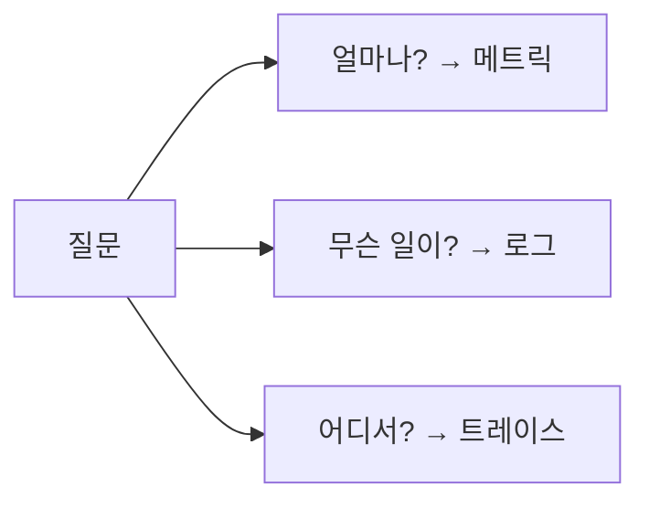

# Metric, Log, Trace

## 이 글에서 다룰 문제

운영 신호를 잘못 고르면 비용은 금방 커지고, 정작 필요한 답은 나오지 않습니다. 모든 것을 로그에 밀어 넣으면 검색 비용이 커지고, 모든 문제를 메트릭으로만 보려 하면 원인을 찾지 못합니다. 반대로 세 신호의 경계를 이해하면 적은 비용으로도 더 많은 질문에 답할 수 있습니다. 이 글은 metric, log, trace가 각각 어떤 질문을 맡고, 어떤 상황에서 무엇을 먼저 꺼내야 하는지 정리합니다.

> Observability 101 시리즈 (2/10)

<!-- a-grade-intro:begin -->

핵심 질문: 세 가지 신호는 어떻게 다르고, 어떤 질문에 무엇을 먼저 써야 할까요?

> Metrics는 얼마나 많은지, logs는 무슨 일이 있었는지, traces는 어디에서 어떻게 느려졌는지를 보여 줍니다. 셋은 서로를 대체하지 않습니다.

<!-- a-grade-intro:end -->

## 이 글에서 배울 것

- 각 신호가 담당하는 질문 영역
- metric, log, trace의 데이터 형태
- cardinality 와 비용이 왜 함께 움직이는지
- 질문에 따라 어떤 신호를 먼저 고를지 판단하는 기준
- 입문 단계에서 자주 나오는 다섯 가지 실수

## 왜 중요한가

관측성 도구를 도입했다고 해서 자동으로 운영이 쉬워지지는 않습니다. 잘못된 신호를 고르면 데이터는 많이 쌓이는데도 문제 해결 속도는 오히려 늦어집니다. 예를 들어 “전체 처리량이 늘었는가” 같은 질문에 로그를 뒤지는 건 비효율적입니다. 반대로 “이 주문이 왜 실패했는가”라는 질문을 메트릭만으로 풀려고 하면 구체 맥락이 빠집니다.

> 올바른 신호 하나가 잘못 만든 대시보드 열 개보다 낫습니다.

## 한눈에 보는 개념



## 핵심 용어

- Counter / Gauge / Histogram: 메트릭의 대표적인 세 가지 형태입니다.
- Sampling: 전체를 다 모으지 않고 일부만 수집해 비용을 줄이는 방법입니다.
- Span: 트레이스 안에서 한 구간을 나타내는 단위입니다.
- Label / Tag: 신호에 붙는 식별자입니다.
- Retention: 신호를 얼마나 오래 보관할지 정하는 정책입니다.

## Before / After

Before: 모든 데이터를 로그에 남깁니다. 검색은 느리고 요금은 커집니다.

After: 추세 는 metric으로, 사건의 맥락 은 log로, 요청 흐름 은 trace로 나눠서 봅니다.

## 실습: 세 신호를 5단계로 비교하기

### 1단계 — Counter

```python
http_requests_total = 0

def on_request():
    global http_requests_total
    http_requests_total += 1
```

Counter는 올라가기만 하는 숫자입니다. 요청 수, 처리 건수, 에러 건수처럼 누적량을 나타낼 때 가장 많이 씁니다. 단순하지만 “얼마나 자주 일어나는가”를 보는 데는 매우 강합니다.

### 2단계 — Histogram

```python
import time
buckets = {0.1: 0, 0.5: 0, 1.0: 0, "inf": 0}

def observe(d):
    for b in [0.1, 0.5, 1.0]:
        if d <= b: buckets[b] += 1; return
    buckets["inf"] += 1
```

평균만 보면 긴 꼬리 구간을 놓치기 쉽습니다. Histogram은 응답 시간이 어떤 분포를 보이는지 알려 줍니다. p50은 평범해 보여도 p99가 치솟는 상황을 찾을 때 특히 중요합니다.

### 3단계 — 구조화된 log

```python
import json
def log(event, **f):
    print(json.dumps({"event": event, **f}))

log("payment_failed", order_id=42, reason="card_declined")
```

로그는 사건을 설명하는 데 강합니다. 어떤 주문이 실패했는지, 어떤 입력이 들어왔는지, 어떤 예외가 났는지 같은 맥락은 로그가 가장 잘 담습니다. 다만 아무 문자열로나 남기면 나중에 질의하기 어렵습니다.

### 4단계 — 단순 trace

```python
import uuid, time

def span(name, trace_id):
    s = time.time()
    log("span_start", trace_id=trace_id, name=name)
    yield
    log("span_end", trace_id=trace_id, name=name, dur=time.time()-s)
```

트레이스는 하나의 요청이 서비스 사이를 어떻게 지나는지 보여 줍니다. “어디가 느렸는가”라는 질문에는 트레이스가 가장 직접적인 답을 줍니다. 특히 마이크로서비스 환경에서는 같은 요청이 여러 서비스를 오갈 때 이 정보가 없으면 원인 구간을 좁히기 어렵습니다.

### 5단계 — 신호 선택 기준

```text
"전체 처리량" → metric
"이 주문이 실패한 이유" → log
"이 요청에서 어느 서비스가 느렸는가" → trace
```

운영에서 중요한 습관은 질문을 먼저 쓰고 신호를 고르는 일입니다. 신호를 모아 놓고 나중에 쓸모를 찾으려 하면 비용과 복잡도만 커집니다.

## 이 코드에서 주목할 점

- counter 는 위로만 움직이고, gauge 는 오르내립니다.
- histogram 은 분포를 보여 줍니다. p50, p95, p99 같은 지표가 여기서 나옵니다.
- trace_id 는 세 신호를 엮는 실입니다.

## 자주 하는 실수 5가지

1. 모든 것을 로그에 넣습니다. 비용이 커지고 검색도 느려집니다.
2. Counter와 Gauge를 헷갈립니다. 그래프 해석이 바로 어긋납니다.
3. 평균만 봅니다. 긴 꼬리 지연을 놓치기 쉽습니다.
4. 라벨에 `user_id` 같은 고유값을 넣습니다. cardinality가 급격히 커집니다.
5. 트레이스만 보고 메트릭을 무시합니다. 전체 추세를 놓칩니다.

## 실무에서는 이렇게 보입니다

대부분의 팀은 세 단계 패턴을 씁니다. 알람은 메트릭 위에 얹고, 디버깅은 로그로 들어가고, 어느 서비스가 문제인지 좁히는 데는 트레이스를 씁니다. 이 구분이 명확할수록 운영 비용과 대응 속도가 함께 좋아집니다.

## 실무자는 이렇게 생각합니다

- 세 신호는 서로 다른 질문 영역을 맡습니다. 대체재가 아닙니다.
- cardinality는 숨은 세금과 같습니다.
- 평균보다 p99가 더 큰 이야기를 들려주는 경우가 많습니다.
- 분산 시스템에서는 `trace_id` 없이는 흐름을 풀기 어렵습니다.
- sampling은 부끄러운 타협이 아니라 비용 제어 수단입니다.

## 체크리스트

- [ ] counter, gauge, histogram 을 구분할 수 있습니다.
- [ ] cardinality 가 무엇인지 설명할 수 있습니다.
- [ ] trace_id 의 역할을 이해합니다.
- [ ] 질문에 따라 어떤 신호를 쓸지 결정할 수 있습니다.

## 연습 문제

1. counter와 gauge의 예시를 각각 세 개씩 적어 보세요.
2. 평균만 보면 p99를 놓치는 사례를 하나 설명해 보세요.
3. 세 개의 서비스가 하나의 요청을 처리할 때 `trace_id` 가 어떻게 흘러야 하는지 그려 보세요.

## 다음 글로 이어가기

세 신호는 서로 다른 경계를 가진 도구입니다. 다음 글에서는 이 중 metric을 실제로 수집하고 그래프로 만드는 과정을 살펴보겠습니다.

<!-- toc:begin -->
- [Observability란 무엇인가?](./01-what-is-observability.md)
- **Metric, Log, Trace (현재 글)**
- Metric 수집과 시각화 (예정)
- 구조화된 로깅 (예정)
- 분산 트레이싱 기초 (예정)
- Dashboard 설계 (예정)
- Alert와 On-Call (예정)
- SLI와 SLO 기초 (예정)
- Cost와 Cardinality (예정)
- 운영 가능한 Observability 스택 (예정)
<!-- toc:end -->

## 참고 자료

- [Prometheus metric types](https://prometheus.io/docs/concepts/metric_types/)
- [Structured logging](https://www.datadoghq.com/blog/structured-logging/)
- [OpenTelemetry traces](https://opentelemetry.io/docs/concepts/signals/traces/)
- [Histograms vs averages](https://prometheus.io/docs/practices/histograms/)

Tags: Observability, Metrics, Logging, Tracing, SRE
