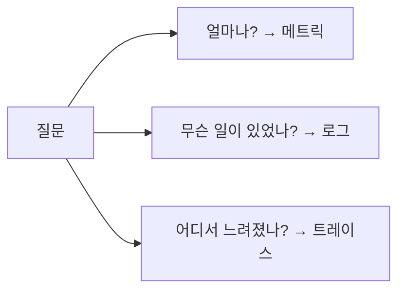

# 메트릭, 로그, 트레이스

관측성을 처음 배우면 세 신호를 모두 많이 모으면 된다고 생각하기 쉽습니다. 하지만 운영에서는 양보다 경계가 더 중요합니다. 어떤 질문은 메트릭으로 바로 답할 수 있고, 어떤 질문은 로그가 없으면 끝까지 설명되지 않으며, 어떤 질문은 트레이스가 없으면 위치를 찾기조차 어렵습니다.

신호를 잘못 고르면 두 가지가 동시에 나빠집니다. 비용은 커지고 답은 사라집니다. 그래서 메트릭, 로그, 트레이스를 각각 어떤 질문의 도구로 이해할지 먼저 정리해야 합니다.

이 글은 Observability 101 시리즈의 2번째 글입니다.

## 이 글에서 다룰 문제

- 메트릭, 로그, 트레이스는 각각 어떤 질문에 답할까요?
- 세 신호의 데이터 형태는 어떻게 다를까요?
- 카디널리티와 비용은 어디에서 커질까요?
- 어떤 상황에서 어떤 신호를 먼저 골라야 할까요?
- 세 신호를 함께 읽을 때 얻는 장점은 무엇일까요?

> 메트릭은 "얼마나"를, 로그는 "무슨 일이 있었나"를, 트레이스는 "어디서 어떻게 느려졌나"를 답합니다. 셋은 경쟁 관계가 아니라 질문 영역이 다른 도구입니다.

## 왜 중요한가

운영 비용이 커지는 팀을 보면 한 가지 패턴이 자주 보입니다. 모든 것을 로그에 넣거나, 반대로 메트릭만 잔뜩 그려 놓고 이유를 찾지 못합니다. 둘 다 신호의 경계를 구분하지 못해서 생기는 문제입니다.

메트릭, 로그, 트레이스의 역할을 정확히 구분하면 같은 돈으로 더 많은 답을 얻을 수 있습니다. 전체 추세는 메트릭으로, 사건의 맥락은 로그로, 요청 경로는 트레이스로 나누면 도구가 단순해지고 검색 시간도 줄어듭니다.

## 한눈에 보는 구조



## 핵심 용어

- 카운터: 값이 계속 증가하는 메트릭입니다. 총 요청 수처럼 누적량을 표현할 때 씁니다.
- 게이지: 값이 오르내리는 메트릭입니다. 큐 길이, 메모리 사용량처럼 현재 상태를 나타냅니다.
- 히스토그램: 값의 분포를 보여 주는 메트릭입니다. p95, p99 같은 꼬리 지연을 계산할 때 중요합니다.
- 스팬: 트레이스 안의 한 구간입니다. 서비스 호출 하나, 데이터베이스 쿼리 하나가 스팬이 됩니다.
- 라벨: 신호에 붙이는 식별자입니다. 잘 쓰면 분류가 쉬워지지만, 과하면 비용이 폭증합니다.

## 바꾸기 전과 후

바꾸기 전에는 모든 사건을 로그에 밀어 넣습니다. 나중에 검색으로 다 찾으면 된다고 믿지만, 실제로는 검색이 느리고 비용도 커집니다. 반대로 메트릭만 보면 평균은 보이지만 왜 실패했는지 설명되지 않습니다.

바꾼 뒤에는 기준이 분명합니다. 전체 처리량과 에러율은 메트릭으로, 주문 한 건이 왜 실패했는지는 로그로, 특정 요청이 어느 서비스에서 오래 걸렸는지는 트레이스로 봅니다. 신호마다 맡는 질문이 달라지면 운영 판단도 빨라집니다.

## 실습: 세 신호를 다섯 단계로 비교하기

### 1단계 — 카운터

```python
http_requests_total = 0

def on_request():
    global http_requests_total
    http_requests_total += 1
```

카운터는 가장 단순한 메트릭입니다. 전체 처리량처럼 계속 누적되는 값을 기록할 때 적합합니다. 시스템이 바쁘고 한가한 흐름을 보는 첫 출발점이 됩니다.

### 2단계 — 히스토그램

```python
import time
buckets = {0.1: 0, 0.5: 0, 1.0: 0, "inf": 0}

def observe(d):
    for b in [0.1, 0.5, 1.0]:
        if d <= b: buckets[b] += 1; return
    buckets["inf"] += 1
```

평균만 보면 긴 꼬리를 놓치기 쉽습니다. 히스토그램은 요청 분포를 남겨 주기 때문에 p95와 p99를 볼 수 있습니다. 사용자는 평균이 아니라 느린 일부 요청을 기억한다는 점에서 특히 중요합니다.

### 3단계 — 구조화된 로그

```python
import json
def log(event, **f):
    print(json.dumps({"event": event, **f}))

log("payment_failed", order_id=42, reason="card_declined")
```

로그는 사건을 남깁니다. 결제가 왜 실패했는지, 어떤 주문 번호에서 어떤 사유가 나왔는지처럼 메트릭으로는 담기 어려운 맥락을 기록합니다. 운영에서 "왜"를 설명하는 재료는 대개 로그에 있습니다.

### 4단계 — 단순한 트레이스

```python
import uuid, time

def span(name, trace_id):
    s = time.time()
    log("span_start", trace_id=trace_id, name=name)
    yield
    log("span_end", trace_id=trace_id, name=name, dur=time.time()-s)
```

트레이스는 요청의 이동 경로를 보여 줍니다. 같은 trace_id 아래에서 시작과 끝을 남기면, 어느 구간이 길어졌는지와 어떤 서비스가 병목인지 읽을 수 있습니다.

### 5단계 — 선택 기준 세우기

```text
"overall throughput" → metric
"why this order failed" → log
"which service was slow for this request" → trace
```

결국 중요한 것은 선택 기준입니다. 처리량과 추세를 보고 싶으면 메트릭, 사건의 이유를 알고 싶으면 로그, 요청 경로를 따라가려면 트레이스를 고릅니다. 이 기준이 선명할수록 신호 설계가 단순해집니다.

## 이 코드에서 먼저 봐야 할 점

- 카운터는 올라가기만 하고, 게이지는 오르내립니다.
- 히스토그램은 평균이 가리는 분포를 보여 줍니다.
- trace_id는 로그와 트레이스를 이어 주는 공통 키입니다.

## 자주 하는 실수 다섯 가지

1. 모든 것을 로그에 넣습니다. 검색 비용이 커지고 답을 찾는 시간도 길어집니다.
2. 카운터와 게이지를 혼동합니다. 그래프가 의미를 잃습니다.
3. 평균만 봅니다. 긴 꼬리 지연이 숨겨집니다.
4. user_id 같은 고유값을 라벨에 넣습니다. 카디널리티가 폭발합니다.
5. 트레이스만 보고 메트릭을 무시합니다. 전체 추세를 놓칩니다.

## 실무에서는 이렇게 생각한다

대부분의 팀은 메트릭으로 경보를 만들고, 로그로 디버깅하고, 트레이스로 원인 서비스를 찾습니다. 세 신호가 같은 정보를 세 번 저장하는 구조는 오래 버티지 못합니다. 질문 영역을 나누는 순간부터 비용과 운영 시간이 함께 줄어듭니다.

시니어 엔지니어가 특히 먼저 보는 것은 경계입니다. 어떤 질문을 메트릭으로 풀고, 어떤 질문을 로그로 넘기고, 어떤 문제에만 트레이스를 깊게 쓰는지 합의가 있으면 시스템이 커져도 신호 설계가 덜 흔들립니다.

## 체크리스트

- [ ] 카운터, 게이지, 히스토그램의 차이를 설명할 수 있습니다.
- [ ] 카디널리티가 왜 비용과 연결되는지 이해합니다.
- [ ] trace_id의 역할을 설명할 수 있습니다.
- [ ] 질문에 따라 어떤 신호를 먼저 볼지 결정할 수 있습니다.

## 연습 문제

1. 카운터와 게이지의 예를 각각 세 개씩 적어 보세요.
2. 평균이 p99를 가리는 사례를 하나 설명해 보세요.
3. 세 개의 서비스를 거치는 요청에서 trace_id가 어떻게 이어질지 스케치해 보세요.

## 정리

메트릭, 로그, 트레이스는 같은 신호의 세 버전이 아닙니다. 각자 답하는 질문이 다르고, 함께 써야 비로소 운영의 흐름이 보입니다. 다음 글에서는 이 가운데 메트릭을 실제로 어떻게 수집하고 그래프로 만드는지 살펴보겠습니다.

<!-- toc:begin -->
- [관측성이란 무엇인가?](./01-what-is-observability.md)
- **메트릭, 로그, 트레이스 (현재 글)**
- 메트릭 수집과 시각화 (예정)
- 구조화된 로깅 (예정)
- 분산 트레이싱 기초 (예정)
- 대시보드 설계 (예정)
- 경보와 온콜 (예정)
- 서비스 수준 지표와 목표 기초 (예정)
- 비용과 카디널리티 (예정)
- 운영 가능한 관측성 스택 (예정)
<!-- toc:end -->

## 참고 자료

- [Prometheus metric types](https://prometheus.io/docs/concepts/metric_types/)
- [Structured logging](https://www.datadoghq.com/blog/structured-logging/)
- [OpenTelemetry traces](https://opentelemetry.io/docs/concepts/signals/traces/)
- [Histograms vs averages](https://prometheus.io/docs/practices/histograms/)

Tags: Observability, Metrics, Logging, Tracing, SRE
